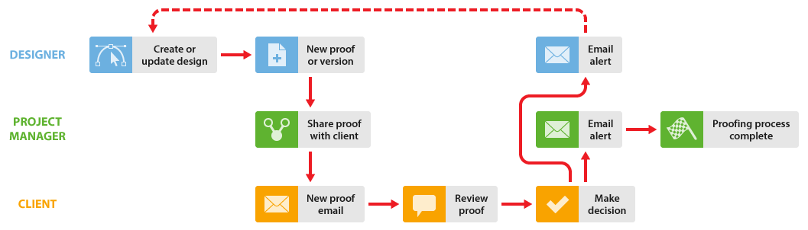

# 在[!DNL Workfront Proof]中与设计人员和项目经理合作

>[!IMPORTANT]
>
>本文提及独立产品[!DNL Workfront Proof]中的功能。 有关[!DNL Adobe Workfront]内部校对的信息，请参阅[校对](../../../review-and-approve-work/proofing/proofing.md)。

您可以通过下面介绍的两种方式，增强项目经理（审阅流程的管理人）和设计人员共同处理项目的校对工作流。

这些工作流在任何情况下都工作正常，但如果设计人员创建的文件可能太大，无法通过电子邮件发送给项目经理，则这些工作流特别有用。

## Designer需要查看评论和决策的时间

当设计人员需要查看对验证所做的评论和决策时，他或她可以开始验证流程，并在流程完成时再次接收验证。 然后，设计人员可以再次开始该过程。

1. 设计者创建一个新校样，并将项目经理指定为项目的所有者（有关详细信息，请参阅[在 [!DNL Workfront Proof]](../../../workfront-proof/wp-work-proofsfiles/create-proofs-and-files/generate-proofs.md)中生成校样）。 作为验证的创建者，设计人员可以：

   * 对验证进行评论，并使用[!UICONTROL 操作]选项卡来跟踪评论线程。
   * 为项目经理创建新版本的验证。

1. 项目经理查看证明，然后与客户共享。 有关详细信息，请参阅[在 [!DNL Workfront Proof]](../../../workfront-proof/wp-work-proofsfiles/share-proofs-and-files/share-proof.md)中共享校对。
1. 客户端收到一封电子邮件，其中包含指向验证的链接。 有关详细信息，请参阅[新验证电子邮件](../../../workfront-proof/wp-emailsntfctns/proof-notifications-and-reminders/new-proof-email.md)。
1. 客户审核验证、添加注释并对验证做出决定。
1. 项目经理会收到一封电子邮件，其中概述了客户端的审阅，而设计人员则会收到一封有关所需更改的电子邮件。 有关详细信息，请参阅[在 [!DNL Workfront Proof]](../../../workfront-proof/wp-emailsntfctns/email-alerts/config-email-notification-settings-wp.md)中配置电子邮件通知设置。
1. 设计人员或项目经理修改文件；如果设计人员随后将其作为新版本上传，[!DNL Workfront Proof]会将证明的所有权重新分配给项目经理。

## 当Designer不需要查看验证评论和决策时

当不需要设计人员参与[!DNL Workfront Proof]审阅流程时，项目经理可以创建校样并添加审阅人。

1. 设计器上载文件并与项目管理器共享。 有关详细信息，请参阅[将文件和Web内容上载到 [!DNL Workfront Proof]](../../../workfront-proof/wp-work-proofsfiles/create-proofs-and-files/upload-files-web-content.md)和[在 [!DNL Workfront Proof]](../../../workfront-proof/wp-work-proofsfiles/share-proofs-and-files/share-files.md)中共享文件。

1. 项目经理会收到文件，只需一次单击即可从文件创建验证。 有关详细信息，请参阅[在 [!DNL Workfront Proof]](../../../workfront-proof/wp-work-proofsfiles/create-proofs-and-files/generate-proofs.md)中生成验证，另请参阅[在 [!DNL Workfront Proof]](../../../workfront-proof/wp-work-proofsfiles/manage-your-work/manage-files.md)中管理文件，以了解有关将文件转换为验证的信息。

1. 客户端收到一封电子邮件，其中包含指向验证的链接。 有关详细信息，请参阅[新验证电子邮件](../../../workfront-proof/wp-emailsntfctns/proof-notifications-and-reminders/new-proof-email.md)。
1. 客户审核证明、添加评论并做出决定。
1. 项目经理会收到一封电子邮件，其中包含客户评论及其决策的摘要。 有关详细信息，请参阅[在 [!DNL Workfront Proof]](../../../workfront-proof/wp-emailsntfctns/email-alerts/config-email-notification-settings-wp.md)中配置电子邮件通知设置。
1. 项目管理器使用[!UICONTROL 打印注释]通知设计者有关更改请求的信息。 有关详细信息，请参阅[在 [!DNL Workfront Proof]](../../../workfront-proof/wp-work-proofsfiles/organize-your-work/print-and-export-comments.md)中打印和导出注释。
1. 如有必要，设计人员会修改文件并将其上载到[!DNL Workfront Proof]，项目经理可以在其中为另一轮验证创建新版本。

