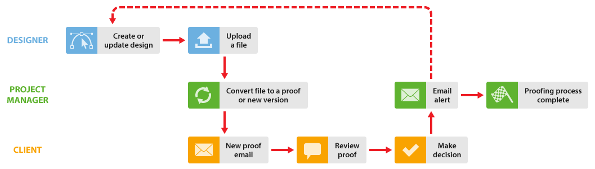

# 在中使用设计人员和项目经理 [!DNL Workfront Proof]

>[!IMPORTANT]
>
>本文介绍了独立版产品中的功能 [!DNL Workfront Proof]. 有关内部校对的信息 [!DNL Adobe Workfront]，请参见 [校对](../../../review-and-approve-work/proofing/proofing.md).

您可以通过下面介绍的两种方式，增强项目经理（审阅流程的管理人）和设计人员共同处理项目的校对工作流。

这些工作流在任何情况下都工作正常，但如果设计人员创建的文件可能太大，无法通过电子邮件发送给项目经理，则这些工作流特别有用。

## 当设计人员需要查看评论和决策时

当设计人员需要查看对验证所做的评论和决策时，他或她可以开始验证流程，并在流程完成时再次接收验证。 然后，设计人员可以再次开始该过程。

1. 设计者创建一个新校样，并将项目经理指定为项目的所有者(有关更多信息，请参阅 [在中生成验证 [!DNL Workfront Proof]](../../../workfront-proof/wp-work-proofsfiles/create-proofs-and-files/generate-proofs.md))。 作为验证的创建者，设计人员可以：

   * 对验证进行评论并使用 [!UICONTROL 操作] 制表符，以跟踪评论线程。
   * 为项目经理创建新版本的验证。

1. 项目经理查看证明，然后与客户共享。 有关更多信息，请参阅 [在中共享验证 [!DNL Workfront Proof]](../../../workfront-proof/wp-work-proofsfiles/share-proofs-and-files/share-proof.md).
1. 客户端收到一封电子邮件，其中包含指向验证的链接。 有关更多信息，请参阅 [新验证电子邮件](../../../workfront-proof/wp-emailsntfctns/proof-notifications-and-reminders/new-proof-email.md).
1. 客户审核验证、添加注释并对验证做出决定。
1. 项目经理会收到一封电子邮件，其中概述了客户端的审阅，而设计人员则会收到一封有关所需更改的电子邮件。 有关更多信息，请参阅 [在中配置电子邮件通知设置 [!DNL Workfront Proof]](../../../workfront-proof/wp-emailsntfctns/email-alerts/config-email-notification-settings-wp.md).
1. 设计者或项目经理会修改文件；如果设计者随后将其作为新版本上载， [!DNL Workfront Proof] 将证明的所有权重新分配给项目经理。

## 当设计者不需要查看验证评论和决策时

当不需要设计人员参与时 [!DNL Workfront Proof] 在审阅过程中，项目经理可以创建验证并添加审阅者。

1. 设计器上载文件并与项目管理器共享。 有关更多信息，请参阅 [将文件和Web内容上传到 [!DNL Workfront Proof]](../../../workfront-proof/wp-work-proofsfiles/create-proofs-and-files/upload-files-web-content.md) 和 [共享文件 [!DNL Workfront Proof]](../../../workfront-proof/wp-work-proofsfiles/share-proofs-and-files/share-files.md).

1. 项目经理会收到文件，只需一次单击即可从文件创建验证。 有关更多信息，请参阅 [在中生成验证 [!DNL Workfront Proof]](../../../workfront-proof/wp-work-proofsfiles/create-proofs-and-files/generate-proofs.md) 另请参阅  [在中管理文件 [!DNL Workfront Proof]](../../../workfront-proof/wp-work-proofsfiles/manage-your-work/manage-files.md) 以获取有关将文件转换为校样的信息。

1. 客户端收到一封电子邮件，其中包含指向验证的链接。 有关更多信息，请参阅 [新验证电子邮件](../../../workfront-proof/wp-emailsntfctns/proof-notifications-and-reminders/new-proof-email.md).
1. 客户审核证明、添加评论并做出决定。
1. 项目经理会收到一封电子邮件，其中包含客户评论及其决策的摘要。 有关更多信息，请参阅 [在中配置电子邮件通知设置 [!DNL Workfront Proof]](../../../workfront-proof/wp-emailsntfctns/email-alerts/config-email-notification-settings-wp.md).
1. 项目经理让设计人员知道变更请求，使用 [!UICONTROL 打印评论]. 有关更多信息，请参阅 [在中打印和导出注释 [!DNL Workfront Proof]](../../../workfront-proof/wp-work-proofsfiles/organize-your-work/print-and-export-comments.md).
1. 如有必要，设计人员会修改文件并将其上载到 [!DNL Workfront Proof]，项目经理可以为该校对的另一轮创建新版本。

