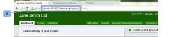
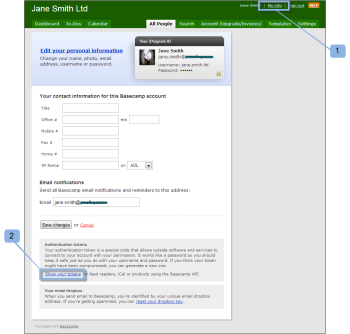

# 将[!DNL Workfront Proof]与[!DNL Basecamp Classic]集成

>[!IMPORTANT]
>
>本文提及独立产品[!DNL Workfront Proof]中的功能。 有关[!DNL Adobe Workfront]内部校对的信息，请参阅[校对](../../../review-and-approve-work/proofing/proofing.md)。

如果您将[!DNL Basecamp]用于项目管理，则可以使用[!DNL Workfront Proof]为项目团队提供更丰富的审阅和批准工具。

## 了解[!DNL Basecamp]与[!DNL Workfront]的集成

与[!DNL Basecamp]集成允许用户在[!DNL Basecamp]内查看、审阅和批准所有验证。 用户可以向您的[!DNL Workfront Proof]帐户提交验证，并将其与您的[!DNL Basecamp]项目连接。 您的审阅人可以使用Basecamp邮件中嵌入的迷你校对，通过[!DNL Basecamp]在校对查看人[&#128279;](../../../review-and-approve-work/proofing/reviewing-proofs-within-workfront/make-a-decision-on-a-proof/make-decisions-on-proof.md)中做出校对决定。

与[!DNL Workfront Proof]集成后，[!DNL Basecamp]允许用户对验证执行以下操作：

* 用户可以在[!DNL Basecamp Classic]内查看和批准验证。
* 用户可以随时使用审阅工具。
* 项目审阅团队在[!DNL Basecamp]中收到一封邮件，其中包含用于审阅和批准的小型校对。
* 用户可以切换到整页验证以供审阅和审批。
* 用户可以在小型和全尺寸校样中添加注释和标记。

  >[!NOTE]
  >
  >评论回复后，便无法编辑或删除。

* 审阅人可以对其他审阅人所做的和标记做出响应。
* 当有新版本的验证可用时，用户会收到警报。
* 非[!DNL Workfront Proof]用户的用户可以在[!DNL Basecamp]中处理验证。

[!DNL Workfront Proof]与[!DNL Basecamp]的集成必须在两个级别上设置：

* 在[帐户设置](https://support.workfront.com/hc/en-us/sections/115000912147-Account-settings)中配置[!DNL Basecamp]这将启用整个组织的Basecamp集成。
* 有关详细信息，请参阅[启用 [!DNL Basecamp] 与 [!DNL Workfront Proof]](#enabling-the-basecamp-integration-with-workfront-proof)的集成。
* 在[个人设置](https://support.workfront.com/hc/en-us/sections/115000921168-Personal-settings)中配置[!DNL Basecamp]：这使验证创建者和所有者能够连接到其个人[!DNL Basecamp]帐户并授权[!DNL Workfront Proof]访问权限。 有关详细信息，请参阅[配置个人设置](#configuring-personal-settings)。

您可以将[!DNL Workfront]与[!DNL Basecamp]或[!DNL Basecamp Classic]集成。 [!DNL Basecamp]的每个版本使用不同的API，因此需要不同的配置过程。

有关配置[!DNL Basecamp Classic]的信息，请参阅本文中的[启用 [!DNL Basecamp] 与 [!DNL Workfront Proof]](#enabling-the-basecamp-integration-with-workfront-proof)的集成。

有关配置[!DNL Basecamp]的信息，请参阅[集成 [!DNL Workfront Proof] 与 [!DNL Basecamp]](../../../workfront-proof/wp-integrations/basecamp/integrate-workfront-proof-with-basecamp.md)。

## 正在启用[!DNL Basecamp]与[!DNL Workfront Proof]的集成

作为 [!DNL Workfront Proof][&#128279;](../../../workfront-proof/wp-acct-admin/account-settings/proof-perm-profiles-in-wp.md)中的[验证权限配置文件或 [!DNL Workfront Proof]](../../../workfront-proof/wp-acct-admin/account-settings/proof-perm-profiles-in-wp.md)中的验证权限配置文件，您可以在[帐户设置](https://support.workfront.com/hc/en-us/sections/115000912147-Account-settings)中为整个帐户设置Basecamp集成。

1. 转到[帐户设置。](https://support.workfront.com/hc/en-us/sections/115000912147-Account-settings)
1. 打开&#x200B;**[!UICONTROL 集成]**&#x200B;选项卡(1)。
1. 要启用Basecamp集成，请单击&#x200B;**[!UICONTROL 启用]** (2)。
1. 验证[!DNL Basecamp Classic]是否为要与(3)集成的版本。
1. （视情况而定）如果未显示[!DNL Basecamp] URL (4)，请单击&#x200B;**[!UICONTROL 编辑]**&#x200B;并输入您的[!DNL Basecamp]帐户的URL(不带http://)。
1. 单击&#x200B;**[!UICONTROL 保存]** (5)。\
   

1. （可选）登录到[!DNL Basecamp Classic]帐户后，在浏览器中检查您的[!DNL Basecamp] URL (6)。

   

   将[!DNL Workfront Proof]与[!DNL Basecamp]集成后，您的用户可以配置其个人设置。 有关设置个人设置的信息，请参阅[配置个人设置](#configuring-personal-settings)。

   如果无法启用[!DNL Basecamp]集成，则[!DNL Workfront Proof]帐户ID可能与您在[!DNL Basecamp]中使用的帐户ID不同。

## 配置个人设置

在为贵组织设置[帐户设置](https://support.workfront.com/hc/en-us/sections/115000912147-Account-settings)后，创建/提交验证的每位作者都应设置其[个人设置。](https://support.workfront.com/hc/en-us/sections/115000921168-Personal-settings)

>[!NOTE]
>
>如果您在一个浏览器窗口中打开[!DNL Basecamp]会话，而在另一个窗口中打开[!DNL Workfront Proof]会话，则完成这些步骤最简单。

* [正在检索 [!DNL Basecamp] API令牌](#retrieving-your-basecamp-api-token)
* [正在将您的 [!DNL Basecamp] API令牌添加到您的个人设置中](#adding-your-basecamp-api-token-to-your-personal-settings)

### 正在检索您的[!DNL Basecamp] API令牌

要在[!DNL Workfront Proof]中完成个人级别的集成，用户需要[!DNL Basecamp] API的单独身份验证令牌。

要检索[!DNL Basecamp] API令牌，请执行以下操作：

1. 登录到您的[!DNL Basecamp]帐户。
1. 单击屏幕右上角的&#x200B;**[!UICONTROL 我的信息]** (1)。\
   显示[!UICONTROL 我的信息]页面。\
   

1. 在[!UICONTROL 身份验证令牌]部分中，单击&#x200B;**[!UICONTROL 显示您的令牌]** (2)以显示您的个人身份验证令牌。
1. 为信息源阅读器&#x200B;**或**&#x200B;[!UICONTROL &#x200B; Basecamp API &#x200B;]&#x200B;**(3)选择**&#x200B;令牌，然后将令牌复制到剪贴板。

1. 将您的[!DNL Basecamp] API令牌粘贴到[!UICONTROL 令牌中，以供信息源阅读器使用]或[!UICONTROL Basecamp API]框。\
   

### 正在将您的[!DNL Basecamp] API令牌添加到您的个人设置中

要将[!DNL Basecamp] API令牌粘贴到[!DNL Workfront Proof] [个人设置](https://support.workfront.com/hc/en-us/sections/115000921168-Personal-settings)中：

1. 转到[个人设置](https://support.workfront.com/hc/en-us/sections/115000921168-Personal-settings) (1)中的[[!UICONTROL 集成] — 用户设置](../../../workfront-proof/wp-getstarted/personal-settings/integrations-user-setup.md)。\
   管理员必须先启用[!DNL Basecamp Classic]集成，您才能启用个人设置。 有关设置集成的信息，请参阅本文中的[启用 [!DNL Basecamp] 与 [!DNL Workfront Proof]](#enabling-the-basecamp-integration-with-workfront-proof)的集成。

1. 在[!DNL Basecamp] API令牌框(2)中，将您刚刚从[!DNL Basecamp] [!UICONTROL 我的信息]页面复制的令牌粘贴到字段(3)中。\
   有关复制[!DNL Basecamp] API令牌的信息，请参阅本文中的[检索 [!DNL Basecamp] API令牌](#retrieving-your-basecamp-api-token)。

1. 单击&#x200B;**[!UICONTROL 保存]** (4)。

您的[!DNL Workfront Proof] [个人设置](https://support.workfront.com/hc/en-us/sections/115000921168-Personal-settings)现已与您的[!DNL Basecamp Classic]帐户集成。
