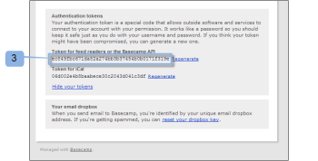

# 集成 [!DNL Workfront Proof] with [!DNL Basecamp Classic]

>[!IMPORTANT]
>
>本文介绍独立产品中的功能 [!DNL Workfront Proof]. 有关内部校对的信息 [!DNL Adobe Workfront]，请参阅 [校对](../../../review-and-approve-work/proofing/proofing.md).

如果您使用 [!DNL Basecamp] 对于项目管理，您可以使用 [!DNL Workfront Proof].

## 了解 [!DNL Basecamp] 与集成 [!DNL Workfront]

集成 [!DNL Basecamp] 允许用户在 [!DNL Basecamp]. 用户可以向 [!DNL Workfront Proof] 帐户，并将其与 [!DNL Basecamp] 项目。 您的审阅人可以和 [在校对查看器中对校样做出决策](../../../review-and-approve-work/proofing/reviewing-proofs-within-workfront/make-a-decision-on-a-proof/make-decisions-on-proof.md) 通过 [!DNL Basecamp]，使用Basecamp消息中嵌入的mini校样。

与集成后 [!DNL Workfront Proof], [!DNL Basecamp] 允许用户通过校样执行以下操作：

* 用户可以在 [!DNL Basecamp Classic].
* 用户可随时查看可用的工具。
* 项目审阅团队会在 [!DNL Basecamp] 以小小的证据供审阅和批准。
* 用户可以切换到全页校样以进行审阅和批准。
* 用户可以向小型校样和全尺寸校样添加注释和标记。

   >[!NOTE]
   >
   >评论被回复后，便无法编辑或删除。

* 审阅人可以对其他审阅人创建的和标记做出响应。
* 当有新版本的校样可用时，用户会收到警报。
* 非 [!DNL Workfront Proof] 用户可以在中处理校样 [!DNL Basecamp].

集成 [!DNL Workfront Proof] with [!DNL Basecamp] 必须在两个级别上设置：

* 配置 [!DNL Basecamp] in [帐户设置：](https://support.workfront.com/hc/en-us/sections/115000912147-Account-settings) 这可为您的整个组织启用Basecamp集成。
* 有关更多信息，请参阅 [启用 [!DNL Basecamp] 与集成 [!DNL Workfront Proof]](#enabling-the-basecamp-integration-with-workfront-proof).
* 配置 [!DNL Basecamp] in [个人设置](https://support.workfront.com/hc/en-us/sections/115000921168-Personal-settings):这样，校样创建者和所有者就可以连接到他们的个人 [!DNL Basecamp] 帐户和授权 [!DNL Workfront Proof] 访问权限。 有关更多信息，请参阅 [配置个人设置](#configuring-personal-settings).

您可以集成 [!DNL Workfront] 使用 [!DNL Basecamp] 或 [!DNL Basecamp Classic]. 每个版本 [!DNL Basecamp] 会使用不同的API，因此需要不同的配置过程。

有关配置的信息 [!DNL Basecamp Classic]，请参阅 [启用 [!DNL Basecamp] 与集成 [!DNL Workfront Proof]](#enabling-the-basecamp-integration-with-workfront-proof) 在本文中。

有关配置的信息 [!DNL Basecamp]，请参阅 [集成 [!DNL Workfront Proof] with [!DNL Basecamp]](../../../workfront-proof/wp-integrations/basecamp/integrate-workfront-proof-with-basecamp.md).

## 启用 [!DNL Basecamp] 与集成 [!DNL Workfront Proof]

As a [中的校样权限配置文件 [!DNL Workfront Proof]](../../../workfront-proof/wp-acct-admin/account-settings/proof-perm-profiles-in-wp.md) 或 [中的校样权限配置文件 [!DNL Workfront Proof]](../../../workfront-proof/wp-acct-admin/account-settings/proof-perm-profiles-in-wp.md)，则可以在中为整个帐户设置Basecamp集成 [帐户设置](https://support.workfront.com/hc/en-us/sections/115000912147-Account-settings).

1. 转到 [帐户设置。](https://support.workfront.com/hc/en-us/sections/115000912147-Account-settings)
1. 打开 **[!UICONTROL 集成]** 选项卡(1)。
1. 要启用Basecamp集成，请单击 **[!UICONTROL 启用]** (2)。
1. 验证 [!DNL Basecamp Classic] 是您要与集成的版本(3)。
1. （视情况而定）如果否 [!DNL Basecamp] 显示URL(4)，单击 **[!UICONTROL 编辑]** 并输入URL [!DNL Basecamp] 帐户(不带http://)。
1. 单击 **[!UICONTROL 保存]** （五）。\
   

1. （可选）检查 [!DNL Basecamp] 登录后浏览器中的URL [!DNL Basecamp Classic] 账号(6)。

   

   集成后 [!DNL Workfront Proof] with [!DNL Basecamp]，则用户可以配置其个人设置。 有关设置个人设置的信息，请参阅 [配置个人设置](#configuring-personal-settings).

   如果无法启用 [!DNL Basecamp] 集成，您的 [!DNL Workfront Proof] 帐户ID可能与您在 [!DNL Basecamp].

## 配置个人设置

设置后 [帐户设置](https://support.workfront.com/hc/en-us/sections/115000912147-Account-settings) 对于贵组织，创建/提交校样的每个作者应将其  [个人设置。](https://support.workfront.com/hc/en-us/sections/115000921168-Personal-settings)

>[!NOTE]
>
>如果您拥有 [!DNL Basecamp] 会话在一个浏览器窗口中打开，您的 [!DNL Workfront Proof] 会话在另一个窗口中打开。

* [检索 [!DNL Basecamp] API令牌](#retrieving-your-basecamp-api-token)
* [添加 [!DNL Basecamp] 个人设置的API令牌](#adding-your-basecamp-api-token-to-your-personal-settings)

### 检索 [!DNL Basecamp] API令牌

在 [!DNL Workfront Proof]，则用户需要其个人身份验证令牌 [!DNL Basecamp] API。

检索 [!DNL Basecamp] API令牌：

1. 登录到 [!DNL Basecamp] 帐户。
1. 单击 **[!UICONTROL 我的信息]** （一）屏幕右上角的。\
   的 [!UICONTROL 我的信息] 页面。\
   

1. 在 [!UICONTROL 身份验证令牌] ，单击 **[!UICONTROL 显示令牌]** (2)显示您的个人身份验证令牌。
1. 选择 **[!UICONTROL 信息源读者的令牌]** 或 **[!UICONTROL Basecamp API]** (3)，然后将令牌复制到剪贴板。

1. 粘贴 [!DNL Basecamp] 将API令牌加入 [!UICONTROL 信息源读者的令牌] 或 [!UICONTROL Basecamp API] 框中。\
   

### 添加 [!DNL Basecamp] 个人设置的API令牌

粘贴 [!DNL Basecamp] 将API令牌置入 [!DNL Workfront Proof] [个人设置](https://support.workfront.com/hc/en-us/sections/115000921168-Personal-settings):

1. 转到 [[!UICONTROL 集成]  — 用户设置](../../../workfront-proof/wp-getstarted/personal-settings/integrations-user-setup.md) 在 [个人设置](https://support.workfront.com/hc/en-us/sections/115000921168-Personal-settings) (1)。\
   管理员必须首先启用 [!DNL Basecamp Classic] 集成，以便启用个人设置。 有关设置集成的信息，请参阅 [启用 [!DNL Basecamp] 与集成 [!DNL Workfront Proof]](#enabling-the-basecamp-integration-with-workfront-proof) 在本文中。

1. 在 [!DNL Basecamp] API令牌框(2)，粘贴您刚从 [!DNL Basecamp] [!UICONTROL 我的信息] 页面。\
   有关复制 [!DNL Basecamp] API令牌，请参阅 [检索 [!DNL Basecamp] API令牌](#retrieving-your-basecamp-api-token) 在本文中。

1. 单击 **[!UICONTROL 保存]** (4)。

您的 [!DNL Workfront Proof] [个人设置](https://support.workfront.com/hc/en-us/sections/115000921168-Personal-settings) 现在已与 [!DNL Basecamp Classic] 帐户。
