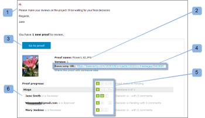

# 在[!DNL Basecamp] Classic中查看验证

>[!IMPORTANT]
>
>本文提及独立产品[!DNL Workfront Proof]中的功能。 有关[!DNL Adobe Workfront]内部校对的信息，请参阅[校对](../../../review-and-approve-work/proofing/proofing.md)。

[!DNL Basecamp]是由[!DNL 37signals]开发的在线项目管理工具。 如果您将[!DNL Basecamp]用于项目管理，则可以使用[!DNL Workfront Proof]为项目团队提供更丰富的审阅和批准工具。

## 了解[!DNL Basecamp Classic]中的验证评论

与[!DNL Workfront Proof]集成后，[!DNL Basecamp]允许用户对验证执行以下操作：

* 用户可以在[!DNL Basecamp Classic]内查看和批准验证。
* 用户可以随时使用审阅工具。
* 项目审阅团队在[!DNL Basecamp]中收到一封邮件，其中包含用于审阅和批准的小型校对。
* 用户可以切换到整页验证以供审阅和审批。
* 用户可以在小型和全尺寸校样中添加注释和标记。
* 评论回复后，便无法编辑/删除。 有关评论的信息，请参阅[对验证的评论](../../../review-and-approve-work/proofing/reviewing-proofs-within-workfront/comment-on-a-proof/comment-on-proof.md)。
* 审阅人可以对其他审阅人所做的和标记做出响应。 有关评论的信息，请参阅[对验证的评论](../../../review-and-approve-work/proofing/reviewing-proofs-within-workfront/comment-on-a-proof/comment-on-proof.md)。
* 当有新版本的验证可用时，用户会收到警报。
* 非[!DNL Workfront Proof]用户的用户可以在[!DNL Basecamp]中处理验证。

## 通过通知电子邮件查看验证

如果将校对链接到[!DNL Basecamp]，[!DNL Workfront Proof]会向所有审阅人发送校对通知电子邮件(1)，其中包含以下信息：

* **校对详细信息** (2)：显示有关校对的信息。 显示的信息取决于Workfront管理员配置Basecamp的方式。
* **[!UICONTROL 前往校对]链接** (3)：在Workfront中打开校对。
* **[!DNL Basecamp]URL** (4)：在Basecamp中打开校对。 如果将非Basecamp审阅人添加到验证中，则其电子邮件通知不包含Basecamp链接。
* **[!UICONTROL 验证进度]** (5)：列出审批阶段并显示验证进度指示器。
* **[!UICONTROL 阶段]** (6)：列出审阅人及其个人进度。

要从电子邮件通知中打开验证，请执行以下操作：

1. 要在[!DNL Workfront Proof]中打开校对，请单击&#x200B;**[!UICONTROL 转到校对]**。\
   或\
   要在[!DNL Basecamp]中打开校对，请单击&#x200B;**[!UICONTROL [!DNL Basecamp]URL]**&#x200B;字段中列出的URL。\
   有关在[!DNL Basecamp Classic]中查看校对的信息，请参阅本文中的[在 [!DNL Basecamp]](#reviewing-a-proof-in-basecamp)中查看校对。

## 通过[!DNL Basecamp Classic]消息查看验证

您可以通过[!DNL Basecamp Classic]消息访问校对。

1. 在[!DNL Basecamp]中，转到您的项目页面(1)。\
   

1. 单击要打开的校样消息。 (2)\
   验证消息将打开，显示微型验证。 校对的名称显示在消息窗口(3)的顶部。\
   您可以在[!DNL Basecamp Classic]中或在[!DNL Workfront Proof]中查看缩略图验证。\
   

1. 要在[!DNL Workfront proof]中以全屏模式查看校对，请单击校对(4)上方列出的URL。
1. （视情况而定）如果您未在其中一个浏览器窗口中登录到您的[!DNL Workfront Proof]帐户，请登录以查看验证：

   1. 单击校对上方的&#x200B;**[!UICONTROL 登录]** (5)。
   1. 键入您的电子邮件地址(6)。\

      您必须使用添加到验证时使用的电子邮件地址。
   1. 单击&#x200B;**[!UICONTROL 下一步]**。
   1. 键入您的[!DNL Workfront Proof]密码(7)。\

      或\
      如果您没有[!DNL Workfront Proof]帐户，请键入要显示的公用名称。\
      您可以选择“[!UICONTROL 记住我]”，因此您只需输入一次详细信息。

1. 要审阅校样，请继续[在 [!DNL Basecamp]](#reviewing-a-proof-in-basecamp)中审阅校样。

>[!NOTE]
>
> 消息页面上微型验证下方显示的评论框仅适用于消息本身。 若要提交审核评论，必须使用小型校样顶部的评论图标按钮或整页校样顶部较大的[!UICONTROL 评论]按钮。 有关详细信息，请参阅查看[在 [!DNL Basecamp]](#reviewing-a-proof-in-basecamp)中查看验证。

## 在[!DNL Basecamp]中查看验证

[!DNL Basecamp]中的迷你校对为您提供了添加和做出[在校对查看者中做出校对决策所需的工具](../../../review-and-approve-work/proofing/reviewing-proofs-within-workfront/make-a-decision-on-a-proof/make-decisions-on-proof.md)。 分配给项目的所有用户都可以看到您的标记和注释，并且可以用自己的注释实时响应。

打开验证时，验证显示在[!UICONTROL 验证]窗口(1)中，验证的名称和版本号显示在左上角(2)。

查看证明：

1. 要添加评论，请单击验证顶部的[!UICONTROL 评论] (3)，然后键入您的评论。\
   无需发送对[!DNL Basecamp]消息的响应，因为备注和[在验证查看者](../../../review-and-approve-work/proofing/reviewing-proofs-within-workfront/make-a-decision-on-a-proof/make-decisions-on-proof.md)中对验证做出决定已保存到验证中（类似于在[!DNL Workfront Proof]中查看验证）。

1. 要添加决策，请单击验证顶部的决策(3)，然后选择您的审批决策。\
   有关对校对做出决定的更多信息，请参阅[在校对查看者中对校对做出决定](../../../review-and-approve-work/proofing/reviewing-proofs-within-workfront/make-a-decision-on-a-proof/make-decisions-on-proof.md#making-a-decision-on-a-proof)。

验证窗口上的其他功能包括：

* **[!UICONTROL 操作菜单]** (4)：允许您选择校对的设置。
* **[!UICONTROL 全屏按钮]** (5)：允许您在全屏和迷你校对之间切换。
* **[!UICONTROL 侧栏]** (6)：允许您展开或缩小验证视图。
* **[!UICONTROL 用户名]** (7)：如果您已登录Workfront，则显示您的用户名。
* **[!UICONTROL 缩放工具]** (8)：允许您放大校对的区域。
* **[!UICONTROL 页面导航工具]** (9)：允许您滚动到验证中的其他页面。

<!--For more information on reviewing proofs, see [Legacy proofing viewer Overview](../../../workfront-proof/wp-work-proofsfiles/review-proofs-lpv/legacy-proofing-viewer.md).-->
