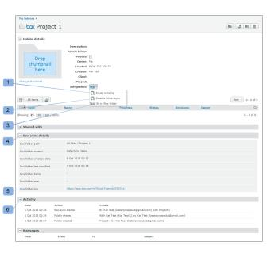

# 同步 [!DNL Box] 文件夹 [!DNL Workfront Proof]

>[!IMPORTANT]
>
>本文介绍独立产品中的功能 [!DNL Workfront Proof]. 有关内部校对的信息 [!DNL Adobe Workfront]，请参阅 [校对](../../../review-and-approve-work/proofing/proofing.md).

您可以同步 [!DNL Box] 文件夹 [!DNL Workfront Proof]. 您对Box文件夹中的文件所做的每项更改都会反映在Workfront校样中（因此，上传新文件、添加新版本、重命名文件等）。

有关文件夹的更多信息，请参阅 [在中管理文件夹及其内容 [!DNL Workfront Proof]](../../../workfront-proof/wp-work-proofsfiles/organize-your-work/manage-folders-and-contents.md).

>[!NOTE]
>
>仅具有 [!UICONTROL 经理] 或更高版本能够同步文件夹。 的 [!DNL Box] 将文件上传到与 [!DNL Workfront Proof]，将成为中创建校样的所有者 [!DNL Workfront Proof] (如果他们是同一用户 [!DNL Workfront Proof] 帐户)。 如果 [!DNL Box] 用户是其他 [!DNL Workfront Proof] 帐户或没有 [!DNL Workfront Proof]，创建文件夹之间同步的人员将成为校样的所有者。 有关更多信息，请参阅 *“编辑用户配置文件和权限”。*

同步 [!DNL Box] 文件夹 [!DNL Workfront Proof]:

1. 在 [!DNL Box] 帐户，转到 [!UICONTROL 所有文件和文件夹] 页面。
1. 单击 **[!UICONTROL 更多选项]** 菜单。 [!DNL Workfront Proof] (1)。
1. 选择 **[!UICONTROL 更多操作]** (2)。
1. 单击 **[!UICONTROL 与同步[!DNL Workfront Proof]]** (3)。
1. 在 [!UICONTROL 同步文件夹] 框（如果您已登录） [!DNL Workfront Proof])，执行下列操作之一：

   * 单击 [!DNL Workfront Proof] 文件夹名称，以将其与Box(4)中的相应文件夹同步。
   * 单击 **[!UICONTROL 新建文件夹]** 要在 [!DNL Workfront Proof] (5)。\

      如果选择创建新文件夹，系统会提示您提供有关新文件夹的详细信息。

1. 单击&#x200B;**[!UICONTROL 保存]**。\
   的 [!UICONTROL 文件夹详细信息] 已同步文件夹的页面将在 [!DNL Workfront Proof]. 本页包含有关文件夹的信息。\
   此页还允许您暂停和禁用同步。 如果暂停同步，文件夹将不再更新为 [!DNL Box]，但可以随时恢复同步。 禁用同步意味着文件夹之间的连接已断开，需要从 [!DNL Box] 帐户。\
   的 [!UICONTROL 文件夹详细信息] 页面包含与 [!DNL Box]:

   * **[!UICONTROL 暂停同步]**:的 [!DNL Workfront Proof] 文件夹将不再更新为Box中的更改。 可以随时恢复同步(1)。
   * **[!UICONTROL 禁用文件夹同步]**:文件夹之间的连接已丢失，必须从 [!DNL Box] 账号(2)。

   * 只有启动文件夹同步的用户才能禁用或暂停该同步。 有关更多信息，请参阅  [在中管理文件夹及其内容 [!DNL Workfront Proof]](../../../workfront-proof/wp-work-proofsfiles/organize-your-work/manage-folders-and-contents.md).
   * **转到 [!DNL Box] 文件夹**:如果您共享了文件夹URL(在 [!DNL Box] 文件夹选项)，此选项将变为可用，并将直接转到 [!DNL Box] 文件夹(3)。
   * **[!UICONTROL 文件夹同步详细信息]**:本节包含有关 [!DNL Box] 文件夹(4)。
   * **[!UICONTROL [!DNL Box]文件夹链接]**:指向的URL [!DNL Box] 文件夹(5)。
   * **[!UICONTROL 活动]:** 显示 [!DNL Workfront Proof] 文件夹中，您可以在此检查谁启动了文件夹同步(6)。
   * 

>[!NOTE]
>
>* 您还可以同步 [!DNL Box] 文件夹 [!UICONTROL 文件夹选项] 菜单。
>* 如果您有自己的品牌 [!DNL Workfront Proof] 登录页面时，您将转到该页面，而不是标准 [!DNL Workfront Proof] 登录页面。 请参阅 [品牌策略](https://support.workfront.com/hc/en-us/sections/115000921208-Branding) 如果您需要更多信息，请参阅。
>* 如果您已启用 [!UICONTROL 单点登录(SSO)] 功能 [!DNL Workfront Proof] 帐户时，您将会进入SSO登录页面并被要求输入您的SSO登录凭据，但前提是您使用的电子邮件地址与您的电子邮件地址相同 [!DNL Box] 帐户和 [!DNL Workfront Proof]. 如果您需要更多信息，请参阅 [[!UICONTROL 单点登录] in [!DNL Workfront Proof]](../../../workfront-proof/wp-acct-admin/managing-security/single-sign-on-overview.md).
>* 如果您没有为 [!DNL Box] 帐户 [!DNL Workfront Proof] ，您将始终被视为标准 [!DNL Workfront Proof] 登录页面。
>

