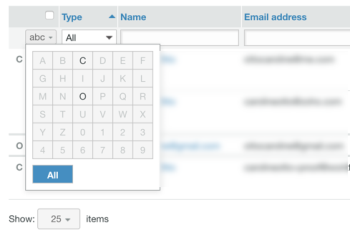

# 在[!DNL Workfront Proof]中管理您的联系人

>[!IMPORTANT]
>
>本文提及独立产品[!DNL Workfront Proof]中的功能。 有关[!DNL Adobe Workfront]内部校对的信息，请参阅[校对](../../../review-and-approve-work/proofing/proofing.md)。

您可以在“联系人”页面上管理您的同事、成员和来宾。

## 打开“联系人”页面

1. 单击左侧导航侧边栏中的&#x200B;**[!UICONTROL 联系人]**。
1. （可选）单击&#x200B;**[!UICONTROL 更改视图]**，然后选择一个选项，以指定您要按联系人还是按公司查看。

## 排序联系人

1. 单击左侧导航侧边栏中的&#x200B;**[!UICONTROL 联系人]**。
1. 单击要作为排序依据的列标题。
或
从“联系人”页面右上角的&#x200B;**[!UICONTROL 排序]**&#x200B;菜单中选择一个选项。

1. 

1. 列标题上的三角形表示排序顺序。 向上指，表示升序；向下指，表示降序。

## 过滤联系人

1. 单击左侧导航侧边栏中的&#x200B;**[!UICONTROL 联系人]**。
1. 单击列标题最右侧的&#x200B;**[!UICONTROL 筛选器]**&#x200B;图标以显示列标题下面的筛选选项。
1. 从下拉菜单中选择[!UICONTROL 筛选选项]，并在每个列标题下方的筛选框中键入相应的内容，然后再次单击&#x200B;**[!UICONTROL 筛选器]**&#x200B;图标以应用这些选项。
1. 

1. 或
1. 选择所需联系人名称中的第一个字母。
1. 

## 管理一个或多个联系人

1. 单击左侧导航侧边栏中的&#x200B;**[!UICONTROL 联系人]**。
1. 选中一个或多个联系人的复选框。
1. 执行以下任一操作：

   * 单击&#x200B;**[!UICONTROL 添加到组]**&#x200B;以将选定的联系人添加到组。

     

   * 单击&#x200B;**[!UICONTROL 删除]**，然后单击下拉菜单中的选项以从验证或组中删除联系人。
   * 单击&#x200B;**[!UICONTROL 更多]** > **[!UICONTROL 发送有关延迟验证的提醒]**，以向所选联系人发送有关任何延迟验证的提醒电子邮件。

   * 单击&#x200B;**[!UICONTROL 更多]** > **[!UICONTROL 将联系人导出到CSV]**，以将选定的联系人导出到CSV文件。

   * 单击&#x200B;**[!UICONTROL 删除联系人]**&#x200B;以从列表中删除选定的联系人。

     
删除联系人并不意味着从您的帐户中删除某个用户；但是，如果管理员或账单管理员从联系人列表中删除某个人，则该人员将从您组织的帐户中完全删除。

   * 单击联系人行末尾的&#x200B;**[!UICONTROL 更多]**&#x200B;图标，然后使用显示的下拉菜单中的任何选项。

     这些选项对于不同类型的联系人是不同的。 有关详细信息，请参阅[了解 [!DNL Workfront Proof]](../../../workfront-proof/wp-mnguserscontacts/contacts/use-members-guests.md)中的用户、成员和来宾。

## 正在导入联系人

您可以从CSV文件导入联系人。

1. 单击左侧导航侧边栏中的&#x200B;**[!UICONTROL 联系人]**。
1. 在“联系人”页面上，单击&#x200B;**[!UICONTROL 更多]** > **[!UICONTROL 导入联系人]**&#x200B;以将联系人添加到列表。

1. 在出现的“导入人员”页面上，单击&#x200B;**[!UICONTROL 选择文件]**。
1. 选择文件中的字段分隔方法。
1. 单击&#x200B;**[!UICONTROL 保存]**。

   * CSV文件必须至少有一列名为“电子邮件”（包含电子邮件地址）。
   * 您还可以包括“姓名”、“公司”、“电话”和“移动设备”的附加列。
   * 您可以使用“名字”和“姓氏”两列，而不是“姓名”列。 如果使用单独的名字和姓氏列，则必须确保不包含“姓名”列。
