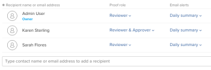

# 将组添加到验证

>[!IMPORTANT]
>
>本文提及独立产品[!DNL Workfront Proof]中的功能。 有关[!DNL Adobe Workfront]内部校对的信息，请参阅[校对](../../../review-and-approve-work/proofing/proofing.md)。

将组添加到验证以自动将内容发送给所有组成员。

有关如何创建组的信息，请参阅[使用 [!DNL Workfront Proof]](../../../workfront-proof/wp-mnguserscontacts/groups/create-proofing-groups.md)创建验证组。

1. 开始使用以下方法之一创建验证：

   * 创建标准校对。

     有关详细信息，请参阅[在 [!DNL Workfront Proof]](../../../workfront-proof/wp-work-proofsfiles/create-proofs-and-files/generate-proofs.md)中生成验证。

   * 创建新校对版本。

     有关更多信息，请参阅。
   * 制作证明的副本。 有关详细信息，请参阅<a href="../../../workfront-proof/wp-work-proofsfiles/create-proofs-and-files/copy-proofs.md" class="MCXref xref">在[!DNL Workfront Proof]</a>中复制校样。

1. 在&#x200B;**[!UICONTROL 工作流]**&#x200B;部分中，开始在&#x200B;**[!UICONTROL 键入联系人姓名或电子邮件地址以添加收件人]**&#x200B;字段。 
1. 选择组名称。
现在将显示组的成员。 
1. （可选）使用下拉菜单更改单个成员的&#x200B;**验证角色**&#x200B;或&#x200B;**电子邮件警报**。
有关详细信息，请参阅<a href="../../../workfront-proof/wp-work-proofsfiles/share-proofs-and-files/manage-proof-roles.md" class="MCXref xref">在[!DNL Workfront Proof]</a>中管理验证角色，以及<a href="../../../workfront-proof/wp-emailsntfctns/email-alerts/config-email-notification-settings-wp.md" class="MCXref xref">在[!DNL Workfront Proof]</a>中配置电子邮件通知设置。
1. （可选）将鼠标悬停在用户信息上并单击&#x200B;**[!UICONTROL X]**，从验证中删除组成员。
或
通过单击&#x200B;**[!UICONTROL 删除所有]**&#x200B;从验证中删除所有成员。
1. 按照<a href="../../../workfront-proof/wp-work-proofsfiles/create-proofs-and-files/generate-proofs.md" class="MCXref xref">在[!DNL Workfront Proof]</a>中生成验证或<a href="../../../workfront-proof/wp-work-proofsfiles/create-proofs-and-files/copy-proofs.md" class="MCXref xref">在[!DNL Workfront Proof]</a>中复制验证中的说明继续创建验证。 
