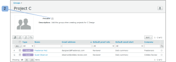

# 使用[!DNL Workfront Proof]将组设为私有

>[!IMPORTANT]
>
>本文提及独立产品[!DNL Workfront Proof]中的功能。 有关[!DNL Adobe Workfront]内部校对的信息，请参阅[校对](../../../review-and-approve-work/proofing/proofing.md)。

将您的组设为私有，意味着只有您才能查看、使用、编辑或删除该组。 如果该组不是专用组，则您帐户中的所有用户都可以查看并使用该组。

## 将新组设置为专用

要将新组设为私有，请执行以下操作：

1. 转到屏幕左侧的&#x200B;**[!UICONTROL 组]**。
1. 设置组时，在[!UICONTROL 新建组]页面上选择&#x200B;**[!UICONTROL 私有]**&#x200B;选项。 (1)

## 将现有组设置为专用

要将现有组设为专用，请执行以下操作：

1. 转到屏幕左侧的&#x200B;**[!UICONTROL 组]**。
1. 在“组详细信息”页面上启用&#x200B;**[!UICONTROL 私有]**&#x200B;选项。 (2)

