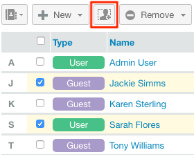

# 使用[!DNL Workfront Proof]管理组

>[!IMPORTANT]
>
>本文提及独立产品[!DNL Workfront Proof]中的功能。 有关[!DNL Adobe Workfront]内部校对的信息，请参阅[校对](../../../review-and-approve-work/proofing/proofing.md)。

作为[!DNL Workfront Proof]管理员，您可以在“组”页面上管理您的公用组和专用组。

## 打开组页面

1. 单击左侧导航侧边栏中的&#x200B;**[!UICONTROL 组]**。
在[!UICONTROL 组]页面上，您可以：

   * 查看您的所有公用和专用组。
   * 创建新组。 有关详细信息，请参阅[使用 [!DNL Workfront Proof]](../../../workfront-proof/wp-mnguserscontacts/groups/create-proofing-groups.md)创建验证组。
   * 将组导出到CSV文件。
   * 对组进行筛选和排序。
   * 选择一个或多个组后，可以使用以下附加选项：

      * 将人员添加到选定组。

        

      * 按照[使用 [!DNL Workfront Proof]](../../../workfront-proof/wp-mnguserscontacts/groups/make-groups-private.md)将组设为私有中的说明，将选定的组设为私有或公用
      * 专用组仅对其创建者可见。
      * 删除选定的组。

        
   * 您也可以在每个组上对其各自的&#x200B;**[!UICONTROL 更多]**（三个点）菜单分别执行操作：

     

      * 查看组详细信息。

        您还可以通过单击组名称来查看组详细信息。
      * 添加人员。
      * 将组设为公用/专用。
      * 删除组。

## 对组进行排序

您可以按组名称、隐私状态和描述对组进行排序。

1. 单击要作为排序依据的列标题。
或
从排序菜单中选择排序选项。
   
列标题上的三角形表示排序顺序。 向上指，表示升序；向下指，表示降序。

## 筛选组

1. 单击列标题最右侧的&#x200B;**[!UICONTROL 筛选器]**图标以显示列标题下面的筛选选项。
   

1. 从下拉菜单中选择[!UICONTROL 筛选选项]，并在每个列标题下方的筛选框中键入相应的内容，然后再次单击&#x200B;**[!UICONTROL 筛选器]**图标以应用这些选项。
或\
   选择组名称中的第一个字母。
   

## 查看和编辑组详细信息

1. 单击群组名称最右侧的&#x200B;**[!UICONTROL 更多]**&#x200B;按钮，然后在下拉菜单中单击&#x200B;**[!UICONTROL 查看群组详细信息]**。
在显示的页面上，可以查看当前组中的所有人员，以及他们的默认角色和组的电子邮件警报。

1. 执行以下任一操作，编辑组详细信息：

   * 通过单击并键入组名来编辑组名称和说明。 单击字段之外的任意位置可保存更改。
   * 单击&#x200B;**[!UICONTROL 隐私]**&#x200B;在下拉菜单中更改群组隐私设置。
   * 单击&#x200B;**[!UICONTROL 添加到组]**&#x200B;以将新人员添加到组。

     

   * 单击右上角的&#x200B;**[!UICONTROL 删除组]**&#x200B;以删除该组。\

     

   * 单击组成员行开头的复选框，然后使用出现在列表正上方的任何选项。
   * 单击组成员行末尾的&#x200B;**[!UICONTROL 更多]**&#x200B;图标，然后使用下拉菜单中的任何选项。

     

## 将联系人添加到组

1. 单击左侧导航面板中的&#x200B;**[!UICONTROL 联系人]**&#x200B;以转到&#x200B;**[!UICONTROL 联系人]**&#x200B;页面。

1. 选中要添加到组中的联系人姓名旁边的复选框。
1. 单击&#x200B;**[!UICONTROL 添加到组]**按钮。
   
出现**[!UICONTROL 添加到组]**&#x200B;对话框。

1. 在&#x200B;**[!UICONTROL 人员]**&#x200B;分区中：

   1. 使用下拉菜单更改成员的&#x200B;**角色**&#x200B;或&#x200B;**电子邮件警报**。 有关详细信息，请参阅[在 [!DNL Workfront Proof]](../../../workfront-proof/wp-work-proofsfiles/share-proofs-and-files/manage-proof-roles.md)中管理验证角色，以及[在 [!DNL Workfront Proof]](../../../workfront-proof/wp-emailsntfctns/email-alerts/config-email-notification-settings-wp.md)中配置电子邮件通知设置。

   1. 使用&#x200B;**[!UICONTROL 输入联系人姓名]**&#x200B;或&#x200B;**[!UICONTROL 电子邮件地址]**&#x200B;字段向组添加其他联系人。

1. 在&#x200B;**[!UICONTROL 组]**&#x200B;部分中，选择要将联系人添加到的组。
1. 单击&#x200B;**[!UICONTROL 添加到组]**。
