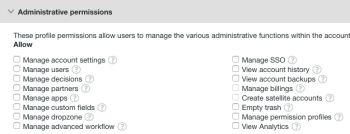

# 使用创建和管理自定义用户档案 [!DNL Workfront Proof]

>[!IMPORTANT]
>
>本文介绍独立产品中的功能 [!DNL Workfront Proof]. 有关内部校对的信息 [!DNL Adobe Workfront]，请参阅 [校对](../../../review-and-approve-work/proofing/proofing.md).

账单管理员和管理员可以创建和管理自定义用户档案，以指定用户在贵组织的帐户和帐户设置中可以执行的操作。

此功能仅在Premium帐户上可用。

## 模块权限 {#module-permissions}

模块权限允许您决定您希望用户对其自己的项目以及帐户中其他用户拥有的项目拥有的访问权限。

“基本访问”部分确定用户能否读取、创建、编辑和删除帐户中他们自己的项目。

的 [!UICONTROL 数据管理] 部分确定用户拥有的权限项目由帐户中的其他用户拥有。

这两个部分都允许您授予帐户中以下项目的权限：

* 校样有关更多信息，请参阅 [在中生成校样 [!DNL Workfront Proof]](../../../workfront-proof/wp-work-proofsfiles/create-proofs-and-files/generate-proofs.md).

* 文件有关详细信息，请参阅 [将文件和Web内容上传到 [!DNL Workfront Proof]](../../../workfront-proof/wp-work-proofsfiles/create-proofs-and-files/upload-files-web-content.md).

* 公用文件夹有关详细信息，请参阅 [了解 [!DNL Workfront Proof]](../../../workfront-proof/wp-work-proofsfiles/organize-your-work/folder-permissions.md).

* 专用文件夹有关详细信息，请参阅 [了解 [!DNL Workfront Proof]](../../../workfront-proof/wp-work-proofsfiles/organize-your-work/folder-permissions.md).

* 联系人有关详细信息，请参阅 [联系人](https://support.workfront.com/hc/en-us/sections/115000920808-Contacts).

* 群组有关更多信息，请参阅 [群组](https://support.workfront.com/hc/en-us/sections/115000920828-Groups).

* 标记有关更多信息，请参阅 [在中创建和管理标记 [!DNL Workfront Proof]](../../../workfront-proof/wp-work-proofsfiles/organize-your-work/create-and-manage-tags.md).

* 自定义视图有关更多信息，请参阅 [在中创建和管理自定义视图 [!DNL Workfront Proof]](../../../workfront-proof/wp-work-proofsfiles/manage-your-work/create-and-manage-custom-views.md).

## 管理权限 {#administrative-permissions}

在此部分中，您可以向用户授予管理权限。 某些权限链接，如果选择该链接，则会自动启用执行任务所需的其他权限。 例如，允许用户管理权限配置文件会自动启用对帐户中用户的管理。

您可以授予以下权限：

* 管理帐户设置有关信息，请参阅 [帐户设置](https://support.workfront.com/hc/en-us/sections/115000912147-Account-settings).

* 管理用户以了解信息，请参阅 [用户](https://support.workfront.com/hc/en-us/sections/115000911887-Users).

* 管理决策有关信息，请参阅 [在校对查看器中对校样做出决策](../../../review-and-approve-work/proofing/reviewing-proofs-within-workfront/make-a-decision-on-a-proof/make-decisions-on-proof.md).

* 管理合作伙伴有关信息，请参阅 [合作伙伴](https://support.workfront.com/hc/en-us/sections/115000912107-Partner-accounts).

* 管理应用程序有关信息，请参阅 [集成](https://support.workfront.com/hc/en-us/categories/115000588707-Integrations).

* 管理自定义字段有关信息，请参阅 [在中创建和管理自定义字段 [!DNL Workfront Proof]](../../../workfront-proof/wp-acct-admin/account-settings/create-and-manage-custom-fields.md).

* 管理拖放区有关信息，请参阅 [拖放区](../../../workfront-proof/wp-work-proofsfiles/create-proofs-and-files/dropzone.md).

* 管理高级工作流有关信息，请参阅 [自动化工作流概述](../../../review-and-approve-work/proofing/proofing-overview/automated-workflow.md).

* 管理单点登录有关信息，请参阅 [单点登录 [!DNL Workfront Proof]](../../../workfront-proof/wp-acct-admin/managing-security/single-sign-on-overview.md).

* 查看帐户历史记录有关信息，请参阅 [了解 [!DNL Workfront Proof] 活动审核跟踪](../../../workfront-proof/wp-work-proofsfiles/basic-features/activity-audit-trail.md).

* 查看帐户备份有关信息，请参阅 [备份您的 [!DNL Workfront Proof] 数据](../../../workfront-proof/wp-work-proofsfiles/organize-your-work/back-up-data.md).

* 管理账单有关信息，请参阅 [管理您的账单](https://support.workfront.com/hc/en-us/sections/115000912187-Managing-your-billing).

* 创建卫星帐户有关信息，请参阅 [在中配置卫星帐户 [!DNL Workfront Proof]](../../../workfront-proof/wp-acct-admin/satellite-accounts/configure-sat-acct-in-wp.md).

* 空垃圾桶有关信息，请参阅 [在中还原和清空垃圾桶 [!DNL Workfront Proof]](../../../workfront-proof/wp-work-proofsfiles/manage-your-work/restore-and-empty-trash.md).

* 管理权限配置文件有关信息，请参阅 [中的校样权限配置文件 [!DNL Workfront Proof]](../../../workfront-proof/wp-acct-admin/account-settings/proof-perm-profiles-in-wp.md).

* 查看分析

## 创建新的自定义用户档案

1. 导航到 **[!UICONTROL 帐户设置]**，然后单击 **[!UICONTROL 用户档案]** 选项卡。

1. 单击 **[!UICONTROL 创建新用户档案]**.

1. 在 **[!UICONTROL 配置文件详细信息]** 部分：

   1. 在 **[!UICONTROL 名称]** 字段中，指定自定义用户档案的名称。
   1. 选择 **[!UICONTROL 启用配置文件]**. 

1. 在 **[!UICONTROL 模块权限]** 部分：

   1. 选择的权限 **基本访问**.
   1. **数据管理**. 有关更多信息，请参阅 [模块权限](#module-permissions)

1. 在 **[!UICONTROL 管理权限]** 选择管理功能的权限。

   有关更多信息，请参阅 [管理权限](#administrative-permissions).

1. 单击&#x200B;**[!UICONTROL 创建]**。新用户档案现已在 **[!UICONTROL 用户]** 选项卡。

1. （可选）将新配置文件分配给新用户帐户和现有用户帐户。
有关更多信息，请参阅 [中的校样权限配置文件 [!DNL Workfront Proof]](../../../workfront-proof/wp-acct-admin/account-settings/proof-perm-profiles-in-wp.md).

## 启用和禁用用户档案 {#enabling-and-disabling-a-profile}

1. 导航到 **[!UICONTROL 帐户设置]**，然后单击 **[!UICONTROL 用户档案]** 选项卡。

1. 选择要启用或禁用的配置文件。
或者要同时启用或禁用多个配置文件，请手动选择配置文件，或选择 **[!UICONTROL 名称]** 来选择所有自定义用户档案。
   

1. 单击 **[!UICONTROL 更多]** 下拉菜单中，然后单击以下任一选项，具体取决于您是要启用还是禁用配置文件：

   * **启用用户档案：** 该用户档案会在 [!DNL Workfront Proof] 菜单。
   * **禁用用户档案：** 随即会出现确认框。 选择 **[!UICONTROL 是]** 确认。 该配置文件将变为不活动状态，并从 [!DNL Workfront Proof] 菜单。

      >[!NOTE]
      >
      >无法再将禁用的配置文件分配给帐户中的用户。 如果帐户中存在具有该配置文件的用户，请在禁用该配置文件之前为他们选择其他配置文件。

      

## 复制配置文件

创建现有配置文件的副本以设置具有相似权限的多个配置文件。

1. 导航到 **[!UICONTROL 帐户设置]**，然后单击 **[!UICONTROL 用户档案]** 选项卡。

1. 单击配置文件的名称，然后单击 **[!UICONTROL 复制配置文件]** 按钮。

   

   现在，复制的用户档案会显示在用户档案列表上。 其原始用户档案名称前面带有“Copy”字样。

   

1. （可选）要启用复制的配置文件，请参阅 [启用和禁用用户档案](#enabling-and-disabling-a-profile).
1. （可选）要对复制的配置文件进行编辑，请参阅 [编辑配置文件](#editing-a-profile).

## 编辑配置文件 {#editing-a-profile}

如果您编辑配置文件，则更新将应用于当前分配此配置文件的所有用户。

1. 导航到 **[!UICONTROL 帐户设置]**，然后单击 **[!UICONTROL 用户档案]** 选项卡。

1. 单击要编辑的配置文件名称。
1. 对配置文件的名称或权限进行任何所需的更改。 这些更改会自动保存和更新。
有关权限的更多信息，请参阅 [模块权限](#module-permissions) 和 [管理权限](#administrative-permissions).

>[!NOTE]
>
>默认 [!DNL Workfront Proof] 用户档案在用户档案列表中可见，但无法修改。

## 删除用户档案

1. 导航到 **[!UICONTROL 帐户设置]**，然后单击 **[!UICONTROL 用户档案]** 选项卡。

1. 选择要删除的一个或多个配置文件。
1. 单击 **[!UICONTROL 垃圾]** 图标。

   

1. 单击 **[!UICONTROL 是]** 在 **[!UICONTROL 确认对话框]** 框中。

1. 如果已将配置文件分配给用户，请使用对话框中的下拉菜单选择要分配给此用户的其他配置文件。 单击 **[!UICONTROL 是]** 确认。

   

>[!NOTE]
>
>无法从帐户删除标准用户档案。 如果您不想在帐户中使用标准用户档案，则可以禁用这些用户档案。

有关禁用用户档案的更多信息，请参阅 [启用和禁用用户档案](#enabling-and-disabling-a-profile).
