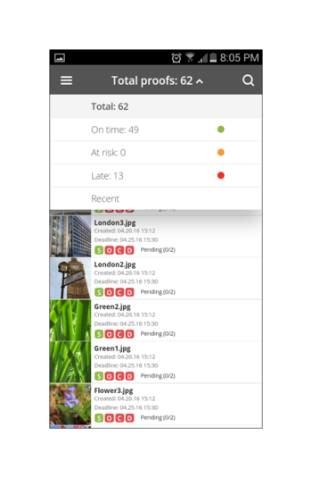

# Workfront Proof移动应用程序

>[!IMPORTANT]
>
>本文介绍独立产品中的功能 [!DNL Workfront Proof]. 有关内部校对的信息 [!DNL Adobe Workfront]，请参阅 [校对](../../../review-and-approve-work/proofing/proofing.md).

下载 [!DNL Workfront Proof] Apple App Store或Google应用商店中的应用程序，以便无论您身在何处都能高效工作。 的 [!DNL Workfront Proof] 应用程序在iPhone和iPod Touch上具有以下功能：

* 查看、审阅和批准静态校样和音频可视校样
* 查看、添加和回复评论
* 通过功能板和视图管理校样

您无需是 [!DNL Workfront Proof] （即，拥有您自己的登录凭据）通过iOS应用程序审核和批准校样。 只要您将应用程序下载到iOS设备并通过iOS电子邮件应用程序访问您的个人URL，那么您便可以在移动中查看和批准。

## 设备要求

需要iOS 7.0或更高版本。 Android 4.0及更高版本。 与iPhone、iPad和iPod touch兼容。

## 下载并安装应用程序

>[!IMPORTANT]
>
>不再支持Workfront Proof移动应用程序，该应用程序可按原样使用。  应用程序中的任何问题将无法修复。

下载我们的 [!DNL Workfront Proof] 直接从 [AppleApp Store](https://itunes.apple.com/us/app/workfront-proof/id1030372728?mt=8) 或 [Google Play商店](https://play.google.com/store/apps/details?id=com.proofhq.tabletapp).

对于iOS设备，请确保卸载之前的 [!DNL Workfront Proof] 应用程序，然后再安装新应用程序。

的 [!DNL Workfront Proof] 应用程序会自动检测您使用的设备类型。 如果要在平板电脑上使用该应用程序，请参阅 [[!DNL Workfront Proof] 适用于平板电脑的移动设备应用程序](../../../workfront-proof/wp-mobile/wp-mobile-apps/wp-mobile-app-tablet.md).

>[!NOTE]
>
>由于移动设备的软件限制，无法查看iOS设备上的SWF文件或音频文件（如MP3）。 如果您想要查看从移动设备上的SWF文件或音频文件创建的校样，请先将其转换为支持的格式，然后再上传到 [!DNL Workfront Proof].

## 应用程序入门

你不必是 [!DNL Workfront Proof] 用户来开始使用应用程序。 只需在设备上安装应用程序，然后单击 **[!UICONTROL 转到校样]** 链接。 应用程序会自动启动并加载校样。

如果您是 [!DNL Workfront Proof] 用户，您可以在打开任何校样之前登录到应用程序。 该应用程序允许您浏览与您共享的所有校样，并轻松在它们之间切换。

1. 打开应用程序。
1. 输入电子邮件和密码，然后点按 **[!UICONTROL 登录]**.

   或

   如果已在 [!DNL Workfront Proof] 帐户。

   您可以使用 **[!UICONTROL 忘记密码]** 选项。

## 功能板

登录后 [!DNL Workfront Proof] 帐户时，将显示功能板。 您可以在此处轻松访问校样。 您可以打开其中一个可用视图、我的校样和所有校样。 或者，您也可以点按某个最近校样的名称，以直接转到校样查看器。

默认情况下，功能板将打开“总校样”视图。 此视图显示您是所有者或与您共享的所有校样。 您可以通过点按页面顶部的栏来更改视图，以打开包含 [!UICONTROL 准时], [!UICONTROL 面临风险], [!UICONTROL 延迟] 和 [!UICONTROL 最近] 选项。 要从任何视图打开校样，请向下滚动列表以查找所需的校样，然后点按其名称以转到校样查看器。

| **按时查看** | 显示您帐户中拥有查看权限且没有截止时间或截止时间超过24小时的所有活动校样。 |
|---|---|
| **风险视图** | 显示截止时间小于24小时的所有校样。 |
| **延迟查看** | 列出并非所有操作都已完成且已违反期限的所有验证。 |
| **近期视图** | 包括您最近访问过且您拥有的校样，这些校样具有根据用户档案权限查看结果的权限，以及与您共享的校样。 此视图仅显示您自己已打开的校样(通过 [!DNL Workfront Proof] 查看器或通过校样详细信息页面)。 |
| **电子邮件链接** | 要从电子邮件中打开校样，只需在电子邮件应用程序中打开该电子邮件，然后单击 [!UICONTROL 转到校样] 按钮链接，此时您将转到 [!DNL Workfront Proof] 应用程序。 |

{style=&quot;table-layout:auto&quot;}

## 在应用程序中查看静态校样

在移动设备应用程序中打开校样时，您可以执行以下操作：

* 阅读并回复其他审阅人留下的评论（1 — 图标中显示的数字表示校样上留下的评论数，如果校样上没有留下任何评论，则此按钮将显示0并呈灰显状态）。
* 添加注释和标记(2)。
* 评论和决策按钮的可见性取决于您的校样角色。
* 作出决定(3)。
* 转到菜单(4)。
* 通过捏住屏幕来缩放校样。
   

## 添加评论和回复

1. 打开校样后，点按 **[!UICONTROL 添加注释]** 按钮(1)。

   

1. 键入您的评论(2)。

   

1. 单击&#x200B;**[!UICONTROL 保存]**。

## 阅读和回复评论

1. 打开校样，然后点按右上角的标注图标以查看注释列表(1)，并选择要查看的注释。
1. 点按此固定图标以打开与其关联的评论(2)。

   

1. 执行以下任一操作：

   * 要回复评论，请点按 **[!UICONTROL 回复]** 按钮(3)。
   * 要返回校样图像，请点按 [!UICONTROL 标注] 图标。
   * 要查看完整评论及其回复，请点按评论本身。

      

   * 要对评论应用操作，请执行以下操作：

      1. 打开评论。
      1. 点按 **[!UICONTROL 回复]**.
      1. 打开 [!UICONTROL 操作] 菜单。
      1. 点按 **[!UICONTROL 添加操作]** (2)。

         

         有关操作的更多信息，请参阅 [对校样注释使用操作](../../../review-and-approve-work/proofing/reviewing-proofs-within-workfront/comment-on-a-proof/use-actions-on-comments-in-viewer.md).

## 添加标记

您可以添加标记（例如加亮校样上某个区域的框）并键入附加到标记的注释。 您还可以在不添加标记的情况下进行注释。 您可以向单个评论添加多个标记。

1. 在您打开的校样上，点按 **添加注释** (1)。

   

1. 在 [!UICONTROL 平移模式] (2), [!UICONTROL 矩形工具] (3)、 [!UICONTROL 手绘] （四）、 [!UICONTROL 箭头] 工具(5)。

   您还可以更改标记(6)的线条颜色。

1. 要在校样上绘制标记，请触摸屏幕，然后将手指移过校样。

   您无需添加文本即可保存标记(7)。

1. 点按 **[!UICONTROL 取消]** (8)要放弃标记的。

   

   在校样上标记区域会自动打开注释字段。 您可以通过点按标记形状(9)旁边的叉来删除创建的标记。

   

## 根据证据做出决定

1. 在校样查看器中打开校样，然后点按 [!UICONTROL 决策] 按钮(1)。

   

1. 点按要提交的决定(2)。
1. 点按 **[!UICONTROL 保存]** 提交您的决定。

   

   >[!NOTE]
   >
   >* 如果在创建校样的帐户上设置了决策弹出消息，则当对校样做出决策时，该消息也会显示在iOS应用程序中。
   >* 如果设置决策原因，则将在 [!UICONTROL 提交您的决定] 屏幕。

   如果您已经提交了决策，并且想要更改或删除它，则可以轻松地执行此操作。 在做出决定后， **[!UICONTROL 删除我的决定]** (6)，出现在 [!UICONTROL 提交您的决定] 屏幕。

   

## 查看应用程序中的音频或视频校样

在iOS应用程序中查看音频 — 视频校样与查看静态文件一样简单：

1. 点按 [!UICONTROL play/pause] 按钮来播放或暂停视频(1)。
1. 要导航视频，请点按 [!UICONTROL 导航] 栏(2)。
1. 要留出评论，请点按 **[!UICONTROL 注释]** 按钮(3)，然后按照上述说明操作。

   校样上留下的任何注释或标记将在导航栏(4)上用针脚进行标记。

1. 如果要查看校样上剩余的注释，请点按 **[!UICONTROL 评论]** 按钮(5)，然后按照上述说明操作。
1. 要作出决定，请点按 **[!UICONTROL 决策]** 按钮(6)，然后按照上述说明操作。

   
