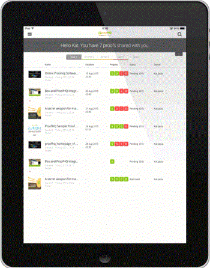

# 适用于平板电脑的[!DNL Workfront Proof]移动应用

>[!IMPORTANT]
>
>本文提及独立产品[!DNL Workfront Proof]中的功能。 有关[!DNL Adobe Workfront]内部校对的信息，请参阅[校对](../../../review-and-approve-work/proofing/proofing.md)。

[!DNL Workfront Proof]平板电脑应用可让您在旅途中方便地查看和批准验证。 该应用可供所有人下载，您不必是[!DNL Workfront Proof]用户，就可以在平板电脑或手机上查看校样。

来宾只需在收到的电子邮件通知中单击[!UICONTROL 前往验证]按钮，即可在应用程序中打开验证。

[!DNL Workfront Proof]用户可以登录应用程序并使用仪表板方便地管理他们的工作。

## 设备要求

* iOS设备：iPad 3、iPad air、iPad mini
* Android设备：Android操作系统4.4+、5+版；Samsung Galaxy Tab 3+ （10.1英寸）

这是专门为平板电脑构建的应用程序。 如果您想在iPhone上使用[!DNL Workfront Proof]，请从iTunes应用商店下载iOS应用程序。

## 下载应用程序

>[!IMPORTANT]
>
>Workfront Proof移动设备应用程序不再受支持，现在即可使用。  将不会修复应用程序中的任何问题。

[!DNL Workfront Proof]平板电脑应用程序在Apple App Store和Google Play Store中可用。

1. 单击以下链接以下载应用程序并将其安装在您的设备上。

   

   

## 登录

[!DNL Workfront Proof]平板电脑应用允许您访问包含需要注意的验证的仪表板。 要访问仪表板，请执行以下操作：

1. 执行下列操作之一：

   * 使用您的[!DNL Workfront Proof]凭据登录。

     如果您收到验证邀请电子邮件并在移动设备上打开，则该链接会将您转到应用程序中的验证。 您不必是用户才能查看验证；但是，您必须在设备上安装应用程序才能查看它们。

   * 如果您的帐户中启用了单点登录，请点按登录屏幕上的选项。

     系统会将您转到登录页面，向您询问您的电子邮件地址。 键入您的电子邮件地址后，您将被重定向到身份提供者的页面，在该页面中，您将能够使用密码登录。

     

## 仪表板

如果您希望保持登录到您的[!DNL Workfront Proof]帐户：

1. 在&#x200B;**[!UICONTROL 设置]**&#x200B;下的侧栏菜单中启用&#x200B;**[!UICONTROL 保持我登录]**：

*[!UICONTROL 仪表板]*&#x200B;链接会将您从应用程序中的任何视图返回到仪表板。 也可以使用它来重新加载仪表板。

仪表板的其他元素是搜索栏，允许您按验证名称和不同的视图搜索帐户，以帮助您有效管理工作负载。

## 使用仪表板视图管理工作负载

与我们Web应用程序中的仪表板图表类似，在移动设备应用程序中，我们会显示与您共享的验证列表。 页面顶部的欢迎消息将为您提供校样总数，我们会将其划分为以下部分： *准时*、*有风险*&#x200B;和&#x200B;*迟到校样*。

* **准时验证**&#x200B;是未设置截止日期或截止日期已超过24小时的验证。
* **存在风险的校样**&#x200B;是截止日期在未来24小时内的校样 — 这些校样的进度条为橙色。
* **延迟验证**&#x200B;是已超过截止日期的验证 — 这些验证的进度条为红色。 在到达截止日期[!DNL Workfront Proof]时，向迟到的决策者和验证所有者发送一封自动提醒电子邮件。

这些校样将分组到单独的视图中，以便您从已超过截止时间的校样开始方便地确定工作的优先级。

您可能会觉得有用的另一个视图是“最近”视图 — 它显示您最近在该应用程序中访问的验证，因此，如果您希望再次查看同一验证，则可以轻松地在该列表中找到它。

## 在应用程序中查看验证

1. 单击校样名称以在[!DNL Workfront Proof]查看器中打开。

   或

   要从电子邮件通知中打开校对，查看者可以单击通知中的&#x200B;**[!UICONTROL 转到校对]**链接。
如果您拥有[!DNL Workfront Proof]帐户，则可以登录并从仪表板访问您的验证。

   >[!NOTE]
   >
   >您必须在设备上安装应用才能在[!DNL Workfront Proof]中查看验证，即使您没有[!DNL Workfront Proof]帐户。

   当您首次打开验证时，我们将向您显示一个导览，帮助您开始查看应用程序中的验证。

   

1. 在验证中导航：

   * 要跳转到验证的特定页面，请横向滑动或使用[!UICONTROL 缩略图]列表。

     您还可以使用页面底部的箭头，或输入特定的页码。

   * 要转到验证的其他版本，请使用页面顶部的版本下拉菜单。
   * 若要放大，请捏住屏幕。
   * 要平移，请按住并移动图像，直到找到正确的位置。

     在移动应用程序中审阅验证就像使用[!DNL Workfront Proof]查看器审阅验证一样简单。 在下面，我们将更仔细地研究添加评论和加价、管理反馈和制定决策。 我们还将讨论应用程序侧边栏中提供的不同选项。

## 应用程序中的评论

以下视频向您介绍了在移动设备应用程序中发表评论的基础知识。 它显示了如何创建注释、如何发布注释的回复、如何使用不同的标记和删除注释，以及如何编辑和删除注释。

只有未发布回复时，您才可以编辑和删除评论。 如果您没有看到[!UICONTROL 垃圾桶]图标，则可能是因为您的[!DNL Workfront Proof]管理员已禁用此选项。

应用程序中有三个评论查看选项。 您可以通过单击注释按钮在它们之间切换。

* **[!UICONTROL 列表视图]**&#x200B;显示所有评论的列表。 您可以通过点按每个注释或点按向上和向下箭头来浏览它们。
* **[!UICONTROL 单个注释视图]**&#x200B;一次显示一个注释。 要转到下一个评论，请点按页面顶部的箭头。
* **[!UICONTROL 隐藏评论视图]**&#x200B;隐藏所有评论。

验证上剩余的每个标记都会在图像上放置一个图钉。 要查看与大头针关联的注释和标记，只需点击大头针即可。 仅当注释编辑框关闭时，才能执行此操作。 要关闭评论框，请点击该框左上角的[!UICONTROL x]。

## 文本批注工具

旅途中的校对文本实际上是在[!DNL Workfront Proof]平板电脑应用程序中。 单击橙色&#x200B;**[!UICONTROL 添加评论]**&#x200B;按钮后，标记工具栏中会显示文本批注工具。

1. 选择工具，然后点按要高亮显示的单词。
1. 在单词上按住手指，直到突出显示变为可用，并使用滑块突出显示要标记的整个单词或短语。

   文本工具有四个选项可供选择：

   | **[!UICONTROL 突出显示]** | 突出显示文本并将其复制到注释框中。 |
   |---|---|
   | **[!UICONTROL 替换]** | 将[[!UICONTROL REPLACE]]和[[!UICONTROL WITH]]与文本一起添加到评论框中，使您更易于推荐替换文本。 |
   | **[!UICONTROL 删除]** | 删除文本并将[DELETE]添加到评论框。 |
   | **[!UICONTROL 插入到]**&#x200B;之后 | 将[INSERT AFTER]添加到评论框中。 |

   {style="table-layout:auto"}

1. （可选）要粘贴您保存在平板电脑上的另一文档中的文本，请点按并按住手指放在注释框上，直到看到粘贴文档中所复制文本的选项为止。

## 在移动设备应用程序中管理评论

在每个人都在验证上留下评论和标记后，验证管理员通常需要查看反馈并决定哪些更改应应用于验证的下一个版本。 在[!DNL Workfront Proof]中，您可以使用评论上的操作来标记每个单独的评论，并标记应该操作的评论。

评论操作需要由[!DNL Workfront Proof]管理员在您的帐户中进行设置，并且只能由具有编辑权限的用户用于验证。

当您正在准备下一版本的验证时，可以随时查看注释。 注释被标记为已解决，带有绿色复选标记。 如果需要重新打开注释，可单击注释框底部的箭头。

如果要阻止其他审阅人响应注释线程，可以将其锁定。 要执行此操作，您需要具有对验证的编辑权限。 锁定评论会话非常简单，您只需点按评论框底部的挂锁图标即可。

## 审查视频校样

使用[!DNL Workfront Proof]平板电脑应用程序可以轻松在旅途中查看视频。 以下视频介绍如何在应用程序中发表评论、标记和决策。

## 比较模式

借助平板电脑应用程序中的比较模式，您可以轻松比较同一文件夹中的两个不同版本的验证或两个验证。

>[!NOTE]
>
>由于iOS的限制，在iPad上无法比较两个视频。 它可以在配备Android操作系统的平板电脑上使用。

比较模式位于屏幕的右上角。

比较工具显示校对的两个最新版本。

1. 要更改要比较的版本，请使用页面顶部的版本下拉列表。
1. 要从同一文件夹中选择其他校对，请使用文件夹浏览器（页面顶部可用的文件夹图标）。

   
   
利用比较工具，可并排比较各个版本，以检查是否进行了请求的更改。 如果解锁导航，您将能够比较两个版本的不同页面。

   

   现在，您可以比较正在查看的验证的不同页面。 您还可以比较同一验证的不同页面，这在检查验证消息和品牌一致性时很有用。

   

## 在应用程序中制定决策

1. 点按页面顶部的绿色决策按钮。

   

   如果您没有看到绿色的&#x200B;**[!UICONTROL 完成审阅]**&#x200B;按钮，并且您认为您应该对校样做出决定，则您的[!DNL Workfront Proof]管理员可以更新您的校样角色，如[在 [!DNL Workfront Proof]](../../../workfront-proof/wp-work-proofsfiles/share-proofs-and-files/manage-proof-roles.md)中管理校样角色中所述。

## 验证查看器侧栏

该侧边栏具有许多有用的特性和功能。 根据您对验证的权限，您可能不会看到所有这些内容。 下面将更详细地讨论所有这些术语。

| 仪表板 | 使您返回移动设备应用程序仪表板。 |
|---|---|
| **[!UICONTROL 工作流]** | 显示审核阶段的详细信息，以及审核者列表、截止日期、进度条、决策以及评论和回复的数量。 |
| **[!UICONTROL 详细信息]** | 显示有关校样、其他共享选项和活动审核记录的信息。 |
| **[!UICONTROL 共享]** | 显示校对URL和嵌入代码。 |
| **[!UICONTROL 通知]** | 允许您更新有关当前审阅的验证的电子邮件通知。 这不会更改您的默认设置。 |
| **[!UICONTROL 锁定]** | 可让您锁定校样。 您需要对验证具有编辑权限才能查看此选项。 |
| **[!UICONTROL 删除]** | 将验证移至垃圾桶文件夹。 您需要对验证具有编辑权限才能将其删除。 |
| **[!UICONTROL 设置]** | 您可以决定在校样上显示pin和/或标记，还可以启用[!UICONTROL 让我保持登录]以防止您从应用程序注销。 |
| **[!UICONTROL 帮助]** | 允许您再次显示应用程序导览。 |
| **[!UICONTROL 注销]** | 将您从应用程序和帐户注销。 |
