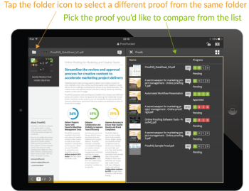
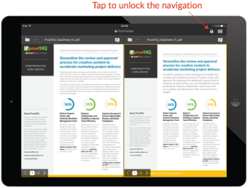

# [!DNL Workfront Proof] 适用于平板电脑的移动设备应用程序

>[!IMPORTANT]
>
>本文介绍独立产品中的功能 [!DNL Workfront Proof]. 有关内部校对的信息 [!DNL Adobe Workfront]，请参阅 [校对](../../../review-and-approve-work/proofing/proofing.md).

的 [!DNL Workfront Proof] 平板电脑应用程序可让您在移动中方便地查看和批准校样。 该应用程序可供所有人下载，您不必是 [!DNL Workfront Proof] 用户可在平板电脑或手机上查看校样。

客人只需单击 [!UICONTROL 转到校样] 按钮，以在应用程序中打开校样。

[!DNL Workfront Proof] 用户可以登录应用程序并使用功能板方便地管理其工作。

## 设备要求

* iOS设备：iPad 3、iPad航空、iPad迷你
* Android设备：Android操作系统版本4.4+、5+;Samsung Galaxy Tab 3+（10.1英寸）

这是专为平板电脑构建的应用程序。 如果您想使用 [!DNL Workfront Proof] 在您的iPhone上，从iTunes Store下载iOS应用程序。

## 下载应用程序

>[!IMPORTANT]
>
>不再支持Workfront Proof移动应用程序，该应用程序可按原样使用。  应用程序中的任何问题将无法修复。

的 [!DNL Workfront Proof] Apple App Store和Google Play应用商店中提供了平板电脑应用程序。

1. 单击以下链接以下载应用程序并将其安装在您的设备上。

   

   

## 登录

的 [!DNL Workfront Proof] 通过平板电脑应用程序，可访问需要您注意的校样功能板。 要访问功能板，请执行以下操作：

1. 执行下列操作之一：

   * 使用 [!DNL Workfront Proof] 凭据。

      如果您收到校样邀请电子邮件，并在移动设备上打开，则该链接会将您转到应用程序中的校样。 您不必是用户，即可查看校样；但是，您必须在设备上安装应用程序才能查看它们。

   * 如果您的帐户中已启用单点登录，请点按登录屏幕上的该选项。

      您将转到登录页面，该页面将要求您提供电子邮件地址。 键入您的电子邮件地址后，您将被重定向到身份提供者的页面，在该页面中，您将能够使用密码登录。

      

## 功能板

如果您希望保持登录状态，请 [!DNL Workfront Proof] 帐户：

1. 启用 **[!UICONTROL 保持我登录]** 在侧栏菜单的 **[!UICONTROL 设置]**:

的 *[!UICONTROL 功能板]* 链接会将您从应用程序中的任意视图返回到功能板。 您还可以使用它重新加载功能板。

功能板的其他元素是搜索栏，它允许您按校样名称和不同视图搜索帐户，从而帮助您有效管理工作量。

## 使用功能板视图管理您的工作负载

与我们Web应用程序中的功能板图表类似，在移动应用程序中，我们显示与您共享的校样列表。 页面顶部的欢迎消息将为您提供下面分为的校样总数 *准时*, *面临风险*&#x200B;和 *延迟校样*.

* **按时间校样** 是没有设置截止时间或截止时间超过24小时的证明。
* **风险证据** 是指截止时间在未来24小时内的校样 — 这些校样的进度条为橙色。
* **延迟校样** 是已超过截止日期的校样 — 这些校样的进度条为红色。 到期后 [!DNL Workfront Proof] 向已故决策者和校样所有者发送自动提醒电子邮件。

这些校样被分组为不同的视图，从已经过最后期限的校样开始，您可以方便地排定工作的优先级。

您可能发现有用的另一个视图是“最近”视图 — 该视图会显示您最近在应用程序中访问的校样，因此，如果您希望再次看到相同的校样，则可以轻松地在该列表上找到它。

## 应用程序中的审阅校样

1. 单击校样的名称以在 [!DNL Workfront Proof] 查看者。

   或

   要通过电子邮件通知打开校样，审阅人可以单击 **[!UICONTROL 转到校样]** 链接。
如果您有 [!DNL Workfront Proof] 帐户，您可以登录并从功能板访问校样。

   >[!NOTE]
   >
   >您必须在设备上安装应用程序才能在 [!DNL Workfront Proof]，即使您没有 [!DNL Workfront Proof] 帐户。

   当您首次打开校样时，我们将向您显示一个教程，帮助您开始在应用程序中查看校样。

   

1. 在校样中导航：

   * 要跳转到校样的特定页面，请横向轻扫或使用 [!UICONTROL 缩略图] 列表。

      您还可以使用页面底部的箭头或输入特定的页码。

   * 要转到校样的其他版本，请使用页面顶部的“版本”下拉菜单。
   * 要放大，请捏住屏幕。
   * 要平移，请按住并移动图像，直到找到正确的位置。

      在移动设备应用程序中查看校样与使用 [!DNL Workfront Proof] 查看者。 下面，我们将详细了解添加评论和标记、管理反馈和制定决策。 我们还将讨论应用程序侧栏中可用的不同选项。

## 应用程序中的注释

以下视频向您展示了在移动设备应用程序中添加注释的基础知识。 它显示了如何进行评论、如何发布对评论的回复、如何使用不同的标记和删除这些标记，以及如何编辑和删除评论。

只有在未发布任何回复时，才能编辑和删除评论。 如果您没有看到 [!UICONTROL 垃圾] 图标，则此选项可能由 [!DNL Workfront Proof] 管理员。

应用程序中有三个注释查看选项。 您可以通过单击评论按钮在评论之间切换。

* **[!UICONTROL 列表视图]** 显示所有注释的列表。 您可以通过点按每个注释或点按向上和向下箭头来浏览它们。
* **[!UICONTROL 单个注释视图]** 一次显示一个评论。 要转到下一个注释，请点按页面顶部的箭头。
* **[!UICONTROL 隐藏注释视图]** 隐藏所有注释。

校样上留下的每个标记都会在图像上留下一个针脚。 要查看与PIN关联的注释和标记，只需点按PIN即可。 仅当注释编辑框关闭时，才能执行此操作。 要关闭评论框，请点按 [!UICONTROL x] 框的左上角。

## 文本批注工具

移动时的校样文本实际上在 [!DNL Workfront Proof] 平板电脑应用程序。 单击橙色后，“标记”工具栏中会显示文本批注工具 **[!UICONTROL 添加注释]** 按钮。

1. 选择工具，然后点按要突出显示的单词。
1. 将手指放在单词上直到高亮显示变为可用，然后使用滑块突出显示要标记的整个单词或短语。

   文本工具有四个选项可供选择：

   | **[!UICONTROL 突出显示]** | 突出显示文本并将其复制到评论框中。 |
   |---|---|
   | **[!UICONTROL 替换]** | 添加[[!UICONTROL 替换]]和[[!UICONTROL WITH]]与文本一起放入评论框中，这样您就可以更轻松地推荐替换文本。 |
   | **[!UICONTROL 删除]** | 在文本中点击并添加 [DELETE] 的双曲余切值。 |
   | **[!UICONTROL 此项后插入]** | 添加 [此项后插入] 中。 |

   {style=&quot;table-layout:auto&quot;}

1. （可选）要粘贴您在平板电脑上保存的其他文档中的文本，请点按并按住注释框，直到看到粘贴从文档复制的文本的选项。

## 在移动设备应用程序中管理评论

在每个人都将其注释和标记留在校样上后，通常校样管理员需要查看反馈，并决定应该对下一版本的校样应用哪些更改。 在 [!DNL Workfront Proof] 您可以使用对注释的操作来标记每个单独的注释，并标记应进行操作的注释。

您的帐户中需要通过 [!DNL Workfront Proof] 管理员和只能由具有编辑权限的人员对校样使用。

当您正在准备下一版本的校样时，可以随时勾选注释。 注释将标记为已解析，并带有绿色复选标记。 如果需要重新打开评论，可以单击评论框底部的箭头。

如果要阻止其他审阅人响应注释线程，可以将其锁定。 要实现此目的，您需要对校样具有编辑权限。 锁定注释线程非常简单，您只需点按注释框底部的挂锁图标。

## 查看视频校样

通过 [!DNL Workfront Proof] 平板电脑应用程序。 以下视频向您展示如何在应用程序中做出评论、标记和决策。

## 比较模式

使用平板电脑应用程序中的比较模式，您可以轻松地比较同一文件夹中两个不同版本的校样或两个校样。

>[!NOTE]
>
>由于iOS的限制，无法在iPad上比较两个视频。 它适用于具有Android操作系统的平板电脑。

比较模式位于屏幕的右上角。

比较工具会显示校样的两个最新版本。

1. 要更改要比较的版本，请使用页面顶部的版本下拉列表。
1. 要从同一文件夹选择其他校样，请使用文件夹浏览器（页面顶部提供的文件夹图标）。

   
   
比较工具允许您并排比较版本，以检查是否进行了请求的更改。 如果解锁导航，您将能够比较两个版本的不同页面。

   

   现在，您可以比较所查看校样的不同页面。 您还可以比较同一校样的不同页面，如果您正在检查校样以确保消息传递和品牌一致性，则此功能会非常有用。

   

## 在应用程序中做出决策

1. 点按页面顶部的绿色决策按钮。

   

   如果你看不到绿色 **[!UICONTROL 完成审阅]** 按钮，你认为你应该做出决定 [!DNL Workfront Proof] 管理员可以更新您的校样角色，如 [在中管理校样角色 [!DNL Workfront Proof]](../../../workfront-proof/wp-work-proofsfiles/share-proofs-and-files/manage-proof-roles.md).

## 校对查看器侧栏

侧栏包含许多有用的功能和特性。 根据您对校样的权限，您可能看不到所有这些权限。 下面将更详细地讨论所有这些内容。

| 仪表板 | 将您返回到移动设备应用程序功能板。 |
|---|---|
| **[!UICONTROL 工作流]** | 向您显示审核阶段的详细信息，以及审阅人列表、其截止时间、进度条、决策以及评论和回复数。 |
| **[!UICONTROL 详细信息]** | 显示有关校样、其他共享选项和活动审核跟踪的信息。 |
| **[!UICONTROL 共享]** | 显示校样URL和嵌入代码。 |
| **[!UICONTROL 通知]** | 允许您根据当前正在审核的校样更新电子邮件警报。 这不会更改您的默认设置。 |
| **[!UICONTROL 锁定]** | 让你锁校样。 您需要对校样具有编辑权限才能看到此选项。 |
| **[!UICONTROL 删除]** | 将校样移到垃圾桶文件夹。 您需要对校样具有编辑权限才能删除校样。 |
| **[!UICONTROL 设置]** | 您可以决定在校样上显示针脚和/或标记，还可以启用 [!UICONTROL 保持我登录] 来阻止您从应用程序中注销。 |
| **[!UICONTROL 帮助]** | 允许您再次显示应用程序导览。 |
| **[!UICONTROL 注销]** | 将您从应用程序和帐户注销。 |
