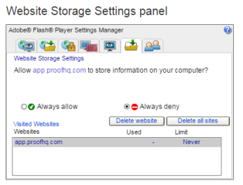

# 查看校样时出现问题 —  [!DNL Flash] 共享对象说明

>[!IMPORTANT]
>
>本文介绍独立产品中的功能 [!DNL Workfront Proof]. 有关内部校对的信息 [!DNL Adobe Workfront]，请参阅 [校对](../../../review-and-approve-work/proofing/proofing.md).

>[!NOTE]
>
>本文中的信息是指当前已弃用且将从 [!DNL Workfront] 2018年。 我们建议您使用新的Web校样查看器(如 [在Web校对查看器中查看校样](https://support.workfront.com/hc/en-us/sections/115000275214-Reviewing-Proofs-in-the-Web-Proofing-Viewer))或桌面校对查看器(如 [在桌面校对查看器中查看校样](https://support.workfront.com/hc/en-us/sections/360000686434-Reviewing-Proofs-in-the-Desktop-Proofing-Viewer))。

## [!DNL Flash] 共享对象

本地共享对象，有时称为“[!DNL Flash] cookie，”是一个数据文件，您访问的站点可以在您的计算机上创建该文件。 共享对象最常用于增强您的Web浏览体验。 A [!DNL Flash] cookie是 [!DNL Adobe Flash] 从Web服务器发送到Web浏览器，然后作为数据文件存储在浏览器中。

自 [!DNL Workfront Proof] 查看者基于 [!DNL Flash]，则值得检查允许使用哪些存储 [!DNL Flash] 应用程序。

## [!DNL Flash] 共享对象 — 已知问题

如果 [!DNL Flash] 存储设置为0 KB或具有另一个块设置 [!DNL Flash] 应用程序在本地保存数据时，可能会导致 [!DNL Workfront Proof] 查看者：

* 尽管已选择不再显示“快速入门”导览弹出窗口的选项，但该弹出窗口仍会继续显示
* [!DNL Workfront Proof] 由于向校样添加的评论数量不断增加，查看器性能降低
* 未加载校样，此时您会获得“灰色屏幕”，而不是实际图像

## 允许 [!DNL Flash] 共享对象

确保存储 [!DNL Flash] 计算机上允许共享对象，并且存储限制不为0。

检查是否允许共享对象：

1. 右键单击 [!DNL Workfront Proof] 查看者。
1. 选择 **[!UICONTROL 全局设置]** 中。
1. 转到 **[!UICONTROL 存储]** 选项卡。
1. 确保 **[!UICONTROL 允许站点保存此计算机上的信息]** (1)。
1. 

## 增加 [!DNL Flash] 存储

默认情况下 [!DNL Flash] 应用程序可以在用户的驱动器上存储多达100 KB的数据，但用户可以轻松修改这些数据。 为众多客户提供解决方案 [!DNL Flash] 相关问题是增加内部 [!DNL Flash] 存储。 此操作可以直接从 [!DNL Workfront Proof] 查看者：

1. 打开一个校样。
1. 打开校样上的右键单击菜单。
1. 单击 **[!UICONTROL 设置]** 打开 [!DNL Flash] 设置弹出窗口。
1. 转到 **[!UICONTROL 本地]** “存储”选项卡。
1. 增加存储，例如100 KB(1)。
1. 关闭设置弹出窗口并重新打开校样。

