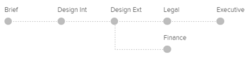

# 在[!DNL Workfront Proof]中设置具有自动工作流的验证

>[!IMPORTANT]
>
>本文提及独立产品[!DNL Workfront Proof]中的功能。 有关[!DNL Adobe Workfront]内部校对的信息，请参阅[校对](../../../review-and-approve-work/proofing/proofing.md)。

当您拥有复杂的审阅流程，或者定期将内容发送给同一组人审阅时，自动工作流程使您能够更轻松地管理内容审阅和批准。

您可以创建验证，然后它会从一个阶段移动到另一个阶段，直到获得最终批准。 在要求相关用户进行审批时，他们随时都会收到通知。

在上传文档时或上传文档后，您可以将自动化工作流添加到验证中。

## 使用自动化工作流创建验证

1. 开始创建验证。
1. 在&#x200B;**[!UICONTROL 共享]**&#x200B;部分中，单击&#x200B;**[!UICONTROL 使用自动工作流]**。

   您可以取消选择此选项以切换回标准工作流。

1. （可选）如果要使用[!DNL Workfront]管理员配置并与您共享的自动工作流模板，请在&#x200B;**[!UICONTROL 选择工作流模板]**&#x200B;下拉菜单中选择该模板。

   >[!NOTE]
   >
   >能否修改模板取决于[!DNL Workfront]管理员配置的模板设置。 如果禁用了修改模板的功能，则只有模板所有者可以修改模板。

1. 指定以下信息以配置自动工作流的第一个阶段：

   * **[!UICONTROL 名称]：**&#x200B;阶段名称显示在工作流图上，并包含在发送给审阅人的电子邮件通知中。
   * **[!UICONTROL 截止日期]：**&#x200B;此字段的功能因您在&#x200B;**[!UICONTROL 从]**&#x200B;计算截止日期下拉列表中选择的选项而异。

   * **[!UICONTROL 从验证创建]：**&#x200B;选择验证的截止日期。
   * **[!UICONTROL 从阶段激活]：**&#x200B;选择将添加到阶段激活日期的工作日数以自动设置校对截止日期。
   * **[!UICONTROL 激活阶段]：**&#x200B;对于工作流的每个阶段，您可以决定何时激活它。 对于第一个阶段，可以使用以下选项。

      * 创建验证时
      * 在特定的时间和日期
      * 手动\

        其他选项可用于后续阶段。 这些选项需要一个父阶段。 它们是：
      * 在达到上一个截止日期后
      * 所有决策均已批准或已批准，但有更改
      * 所有决策均已批准
      * 所有决策都已作出
   * **[!UICONTROL 从]计算的截止日期：**&#x200B;您在此下拉列表中选择的选项影响&#x200B;**[!UICONTROL 截止日期]**&#x200B;字段中可用的选项。

   * **[!UICONTROL 验证创建]：**&#x200B;在&#x200B;**[!UICONTROL 截止日期]**&#x200B;字段中，选择验证的截止日期。

   * **[!UICONTROL 阶段激活]：**&#x200B;在&#x200B;**[!UICONTROL 截止日期]**&#x200B;字段中，选择要添加到阶段激活日期的工作日数以自动设置验证截止日期。

   * **[!UICONTROL 锁定阶段]：**&#x200B;选择何时可以锁定阶段。
   * **[!UICONTROL 主要决策者]：**&#x200B;选择舞台上的主要决策者。 只有在将审阅人添加到舞台后，决策制定者才可在下拉列表中使用。
   * **[!UICONTROL 只需一个决定]：**&#x200B;选择此选项可在其中一个决策者做出决定后完成审阅。\

     如果您在&#x200B;**[!UICONTROL 主要决策者]**&#x200B;下拉菜单中指定了用户，则此选项不可用。

   * **[!UICONTROL 私有阶段]：**&#x200B;选择此选项时，未添加到此阶段或帐户中不是主管、管理员或账单管理员的用户看不到评论和决策

1. （可选）将审阅人添加到阶段。
1. 添加审阅人时，请考虑以下事项：

   * 查看者只能添加到验证一次。 （您不能将同一人添加到验证上的多个阶段。）
   * 添加到专用阶段的审阅人只能看到他们被添加到验证中的阶段，以及在该阶段所做的评论。
   * 默认情况下，将用户添加到阶段会授予该用户从创建验证之时起查看验证的权限。\

     系统管理员可以配置验证系统，以限制用户在工作流进入添加用户的阶段之前访问验证。 有关更多信息，请参阅

1. （可选）单击&#x200B;**[!UICONTROL 新建阶段]**，然后重复步骤4和步骤5以将多个阶段添加到自动工作流。
1. 通过在[!UICONTROL 新验证]页面上的[!UICONTROL 组织]和[!UICONTROL 更多设置]部分中指定必要的信息继续创建验证，如中所述

## 自动化工作流图

在为验证设置工作流时，您会注意到正在创建一个图表。 您添加到验证的每个阶段都将出现在图表中，清楚地指示阶段之间的依赖关系。 专用阶段使用键图标进行标记。

图表会浮动，这意味着即使向下滚动页面，它仍保持可见。

如果不需要查看图，可以隐藏它(1)。

## 添加阶段

您可以向正在创建或修改的工作流中添加其他阶段。

1. 如果您要将阶段添加到现有校对，请转到“校对详细信息”页面，如[在 [!DNL Workfront Proof]](../../../workfront-proof/wp-work-proofsfiles/manage-your-work/manage-proof-details.md)中管理校对详细信息中所述。
1. 在&#x200B;**[!UICONTROL 工作流]**&#x200B;部分中，单击&#x200B;**[!UICONTROL 新建阶段]**。

1. 按照本文中[!UICONTROL 使用自动工作流创建验证]部分中的步骤4指定阶段信息。
1. 单击&#x200B;**[!UICONTROL 添加阶段]**，然后单击&#x200B;**[!UICONTROL 完成]**。

## 删除阶段

1. 单击舞台(1)右上角的垃圾桶图标。\
   将鼠标悬停在舞台上时，将显示图标。\
   

## 暂存设置

* **[!UICONTROL 阶段名称]**：显示在工作流图上，并包含在发送给审阅人的电子邮件通知中。
* **[!UICONTROL 激活阶段]**：对于工作流的每个阶段，您可以决定何时激活它。 对于您的第一个阶段，将提供以下选项：

   * 创建验证时
   * 在特定的时间和日期
   * 手动
   * 只有这三个选项可用于第一个阶段。 添加第二个阶段时，其他选项将变为可用；这些选项要求您选择父阶段。
   * 在达到上一个截止日期后（需要选择父阶段）
   * 所有决策均为“已批准”或[!UICONTROL 已批准，但有更改]（需要选择父阶段）
   * 所有决策均已批准（需要选择父阶段）
   * 已做出所有决策（需要选择父阶段）

* **[!UICONTROL 截止日期]：**&#x200B;您可以决定在工作流的每个阶段应如何计算截止日期。 选项包括：

   * 从验证创建开始：在[!UICONTROL 截止日期]字段(9)中，您可以选择验证的截止日期。
   * 从阶段激活：在[!UICONTROL 截止日期]下拉列表中，选择将添加到阶段激活日期的工作日数以自动设置验证截止日期。

* **[!UICONTROL 锁定]：**&#x200B;有许多选项可决定何时可以锁定阶段。 这些选项包括：

   * 手动锁定
   * 从不
   * 当下一阶段开始时
   * 当作出所有决策时

**[!UICONTROL 主要决策者]**：您在舞台上设置了主要决策者。 只有将审阅人添加到舞台后，可用的决策者才会显示在列表中。

>[!NOTE]
>
>如果您选择了主要决策者，则此阶段将不再提供一个需要决策选项。

* **[!UICONTROL 只需一个决策]**：您可以在阶段中启用此选项。 这意味着，一旦决策人做出决定，审查即告完成。
* **[!UICONTROL 隐私]：**&#x200B;每个阶段都可以设为私有。 如果某个阶段是私有的，则未添加到此阶段或者不是帐户中的主管、管理员或账单管理员的用户看不到这些评论和决策。 有关详细信息，请参阅[自动化工作流概述](../../../review-and-approve-work/proofing/proofing-overview/automated-workflow.md) 。

## 将审阅人添加到阶段

1. 在每个阶段底部的字段中输入联系人名称或电子邮件地址。
1. 单击绿色加号图标以添加它们。
1. 在验证上设置角色。
1. 设置电子邮件警报。
1. 在设置第一个阶段时，您还可以选择更改验证的所有者。

   >[!NOTE]
   >
   >* 查看者只能添加到验证一次。 您无法将同一人添加到验证上的多个阶段。
   >* 未添加到专用阶段的审阅人无法在该阶段的验证或评论中看到该阶段。

## 将校对转换为自动工作流

您可以将基本校对转换为自动工作流。

1. 在[!UICONTROL 校对详细信息]页面上单击&#x200B;**[!UICONTROL 转换为自动工作流]**。
将校对重新处理到自动工作流后，所有阶段均为活动状态且公共，其[!UICONTROL 锁定阶段]选项默认设置为“手动”。 所有阶段都保留在用户及其设置中。

   * 在每个阶段创建验证时，激活阶段均设置为。
   * 从选项计算的截止日期设置为在每个阶段创建验证。
   * 如果仅对基本验证选择一个决策选项，则所有阶段均已选择该选项。
   * 如果在基本验证中选择了[!UICONTROL 主要决策者]，则将该收件人的阶段设置为这些阶段，所有其他阶段都将它设置为“无”。
   * 阶段名称保持不变。

## 向现有的自动工作流添加其他模板

将基本验证转换为自动工作流后，您可以向其添加其他模板。

1. 在校对详细信息页面的“工作流”部分中，单击&#x200B;**[!UICONTROL 添加模板]。**

   * 模板设置确定可对此模板添加到其中的验证执行的操作。 例如，如果模板禁用了[!UICONTROL 添加阶段和将人员添加到阶段]选项，则[!UICONTROL 添加阶段]和[!UICONTROL 共享校对]的按钮将不可见。
   * 如果在给定模板中禁用了[!UICONTROL 添加阶段选项]，则在添加该选项后，[!UICONTROL 添加模板]按钮不可见。
   * 将某人添加到自动工作流模板中的某个阶段时，如果该人也已经存在于验证中，那么如果应用此模板，则系统将自动将该人从阶段中删除。 如果没有其他人员添加到此特定阶段，将显示以下错误，因为系统将不允许向工作流添加空阶段。

     
