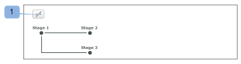

# 在中使用自动工作流设置校样 [!DNL Workfront Proof]

>[!IMPORTANT]
>
>本文介绍独立产品中的功能 [!DNL Workfront Proof]. 有关内部校对的信息 [!DNL Adobe Workfront]，请参阅 [校对](../../../review-and-approve-work/proofing/proofing.md).

当您具有复杂的审阅流程，或者如果您定期将内容发送给同一组人员进行审阅，则通过自动工作流，您可以更轻松地管理内容审阅和批准。

您创建校样，然后它会从舞台移动到舞台直至最终批准。 相关用户在需要批准时随时会收到通知。

在上传文档时或上传文档后，您可以向校样添加自动工作流。

## 使用自动工作流创建校样

1. 开始创建校样。
1. 在 **[!UICONTROL 共享]** ，单击 **[!UICONTROL 使用自动化工作流]**.

   您可以取消选择此选项以切换回标准工作流。

1. （可选）如果您要使用 [!DNL Workfront] 管理员配置并与您共享，请在 **[!UICONTROL 选择工作流模板]** 下拉菜单。

   >[!NOTE]
   >
   >您修改模板的能力取决于 [!DNL Workfront] 管理员。 如果禁用了修改模板的功能，则只有模板的所有者才能修改模板。

1. 指定以下信息以配置自动化工作流的第一阶段：

   * **[!UICONTROL 名称]:** 阶段名称显示在工作流图中，并包含在发送给审阅人的电子邮件通知中。
   * **[!UICONTROL 截止时间]:** 根据您在 **[!UICONTROL 计算的截止日期]** 下拉列表。

   * **[!UICONTROL 从校样创建]:** 选择校样的截止日期。
   * **[!UICONTROL 从阶段激活]:** 选择将添加到阶段激活日期的工作天数，以自动设置校样的截止日期。
   * **[!UICONTROL 激活阶段]:** 对于工作流的每个阶段，您可以决定何时应激活它。 对于您的第一个阶段，可以使用以下选项。

      * 论校样创建
      * 在特定的时间和日期
      * 手动\

         其他选项可用于后续阶段。 这些选项需要父级阶段。 它们是：
      * 在达到上一个截止日期后
      * 所有决策均已通过更改获得批准或批准
      * 所有决定均已批准
      * 所有决定都做出
   * **[!UICONTROL 计算的截止日期]:** 在此下拉列表中选择的选项会影响 **[!UICONTROL 截止时间]** 字段。

   * **[!UICONTROL 校样创建]:** 在 **[!UICONTROL 截止时间]** 字段，选择校样的截止日期。

   * **[!UICONTROL Stage激活]:** 在 **[!UICONTROL 截止时间]** 字段中，选择要添加到阶段激活日期的工作天数，以自动设置校样的截止日期。

   * **[!UICONTROL 锁台]:** 选择舞台可锁定的时间。
   * **[!UICONTROL 主要决策者]:** 在舞台上选择主要决策者。 只有在将审阅人添加到舞台后，才可在下拉列表中提供决策者。
   * **[!UICONTROL 只需要一个决定]:** 选择此选项，以便在某个决策者做出决策后完成审核。\

      如果您在 **[!UICONTROL 主要决策者]** 下拉菜单。

   * **[!UICONTROL 私人舞台]:** 选择此选项后，未添加到此阶段或帐户中不是“主管”、“管理员”或“帐单管理员”的人员将看不到评论和决策

1. （可选）将审阅人添加到舞台。
1. 添加审阅人时，请考虑以下事项：

   * 只能向校样添加一次审阅人。 （不能将同一人添加到校样的多个阶段。）
   * 添加到专用舞台的审阅人只能查看在该舞台中添加的校样和评论的舞台。
   * 默认情况下，将用户添加到舞台会授予用户从创建校样开始查看校样的权限。\

      系统管理员可以配置校样系统以限制用户访问校样，直到工作流进入添加用户的阶段。 有关更多信息，请参阅

1. （可选）单击 **[!UICONTROL 新阶段]**，然后重复步骤4和步骤5以向自动工作流添加多个阶段。
1. 通过在 [!UICONTROL 组织] 和 [!UICONTROL 更多设置] 部分 [!UICONTROL 新校样] 页面，如

## 自动化工作流图

在为校样设置工作流时，您会注意到正在创建一个图。 您添加到校样的每个阶段都会显示在图中，清楚地指示各个阶段之间的依赖关系。 使用键图标标记专用阶段。

图将处于浮动状态，这意味着即使向下滚动页面，该图表仍将可见。

如果您不需要查看图表，可以将其隐藏(1)。

## 添加阶段

您可以向正在创建或修改的工作流中添加其他阶段。

1. 如果要向现有校样添加舞台，请转到校样详细信息页面，如 [在中管理校样详细信息 [!DNL Workfront Proof]](../../../workfront-proof/wp-work-proofsfiles/manage-your-work/manage-proof-details.md).
1. 在 **[!UICONTROL 工作流]** ，单击 **[!UICONTROL 新阶段]**.

1. 按照 [!UICONTROL 使用自动工作流创建校样] 章节。
1. 单击 **[!UICONTROL 添加阶段]**，然后单击 **[!UICONTROL 完成]**.

## 删除阶段

1. 单击舞台(1)右上角可用的垃圾桶图标。\
   将鼠标悬停在舞台上时，会显示该图标。\
   

## 舞台设置

* **[!UICONTROL 阶段名称]**:显示在工作流图中，并包含在发送给审阅人的电子邮件通知中。
* **[!UICONTROL 激活阶段]**:对于工作流的每个阶段，您可以决定何时应激活它。 对于您的第一个阶段，将提供以下选项：

   * 论校样创建
   * 在特定的时间和日期
   * 手动
   * 只有这三个选项适用于您的第一个阶段。 添加第二个阶段时，其他选项将可用；它们要求您选择父级阶段。
   * 在达到上一个截止日期后（需要挑选父阶段）
   * 所有决定均已批准或 [!UICONTROL 已批准更改] （需要选取父级阶段）
   * 所有决策均已批准（需要选取父阶段）
   * 所有决策都已做出（需要选择父阶段）

* **[!UICONTROL 截止时间]:** 您可以决定如何在工作流的每个阶段计算截止日期。 选项包括：

   * 从校样创建：在 [!UICONTROL 截止时间] 字段(9)您可以选择校样的截止日期。
   * 从阶段激活：在 [!UICONTROL 截止时间] 下拉列表，您可以选择要添加到阶段激活日期的工作天数，以自动设置校样的截止日期。

* **[!UICONTROL 锁]:** 有许多选项可决定何时可以锁定舞台。 选项包括：

   * 手动锁
   * 从不
   * 下一阶段开始时
   * 当做出所有决定时

**[!UICONTROL 主要决策者]**:在舞台上设置主决策者。 只有在您将审阅人添加到舞台后，才会在列表中显示可用的决策者。

>[!NOTE]
>
>如果您选择了主决策者，则此阶段将不再提供一个所需决策选项。

* **[!UICONTROL 只需要一个决定]**:您可以在舞台上启用此选项。 这意味着，一旦某位决策者作出决定，审查就将完成。
* **[!UICONTROL 隐私]:** 每个阶段都可以设为私有。 如果某个阶段是私有的，则未添加到此阶段或帐户中不是“主管”、“管理员”或“账单管理员”的人员将不会看到这些评论和决策。 有关更多信息，请参阅 [自动化工作流概述](../../../review-and-approve-work/proofing/proofing-overview/automated-workflow.md) .

## 将审阅人添加到舞台

1. 在每个阶段底部的字段中输入联系人姓名或电子邮件地址。
1. 单击绿色加号图标以添加它们。
1. 在校样上设置角色。
1. 设置电子邮件警报。
1. 在设置第一个阶段时，您还可以选择更改校样的所有者。

   >[!NOTE]
   >
   >* 只能向校样添加一次审阅人。 不能将同一人添加到校样的多个阶段。
   >* 未添加到专用舞台的审阅人无法看到该舞台中的校样或评论。

## 将校样转换为自动工作流

您可以将基本校样转换为自动工作流。

1. 单击 **[!UICONTROL 转换为自动化工作流]** 在 [!UICONTROL 校样详细信息] 页面。
将校样重新工作到自动工作流后，所有阶段均处于活动状态、公开状态及其 [!UICONTROL 锁台] 选项默认设置为“手动”。 所有阶段仍保留在用户及其设置中。

   * 在每个阶段中，激活阶段都设置为创建校样时。
   * 在每个阶段中，从选项计算的截止日期都设置为创建校样。
   * 如果在基本校样上只选择了一个决策选项，则所有阶段都将选择该选项。
   * 如果是基本校样 [!UICONTROL 主要决策者] 选择后，该收件人的阶段将设置为这些阶段，而所有其他阶段都将其设置为“无”。
   * 阶段名称保持不变。

## 向现有的自动化工作流中添加其他模板

将基本校样转换为自动工作流后，您可以向其添加其他模板。

1. 在校样详细信息页面的工作流部分，单击 **[!UICONTROL 添加模板].**

   * 模板设置决定了对添加了此模板的校样可以执行的操作。 例如，如果模板具有 [!UICONTROL 添加舞台并将人员添加到舞台] 选项已禁用，按钮为 [!UICONTROL 添加阶段] 和 [!UICONTROL 共享校样] 将不可见。
   * 如果 [!UICONTROL 添加阶段选项] 在给定的模板中添加 [!UICONTROL 添加模板] 按钮。
   * 如果将人员添加到自动工作流模板中的舞台，但校样上已存在该人员，则如果应用了此模板，系统将自动将该人员从舞台中删除。 如果没有其他人添加到此特定阶段，则将显示以下错误，因为系统将不允许向工作流添加空阶段。

      
