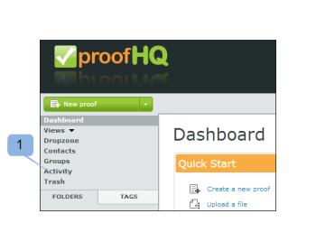

# 了解[!DNL Workfront Proof]活动审核记录

>[!IMPORTANT]
>
>本文提及独立产品[!DNL Workfront Proof]中的功能。 有关[!DNL Adobe Workfront]内部校对的信息，请参阅[校对](../../../review-and-approve-work/proofing/proofing.md)。

[!UICONTROL 活动审核追踪]页面为您提供了帐户中已发生的所有活动的完整列表。

要访问[!UICONTROL 活动]页面，请执行以下操作：

1. 在左侧边栏中，单击&#x200B;**[!UICONTROL 活动]**。\
   \
   此时将显示[!UICONTROL 活动审核记录]页。\
   

1. 在视图下拉菜单中，选择要显示的视图。\
   您可以从以下视图中进行选择：

   * **[!UICONTROL 验证和媒体日志]**：显示您帐户中验证和文件的所有活动。
   * **[!UICONTROL 文件夹日志]：**&#x200B;显示您帐户中文件夹上的所有活动。
   * **[!UICONTROL 个人资料日志]：**&#x200B;显示个人资料中所做的所有更改。
   * **[!UICONTROL 帐户日志]：**&#x200B;显示帐户设置中的所有更改。 此视图仅对具有管理员权限的用户可用。
   * **[!UICONTROL 身份验证日志]：**&#x200B;显示帐户上的所有登录活动，显示成功和不成功的尝试。
   * **[!UICONTROL 帐单日志]：**&#x200B;显示您帐户的帐单历史记录。 此视图仅对拥有账单管理员权限的用户可用。
   * **[!UICONTROL 电子邮件日志]：**&#x200B;显示从您的帐户发送的所有电子邮件。
