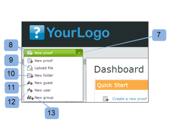

# [!DNL Workfront Proof]中的仪表板

>[!IMPORTANT]
>
>本文提及独立产品[!DNL Workfront Proof]中的功能。 有关[!DNL Adobe Workfront]内部校对的信息，请参阅[校对](../../../review-and-approve-work/proofing/proofing.md)。

“仪表板”是您登录[!DNL Workfront Proof]帐户时看到的第一页。 它汇总了您[!DNL Workfront Proof]帐户中的活动，并提供了到[!DNL Workfront Proof]中其他部分和功能的快速链接。

仪表板包含以下内容：

* 组织徽标(1)
* 顶部导航(2)
* 搜索(3)

* 标题菜单(4)
* 新建菜单(5)
* 侧栏(6)
* 欢迎部分(7)
* 概述(8)
* 最近访问的项目(9)
* 最近活动(10)

>[!NOTE]
>
>能否在功能板上查看和使用的菜单和链接取决于您的用户配置文件和权限。

您可以对帐户进行品牌化设置，以显示您自己组织的徽标、颜色、自定义链接等。 有关详细信息，请参阅[品牌化 [!DNL Workfront Proof] 网站](../../../workfront-proof/wp-acct-admin/branding/brand-wp-site.md)。”

如果您不为帐户设置品牌，则会显示[!DNL Workfront Proof]徽标和标准颜色。

## 标题菜单

### 用户名

您选择的用户名(2)将显示在此处。 可以在“个人”设置中进行更改。

### 设置

在此(3)您可以访问您的：

* 个人设置
* 帐户设置
* 计费

>[!NOTE]
>
>上述菜单的可见性取决于您的配置文件。 有关更多信息，请参阅用户配置文件和权限。

### 帮助

此处(4)您可以访问：

* 帮助文章
* 演示电影

>[!NOTE]
>
>通过我们的Select和Premium计划，您可以配置“帮助”选项以将用户指向您自己的内容。 有关更多详细信息，请参阅我们的高级品牌选项。

### 注销

单击此处以注销您的帐户。

## 新菜单

要打开“新建”菜单，

1. 单击下拉箭头(7)。

   **[!UICONTROL 新建]**&#x200B;菜单具有以下选项：

   * 新验证(8)
   * 上传文件(9)
   * 新建文件夹(10)
   * 新来宾(11)
   * 新用户(12)
   * 新组(13)

## 功能板菜单

“仪表板”菜单包含以下菜单：

* 编辑标记
* 移动到
* 更多操作
* 删除

## 编辑标记

通过[!UICONTROL 编辑标记]菜单(1)，您可以：

* 将标记应用到一个或多个项目
* 创建新标记
* 管理标记(2)

## 移动到

此函数允许您将验证和文件移动到您的某个文件夹中。 为此，请执行以下操作：

1. 选中相关项目的勾选框。
1. 单击&#x200B;**[!UICONTROL 移至]** (3)并选择相关文件夹(4)。
1. 单击&#x200B;**[!UICONTROL 保存]** (5)。

   

### 更多操作

在[!UICONTROL 更多操作]菜单(6)中，您可以执行以下操作：

* 锁定（仅限验证）
* 激活
* 存档（仅验证）
* 取消存档（仅验证）
* 更改所有者

### 删除

要删除项目，请执行以下操作：

1. 选择项目左侧的勾选框，然后单击&#x200B;**[!UICONTROL 删除]** (7)。

1. 在出现的确认屏幕中，检查详细信息，然后单击&#x200B;**[!UICONTROL 是]** (8)进行确认。

### 侧栏

该侧边栏包含指向以下页面的链接：

* 仪表板(1)
* 查看次数(2)
* 工作流(3)（仅限Premium计划）
* 拖放区域(4)（Select和Premium计划）
* 联系人(5)
* 组(6)
* 活动(7)
* 垃圾桶(8)
* 我的文件夹(9)（您还可以从侧栏访问每个单独的文件夹）
* 其他组织的文件夹(10)（可在其中查找其他组织与您共享的项目）
* 标记(11)

在侧栏帮助页面中对侧栏进行了更详细的描述。

### [!UICONTROL 欢迎]节

[!UICONTROL 欢迎]部分包含以下有用链接：

* 观看我们的演示影片(1)
* 帮助页面(2)
* 支持联系人详细信息(3)
* “不再显示欢迎部分”链接(4)

### 概述

在此部分中，您将找到以下快速链接：

* 创建新验证上传文件
* 创建新文件夹
* 添加新用户
* 更改密码

概述部分还显示预过滤的信息。 这些功能包括：

* 要管理的验证 — 由您拥有并委派给您的活动验证总数
* 等待决策的验证 — 需要您决策的活动验证总数

  

在这里，您可以立即看到多少个验证需要您或审阅者立即操作：

* 总计
* 准时 — 没有截止日期或截止日期已超过24小时的验证
* 存在风险 — 截止日期不到24小时的验证
* 延迟 — 验证未完成所有操作并已超过截止日期

>[!NOTE]
>
>图表值可点击 — 您可以轻松地转到项的详细列表。

### 最近访问的项目

[!UICONTROL 最近访问过的项目]部分显示您最近访问过的项目。 其中包括您拥有的项目、根据配置文件权限您有权查看的项目以及与您共享的项目。 此分区将仅包含您自己打开的项目（通过[!DNL Workfront Proof]查看器或验证详细信息页面）。

[!UICONTROL 最近访问的项]部分显示有关最近校对和文件的以下信息：

* 名称
* 进度
* 状态
* 决定
* 所有者

摘要（此信息默认将折叠 — 单击相关验证左侧的展开/折叠按钮以打开验证摘要）

“操作”菜单

有关此部分可用的不同布局选项，请参阅页面布局。

>[!NOTE]
>
>单击[!UICONTROL 最近访问的项目]分区中的校样名称将直接转到校样查看器中的校样。

要访问验证详细信息页面，请执行以下操作：

1. 单击验证名称右侧可用的&#x200B;**[!UICONTROL 操作]**&#x200B;菜单(1)。
1. 从菜单中选择&#x200B;**[!UICONTROL 查看校对详细信息]** (2)。

### 最近活动

此部分显示有关帐户中最近活动的以下详细信息：

* 日期和时间验证/文件名
* 操作
* 详细信息

您还可以转到项目的“详细信息”页面，方法是单击打开项目的“操作”菜单，然后选择“查看详细信息”。 要查看有关帐户中活动的更多信息，请参阅活动审核跟踪。

>[!NOTE]
>
>单击[!UICONTROL 最近活动]分区中的校对名称将在校对查看器中打开校对。

转到该验证的验证详细信息页面：

1. 单击&#x200B;**[!UICONTROL 操作]**&#x200B;菜单(1)。
1. 从下拉菜单中选择&#x200B;**[!UICONTROL 查看校对详细信息]** (2)。

   
