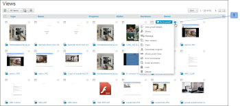
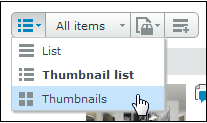

# 中的视图选项卡上的页面布局 [!DNL Workfront Proof]

>[!IMPORTANT]
>
>本文介绍了独立版产品中的功能 [!DNL Workfront Proof]. 有关内部校对的信息 [!DNL Adobe Workfront]，请参见 [校对](../../../review-and-approve-work/proofing/proofing.md).

您可以调整页面布局 [!UICONTROL 视图] 选项卡。 可以使用以下布局选项：

## 列表

* 显示校对或文件名以及标准视图列
* 此 [!UICONTROL 验证操作] 菜单位于线路(1)的右侧

  

## 袖珍图标列表

* 显示校对图像/文件图标、校对或文件名以及标准视图列
* 此 [!UICONTROL 验证操作] 菜单位于线路(1)的右侧
* 请注意，这是默认的标准视图。

  

## 缩略图

* 仅显示校对图像/文件图标和校对/文件名
* 此 [!UICONTROL 验证操作] 菜单位于每个校样(1)的右上角

  

## 更改页面布局

要更改仪表板或垃圾桶页面上的页面布局，请单击页面顶部的视图按钮之一来选择首选视图：

要更改帐户中所有其他视图页面的页面布局，请展开页面顶部的下拉菜单，然后单击首选页面布局：

