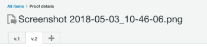

# 在[!DNL Workfront Proof]中生成验证

>[!IMPORTANT]
>
>本文提及独立产品[!DNL Workfront Proof]中的功能。 有关[!DNL Adobe Workfront]内部校对的信息，请参阅[校对](../../../review-and-approve-work/proofing/proofing.md)。

[!DNL Workfront Proof]允许您从文档或网站创建校样，并与他人共享这些校样。 以下步骤描述了可用的各种配置选项：

## 为文档生成验证

1. 执行以下任一操作以开始创建新验证并显示[!UICONTROL 新验证]页面：

   * 单击任何页面左上角的绿色&#x200B;**[!UICONTROL 新验证]**&#x200B;按钮。
   * 在&#x200B;**[!UICONTROL 仪表板]**&#x200B;区域的&#x200B;**[!UICONTROL 概述]**&#x200B;选项卡中，单击&#x200B;**[!UICONTROL 新验证]**&#x200B;链接。

   * 通过Dropzone（企业功能）提交。
   * 显示&#x200B;**[!UICONTROL 新校对]**&#x200B;页面。

1. 要验证一个或多个文档，请通过以下任一方式添加要验证的文档（重复此过程以添加多个要验证的文档）：

   * 将文档从文件系统拖放到&#x200B;**[!UICONTROL 添加文件]**&#x200B;区域的拖放区域。
   * 单击&#x200B;**[!UICONTROL 添加文件]**&#x200B;区域中的拖放区域，然后浏览以查找并选择要从工作站上的文件系统上传的文档。

     

1. 要校对一个或多个网站，请在&#x200B;**[!UICONTROL 添加文件]**&#x200B;区域指定您要校对的网站的URL，然后按&#x200B;**[!UICONTROL Enter]**。

1. （可选）重复此过程以添加多个网站进行校对。

   有关校对网站的更多详细信息，请参阅[为URL生成校对](#generate-a-proof-for-a-url)。

   

1. （可选）修改任何已上载文件的文件名：

   1. 将鼠标悬停在&#x200B;**[!UICONTROL 添加文件]**&#x200B;区域的文档列表中要修改的文档名称上，然后单击&#x200B;**[!UICONTROL 编辑]**&#x200B;图标。

      

   1. 在&#x200B;**[!UICONTROL 校对名称]**&#x200B;字段中，指定新名称，然后单击&#x200B;**[!UICONTROL 完成]**。

   1. （可选）若要删除上传的任何文件，请将鼠标悬停在&#x200B;**[!UICONTROL 添加文件]**&#x200B;区域中的文档列表中要删除的文档上，然后单击&#x200B;**[!UICONTROL 删除]**&#x200B;图标。

      

   1. （可选）启用选项&#x200B;**[!UICONTROL 将所有兼容的文件合并为单个校对]**。

      **启用此选项时：**&#x200B;所有静态文件和网站都在一个验证中可用，您最多可以在给定时间上传50个文件。

      >[!NOTE]
      >
      >交互式文件（包括视频和交互式网站）无法合并为单个验证。

      **禁用此选项时：**&#x200B;所有文档和网站都作为单个校样生成，您最多可以在给定时间上传20个文件。

      要将所有上传的文件和网站合并到一个验证中，请执行以下操作：

      1. 启用选项&#x200B;**[!UICONTROL 将所有兼容的文件合并为单个校对]**。
      1. 在&#x200B;**[!UICONTROL 校对名称]**&#x200B;字段中，为组合校对指定新名称。
      1. 在&#x200B;**[!UICONTROL 添加文件]**&#x200B;区域，通过将文件拖到所需顺序来重新排序包含的文件。 文件的顺序是组合验证的页面顺序。 有关创建组合验证的更多信息，请参阅[创建多页验证](../../../review-and-approve-work/proofing/creating-proofs-within-workfront/create-multi-page-proof.md)。

1. （可选）如果要使用包括多个阶段的自动工作流，请在&#x200B;**[!UICONTROL 工作流]**&#x200B;部分中，从以下选项中选择：

   * **基本：**&#x200B;选择此选项可指定希望在校对创建后立即访问校对的用户。 您可以与多个用户共享验证。

     有关共享校样的更多信息，请参阅[在 [!DNL Adobe Workfront]](../../../review-and-approve-work/proofing/managing-proofs-within-workfront/share-a-proof-in-workfront.md)内共享校样中的“将用户添加到校样”。

   * **自动：**&#x200B;选择此选项可在您拥有复杂的审阅流程，或定期将内容发送给同一组人员审阅时，管理内容审阅和批准。 借助自动化工作流，验证会从一个阶段移动到另一个阶段，直至最终批准。 相关用户可随时收到需要批准的通知。

     有关创建自动工作流的详细信息，请参阅[在 [!DNL Workfront Proof]](../../../workfront-proof/wp-work-proofsfiles/automated-workflow/set-up-proof-auto-workflow.md#create2)中设置具有自动工作流的验证。

1. 选择是否向在上一步中选择的用户发送电子邮件通知和自定义消息：

   * **将此验证通知收件人：**&#x200B;选择此选项可向用户发送电子邮件通知。 在&#x200B;**[!UICONTROL 工作流]**&#x200B;部分中选择&#x200B;**[!UICONTROL 基本共享]**&#x200B;时，会在创建验证时发送电子邮件通知。 在&#x200B;**[!UICONTROL 工作流]**&#x200B;部分中选择&#x200B;**[!UICONTROL 自动化工作流]**&#x200B;时，当验证进入用户关联的自动化工作流的阶段时，将发送电子邮件通知。

   * **添加自定义消息：**&#x200B;选择此选项可在通知中包含自定义消息。 您可以指定主题和消息正文。 消息正文可以包括富文本格式，例如粗体、项目符号和超链接。

1. 选择以下任何验证设置：

   <table style="table-layout:auto"> 
    <col> 
    <col> 
    <tbody> 
     <tr> 
      <td role="rowheader">需要登录 — 验证只能与其他用户共享</td> 
      <td> 
<strong>需要登录 — 校对只能与其他用户共享：</strong>选择此选项时，只有[!DNL Workfront Proof]个用户能够查看校对。
 
默认情况下禁用此选项；任何具有URL的人员都可以查看校对。
 
选中此选项时：
 
       <ul> 
        <li>用户无法登录到验证，除非他们已添加到验证中。</li> 
        <li>无法启用订阅。</li> 
       </ul> </td> 
     </tr> 
     <tr> 
      <td role="rowheader">此证明只需一个决定</td> 
      <td> 
如果选择该选项，则审阅会在决策者之一做出决定后完成。
 
默认禁用此选项。
 </td> 
     </tr> 
     <tr> 
      <td role="rowheader">要求对决策进行电子签名</td> 
      <td>用户必须在做出验证决策时指定用户名和密码。</td> 
     </tr> 
     <tr> 
      <td role="rowheader">作出所有必需的决策时锁定验证</td> 
      <td> 
<strong></strong> 启用此设置后，将在做出所有决策后锁定验证状态。 当最终批准者做出决定时，状态会自动从已解锁更改为已锁定。
 
默认禁用此选项。
 </td> 
     </tr> 
     <tr> 
      <td role="rowheader">下载原始文件</td> 
      <td> 
<strong></strong> 选择此选项后，审阅人将能够下载从中创建验证的原始文件。
 
取消选择此选项时，“下载”图标不再可见。 默认启用此选项。
 </td> 
     </tr> 
     <tr> 
      <td role="rowheader">通过公共URL或嵌入代码共享验证</td> 
      <td>选择此选项后，可以通过公共URL或嵌入代码共享验证。</td> 
     </tr> 
     <tr> 
      <td role="rowheader">通过公共URL或嵌入代码订阅验证</td> 
      <td> 
选择此选项时，未明确添加到验证的用户可以订阅验证。 订阅验证的用户将获得您在以下设置中定义的角色和电子邮件：
 
       <ul> 
        <li><strong>订阅者角色</strong>：分配给订阅了验证的所有审阅人的默认验证角色。</li> 
        <li><strong>订阅者的电子邮件警报设置</strong>：分配给订阅验证的所有审阅者的默认电子邮件警报。</li> 
        <li> 
<strong>通过电子邮件链接访问</strong>所需的校对：配置订阅者是否收到包含校对链接的电子邮件。 您可以选择<strong>无电子邮件</strong> （访问验证不需要电子邮件链接）、<strong>仅验证通知电子邮件</strong> （订阅者通过电子邮件接收验证链接，无需任何验证）或<strong>验证和验证通知电子邮件</strong> （订阅者通过电子邮件接收验证链接，必须单击该链接才能访问验证；此选项旨在确保人员输入了他们有权访问的正确电子邮件地址）。
 
注意：如果验证已附加自动工作流，则所有订阅都将向验证所有者生成确认电子邮件，以便他们决定应将人员添加到哪个阶段。
 </li> 
       </ul> </td> 
     </tr> 
    </tbody> 
   </table>

1. 单击&#x200B;**[!UICONTROL 创建校对]**。

   Workfront开始生成选定文档或网站的验证。 根据文件大小和类型，文档上传的滞后时间会有所不同。 请耐心等待，因为生成更大的文件需要更长的时间。 您可以离开页面，Workfront将继续生成您的文件。 最大文件上传大小为4GB。

   生成校对后，单击&#x200B;**[!UICONTROL 前往校对]**&#x200B;以启动校对工具。

   

   文档显示在校对工具中。

   帐户未启用验证的用户仍可以查看文档并对验证进行评论。

## 为URL生成校对 {#generate-a-proof-for-a-url}

您可以首次为URL生成校对。 或者，您可以生成新版本的URL校对，其中之前已生成校对。

>[!NOTE]
>
>仅当您的[!DNL Workfront]环境与[!DNL Workfront Proof] Premium帐户集成时，才能为URL生成交互式验证。 如果您无法使用本节中介绍的校对，请与系统管理员联系。

要为URL生成校对，请执行以下操作：

1. 执行以下任一操作以开始创建新验证并显示[!UICONTROL 新验证]页面：

   * 单击任何页面左上角的绿色&#x200B;**[!UICONTROL 新验证]**&#x200B;按钮。
   * 在&#x200B;**[!UICONTROL 仪表板]**&#x200B;区域的&#x200B;**[!UICONTROL 概述]**&#x200B;选项卡中，单击&#x200B;**[!UICONTROL 新验证]**&#x200B;链接。

   * 通过Dropzone（企业功能）提交。

1. （视情况而定）在出现的&#x200B;**[!UICONTROL 新验证]**&#x200B;页面中，创建现有验证的新版本：

   1. 选择要添加新版本的URL校对。
   1. 单击页面顶部的&#x200B;**[!UICONTROL 新版本]**&#x200B;按钮。

      

1. 在显示的新验证版本页面中，在&#x200B;**[!UICONTROL 添加文件]**&#x200B;区域指定要验证的网站的URL，然后按&#x200B;**[!UICONTROL Enter]**。

1. （可选）重复此过程以添加多个网站进行校对。

   

1. 单击&#x200B;**[!UICONTROL 添加文件]**&#x200B;区域中的文档列表中的网站。

   

1. 为验证指定&#x200B;**[!UICONTROL 验证名称]**。

   默认情况下，验证名称与网站URL相同。

1. 选择&#x200B;**[!UICONTROL 处理网站内容]**&#x200B;选项：

   <table style="table-layout:auto"> 
    <col> 
    <col> 
    <tbody> 
     <tr> 
      <td role="rowheader">捕获屏幕快照</td> 
      <td>创建URL头页的静态图像的校对。</td> 
     </tr> 
     <tr> 
      <td role="rowheader">交互型</td> 
      <td> 
创建一个校样，允许查看者导航站点、查看HTML5图像、Flash元素等。
 
要创建交互式验证，必须使用安全协议(https)托管网站。 此外，无法嵌入到iframe中的网站无法生成为交互式验证（iframe嵌入限制由您尝试嵌入的网站控制）。
 
创建初始验证后，创建后续版本时无法更改此设置。
 
有关交互式校对的更多信息，请参阅<a href="#generate-a-proof-for-interactive-content" class="MCXref xref">为交互式内容生成校对</a>。
 </td> 
     </tr> 
     <tr> 
      <td role="rowheader">屏幕快照分辨率</td> 
      <td> 
（此选项不适用于交互式验证。） 您可以调整内容显示所用的分辨率，也可以选择多个分辨率。
 
这使用户能够查看验证以查看内容在不同设备上的显示方式，例如各种尺寸的电话、平板电脑和显示器。
 
如果选择多个分辨率，则会为您选择的每个分辨率创建单独的校样。
 
当用户对验证进行评论时，当前屏幕分辨率自动显示在评论中，以确保其他用户知道评论关联的分辨率。
 </td> 
     </tr> 
     <tr> 
      <td role="rowheader">查找子页面</td> 
      <td>（此选项不适用于交互式验证。） 选择此选项可导航浏览网站的页面。 您可以将网站从主页扩展到深2层。 将鼠标悬停在页面上可查看页面的URL。 仅选择您要验证的页面。 默认情况下，您选择的每个页面都将创建为单个验证；或者，启用<strong>合并为单个验证</strong>选项以将所有选定页面合并为单个验证。</td> 
     </tr> 
    </tbody> 
   </table>

1. （可选）配置任何高级验证选项，例如共享验证、添加自动工作流或设置访问和订阅设置。 有关这些选项的更多详细信息，请参阅以下文章：

   * [在 [!DNL Adobe Workfront]内共享验证](../../../review-and-approve-work/proofing/managing-proofs-within-workfront/share-a-proof-in-workfront.md)
   * [在 [!DNL Workfront Proof]中设置具有自动工作流的验证](../../../workfront-proof/wp-work-proofsfiles/automated-workflow/set-up-proof-auto-workflow.md)
   * [配置验证的访问和订阅设置](../../../review-and-approve-work/proofing/managing-proofs-within-workfront/configure-access-subscription-settings-proof.md)

1. 单击&#x200B;**[!UICONTROL 完成]**。

   如果您向现有URL验证添加新版本，则在此版本中维护在原始验证或以前的版本上配置的任何选项。 如果您向现有URL验证添加新版本，则在此版本中维护在原始验证或以前的版本上配置的任何选项。

1. 单击&#x200B;**[!UICONTROL 创建校对]**。

## 为交互式内容生成验证 {#generate-a-proof-for-interactive-content}

使用此功能需要Pro Workfront计划或更高版本。 有关各种可用计划的详细信息，请参阅[Workfront计划](https://www.workfront.com/plans)。

有关交互式内容的详细信息，请参阅[交互式内容校对概述](../../../review-and-approve-work/proofing/proofing-overview/interactive-content-proofs.md)。

* [将交互式内容添加为URL](#add-interactive-content-as-a-url)
* [将交互式内容添加为ZIP文件](#add-interactive-content-as-a-zip-file)

### 将交互式内容添加为URL {#add-interactive-content-as-a-url}

有关如何添加交互式URL校对的信息，请参阅[生成URL的校对](#generate-a-proof-for-a-url)。

### 将交互式内容添加为ZIP文件 {#add-interactive-content-as-a-zip-file}

1. 通过创建.zip捆绑文件来准备内容。

   有关.zip捆绑文件规范的信息，请参阅[交互式内容校对概述](../../../review-and-approve-work/proofing/proofing-overview/interactive-content-proofs.md)一文中的[关于在ZIP文件中准备交互式内容以进行校对](../../../review-and-approve-work/proofing/proofing-overview/interactive-content-proofs.md#howtoprepareaninteractiveziparchive)。

1. 执行以下任一操作以开始创建新验证并显示[!UICONTROL 新验证]页面：

   * 单击任何页面左上角的绿色&#x200B;**[!UICONTROL 新验证]**&#x200B;按钮。
   * 在&#x200B;**[!UICONTROL 仪表板]**&#x200B;区域的&#x200B;**[!UICONTROL 概述]**&#x200B;选项卡中，单击&#x200B;**[!UICONTROL 新验证]**&#x200B;链接。

   * 通过Dropzone（企业功能）提交。

1. 在出现的&#x200B;**[!UICONTROL 新校对]**&#x200B;页面中，将您的交互式.zip包拖放到&#x200B;**[!UICONTROL 添加文件]**&#x200B;区域。

1. （可选）配置任何高级验证选项，例如共享验证、添加自动工作流或设置访问和订阅设置。 有关这些选项的更多详细信息，请参阅以下文章：

   * [在 [!DNL Adobe Workfront]内共享验证](../../../review-and-approve-work/proofing/managing-proofs-within-workfront/share-a-proof-in-workfront.md)
   * 在文章中
   * [配置验证的访问和订阅设置](../../../review-and-approve-work/proofing/managing-proofs-within-workfront/configure-access-subscription-settings-proof.md)

1. 单击&#x200B;**[!UICONTROL 创建校对]**。

   Workfront开始生成.zip捆绑包的验证。 根据包大小，文档上传的滞后时间会有所不同。 生成较大的文件需要较长时间。 您可以离开页面，Workfront将继续生成您的文件。 最大文件上传大小为4GB。

   生成校对后，您可以单击似乎打开校对的&#x200B;**[!UICONTROL 转到校对]**&#x200B;按钮。
