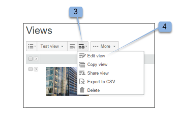

# 在[!DNL Workfront Proof]中创建和管理自定义视图

>[!IMPORTANT]
>
>本文提及独立产品[!DNL Workfront Proof]中的功能。 有关[!DNL Adobe Workfront]内部校对的信息，请参阅[校对](../../../review-and-approve-work/proofing/proofing.md)。

您可以创建文件和校样的自定义视图，以您希望的方式列出项目。 您还可以将自定义视图中的信息导出为报表（CSV，逗号分隔值，文件格式）。

>[!NOTE]
>
>自定义视图仅在Select和Premium计划上可用。 请联系我们的销售团队以获取报价。

## 创建自定义视图

在创建自定义视图时，您可以选择：

* 是包括校样、文件还是两者
* 显示哪些列
* 排序依据的列
* 列的排序顺序（升序或降序）
* 用于确定视图中包含哪些信息的过滤器类型

创建自定义视图后，即可立即使用。 新视图的名称也包含在标题我的自定义视图下的下拉菜单中（标准视图下）。

要创建自定义视图，请执行以下操作：

1. 转到&#x200B;**[!UICONTROL 视图]**&#x200B;页面。
1. 有关视图的详细信息，请参阅 [!DNL Workfront Proof]](../../../workfront-proof/wp-work-proofsfiles/manage-your-work/manage-items-on-views-page.md)中的[管理视图页面上的项目。
1. 根据您是要从头开始创建新的自定义视图，还是要基于现有的标准视图创建新的自定义视图，执行以下任一操作：

   * 要基于现有标准视图创建新的自定义视图：从下拉菜单中，选择要用作新自定义视图基础的现有标准视图。 单击&#x200B;**[!UICONTROL 视图设置]**&#x200B;图标，然后单击&#x200B;**[!UICONTROL 复制]**&#x200B;到新的自定义视图。

   * 

   * 要从头开始创建新的自定义视图：单击&#x200B;**[!UICONTROL 新建视图]**&#x200B;图标。
   * 

1. 在&#x200B;**[!UICONTROL 详细信息]**&#x200B;部分中，指定以下信息：

   * **[!UICONTROL 名称]**（必需）：新视图的名称。 使用唯一的名称，以便用户能够在视图的下拉菜单中轻松找到自定义视图。
   * **[!UICONTROL 项目]**：选择是希望验证和文件、仅验证还是仅文件包含在视图中。 默认情况下，校样和文件都会包含在内。

1. 在&#x200B;**[!UICONTROL 列]**&#x200B;部分中，确定要包含在自定义视图中的列。

   1. 单击向右箭头图标。
   1. 

   1. 双击选定列的名称。
   1. 您必须至少选择一个列，并且一个列只能添加一次。
   1. 从&#x200B;**[!UICONTROL 可用列]**&#x200B;区域中选择要包含在新视图中的列。
   1. 这些列从&#x200B;**[!UICONTROL 可用列]**&#x200B;列表移动到&#x200B;**[!UICONTROL 选定列]**&#x200B;列表。

   1. 您可以从标准列中进行选择，也可以选择自定义字段和决策原因作为自定义视图中的列。 （如果在帐户中配置了这些列，则它们将显示在可用列的标准列表区域下。）
   1. 您可以包括的标准列

      <table style="table-layout:auto">
      <thead>

      </thead>
      <tbody>  
      <tr>   
      <td><strong>活动阶段名称</strong></td>   
      <td>自动工作流中活动阶段的名称。</td>  
      </tr>  
      <tr>   
      <td><strong>注释</strong></td>   
      <td>收到的评论数。</td>
      </tr>  
      <tr>   
      <td><strong>计数器</strong></td>
      <td>显示已上传到您帐户中的证明数量（您必须在“帐户设置”中启用证明计数器选项）。</td>
      </tr>
      <tr>
      <td><strong>已创建</strong></td>
      <td>创建项目的日期和时间。</td>
      </tr>
      <tr>
      <td><strong>创建者</strong></td>
      <td>创建项目的用户。</td>
      </tr>
      <tr>
      <td><strong>[！UICONTROL日期已添加到验证]</strong></td>
      <td>将您添加到证明的日期。 </td>
      </tr>
      <tr>
      <td><strong>截止日期</strong></td>
      <td>整个证明的截止日期。</td>
      </tr>
      <tr>
      <td><strong>决策</strong></td>
      <td>在预期数量之外给出的决定的数量（例如0个，1个，1个，等等）</td>
      </tr>
      <tr>
      <td><strong>[！UICONTROL下载]</strong></td>
      <td>下载原始文件的次数。</td>
      </tr>
      <tr>
      <td><strong>文件名</strong></td>
      <td>文件或校对的名称。</td>
      </tr>
      <tr>
      <td><strong>文件夹</strong></td>
      <td>包含该项目的文件夹。</td>
      </tr>
      <tr>
      <td><strong>上一个活动</strong></td>
      <td>项目上最后一个活动的日期和时间。</td>
      </tr>
      <tr>
      <td><strong>最新决策于</strong></td>
      <td>上次做出决策的日期和时间。</td>
      </tr>
      <tr>
      <td><strong>我的截止日期</strong></td>
      <td>您自己的截止日期，确定将您添加为审阅者/批准者（如果适用）的验证。</td>
      </tr>
      <tr>
      <td><strong>所有者</strong></td>
      <td>项目的所有者。</td>
      </tr>
      <tr>
      <td><strong>所有者国家/地区</strong></td>
      <td>在系统中为证明所有者注册的国家/地区。 </td>
      </tr>
      <tr>
      <td><strong>父校对</strong></td>
      <td>父校对的名称。</td>
      </tr>
      <tr>
      <td><strong>进度</strong></td>
      <td>
进度条。 显示尚未开始、打开、评论或决定的验证。

此信息不按排序。
</td>
      </tr>
      <tr>
      <td><strong>校样名称</strong></td>
      <td>证明的名称。</td>
      </tr>
      <tr>
      <td><strong>校对类型</strong></td>
      <td>
验证类型：静态文件、静态网页、交互式Web （.zip上传）、交互式Web (https)、视频、音频等。 

组合验证被标识为“组合验证类型”。 证明的文件类型。
</td>
      </tr>
      <tr>
      <td><strong>文件大小(MB)</strong></td>
      <td>
与磁盘使用配额相关的验证文件大小。

为当前版本的验证提供的此信息。 如果没有当前版本，则为最新版本。
</td>
      </tr>
      <tr>
      <td>
 

<strong>活动阶段截止日期</strong>
</td>
      <td>自动化工作流中暂存的截止日期。</td>
      </tr>
      <tr>
      <td><strong>阶段名称</strong></td>
      <td>自动化工作流中每个阶段的名称。 这包括过去阶段、活动阶段和未来阶段。</td>
      </tr>
      <tr>
      <td><strong>州/省</strong></td>
      <td>活动、已锁定、草稿或已提交。</td>
      </tr>
      <tr>
      <td><strong>状态</strong></td>
      <td>“待定”、“需要更改”、“已批准但有更改”、“已批准”或“不相关”。</td>
      </tr>
      <tr>
      <td><strong>标记</strong></td>
      <td>任何附加到项目的标记。</td>
      </tr>
      <tr>
      <td><strong>即将到来的阶段名称</strong></td>
      <td> 自动工作流中尚未启动的每个阶段的名称。 </td>
      </tr>
      <tr>
      <td><strong>版本计数器</strong></td>
      <td> 项目的版本数。 </td>
      </tr>
      <tr>
      <td><strong>校对版本号</strong></td>
      <td><i>验证的版本号。</i></td>
      </tr> 
      </tbody>
      </table>

   1. （可选）执行以下任一操作将该列移动到&#x200B;**[!UICONTROL 选定的列]**&#x200B;区域，使其包含在新视图中：

      * 重新排序&#x200B;**[!UICONTROL 选定列]**&#x200B;列表中的任意列。
      * 列在&#x200B;**[!UICONTROL 选定的列]**&#x200B;列表中的显示顺序决定了列在自定义视图中的显示顺序。
      * 这些列按照您从&#x200B;**[!UICONTROL 可用列]**&#x200B;列表中添加它们的顺序显示在&#x200B;**[!UICONTROL 选定列]**&#x200B;列表中。

      * 要对&#x200B;**[!UICONTROL 选定的列]**&#x200B;列表中的列重新排序，请选择该列的名称，然后将其在列表中向上或向下拖动。

      * 通过单击选定列的名称，然后单击&#x200B;**[!UICONTROL 向左]**&#x200B;箭头，从&#x200B;**[!UICONTROL 选定列]**&#x200B;列表中删除列。 或者，您可以双击选定列的名称（该列将移回&#x200B;**[!UICONTROL 可用列]**&#x200B;列表）。

      * 一个列只能添加一次。 例如，如果将“注释”列从[!UICONTROL 可用]移至[!UICONTROL 选定列]列表，则此列的名称将从[!UICONTROL 可用列]列表中消失。

1. 在&#x200B;**[!UICONTROL 排序]**&#x200B;部分中，指定以下信息：

   * **排序方式：**&#x200B;如果要设置项在自定义视图中按特定顺序列出，请使用[!UICONTROL 排序]选项卡。 如果未选择要排序的列，则缺省值为无列 — 即无特殊排序列或顺序。
   * 只有您在[!UICONTROL 列]选项卡上选择的列包含在[!UICONTROL 按列]排序的下拉列表中。
   * **升序或降序：**&#x200B;选择是否要对列默认进行升序或降序排序。

1. 使用&#x200B;**[!UICONTROL 筛选器]**&#x200B;部分定义一个或多个条件，用于选择要包含在自定义视图中的项。 如果您要将自定义视图用作报表，则过滤器特别有用。
1. 要在自定义视图中包含所有项目，请跳过&#x200B;**[!UICONTROL 筛选器]**&#x200B;部分。
1. 可用过滤器：

   * **字段：**&#x200B;为此筛选器选择字段（默认字段为注释）。 字段列表包含所有标准字段（如[!UICONTROL 列]选项卡中所示）。 该列表不限于您选择显示的列。
   * **运算符：**&#x200B;可用于筛选器的运算符取决于所选字段的类型。 选择一个显示字段和值字段之间关系的运算符。 您稍后将填写此信息。
   * **值：**&#x200B;根据字段和您选择的运算符，在此字段中选择或输入您选择的值。 根据您选择的运算符，可能有一个“值”字段，或者两个或零。 请参阅以下示例。
   * **使用以下逻辑应用筛选器：**&#x200B;不同字段之间的筛选条件将使用AND运算符。 使用同一字段的多个筛选条件将为同一字段使用OR运算符。

     如果只想查看不带注释的校样，请选择以下值：

      * 字段：注释
      * 运算符：等于
      * 值字段： 0

     如果只想查看具有两个或多个注释的校样，请选择以下值：

      * 字段：注释
      * 运算符：大于或等于
      * 值字段：2

     如果只想查看包含1到4条注释的校样，请选择以下值：

      * 字段：注释
      * 运算符：介于
      * 值字段（第一个字段）：1
      * 值字段（第二个字段）： 4

        您可以毫无问题地更改已添加到自定义视图中的筛选器，或者根据需要通过单击[!UICONTROL 设置]筛选器旁边的交叉图标来移除该筛选器。

        由于字段列表不限于您在[!UICONTROL 列]选项卡上选择的列，因此，在创建包含未在自定义视图中选择要显示的列的筛选器时，请务必谨慎。 例如，视图的以下过滤器将选择版本计数器值为2或更多的所有验证：

         * 字段=版本计数器
         * 运算符=大于或等于
         * 值字段= 2

           >[!NOTE]
           >
           >您可以毫无问题地更改已添加到自定义视图中的筛选器，或者根据需要通过单击[!UICONTROL 设置]筛选器旁边的交叉图标来移除该筛选器。

1. 在&#x200B;**[!UICONTROL 共享]**&#x200B;部分中，选择帐户中能够看到您的自定义视图的用户。
1. 自定义视图特定于创建它们的用户。 默认情况下，新的“自定义”视图仅对其创建者可见；但是，您可以选择以下选项之一来共享您的自定义视图：

   * **只有您才能看到此自定义视图**（默认）：如果您希望自定义视图仅对您可用，请选择此选项。
   * **所有用户都可以看到此自定义视图**：选择此选项可让您的帐户中的所有用户都可以使用自定义视图。
   * **选择可以查看此自定义视图的用户**：选择此选项可使自定义视图仅对特定用户可用。
   * 开始键入您希望访问自定义视图的用户的名称或电子邮件地址，然后在名称出现在下拉列表中时单击该名称。
   * 如果您此时选择不与其他用户共享您的视图，则以后可以通过编辑自定义视图来实现这一点。

1. 单击&#x200B;**[!UICONTROL 创建]**。
1. 自定义视图将显示并出现在[!DNL Views]页面上。 有关查看次数的详细信息，请参阅 [!DNL Workfront Proof]](../../../workfront-proof/wp-work-proofsfiles/manage-your-work/manage-items-on-views-page.md)中 [!DNL Views] 页上的[管理项目。

## 编辑自定义视图

您可以轻松编辑自定义视图。 要编辑自定义视图，请执行以下操作：

1. 转到&#x200B;**[!UICONTROL 视图]**&#x200B;页面。\
   有关视图的详细信息，请参阅 [!DNL Workfront Proof]](../../../workfront-proof/wp-work-proofsfiles/manage-your-work/manage-items-on-views-page.md)中的[管理视图页面上的项目。

1. 单击[!UICONTROL 视图]按钮(1)
1. 从下拉菜单中选择要编辑的视图。\
   

1. 单击&#x200B;**[!UICONTROL 查看选项]**&#x200B;按钮，然后单击&#x200B;**[!UICONTROL 编辑视图]**。\
   \
   此时将显示“编辑自定义视图”页。

1. 单击[!UICONTROL 操作]菜单。 (3)\
   仅当您在视图中包含验证名称列时，此按钮才可用。
1. 从菜单中选择[!UICONTROL 编辑视图]。 (4) \
   

1. 此时将显示“编辑自定义视图”页。

>[!NOTE]
>
>如果您编辑“自定义”视图，“选定列”列表中的列将自动按字母顺序排列。 在更新视图之前，需要根据需要重新排列它们。

## 复制自定义视图

利用“复制视图”功能，可轻松复制现有自定义视图。 这非常有用，例如，如果您要为所有设计人员设置单独的视图，则每个视图均相同，但校样所有者（设计人员）除外。

要复制自定义视图，请执行以下操作：

1. 转到&#x200B;**[!UICONTROL 视图]**&#x200B;页面。\
   有关视图的详细信息，请参阅 [!DNL Workfront Proof]](../../../workfront-proof/wp-work-proofsfiles/manage-your-work/manage-items-on-views-page.md)中的[管理视图页面上的项目。

1. 单击&#x200B;**[!UICONTROL 视图]**&#x200B;按钮。 (1)
1. 从列表中选择您的自定义视图。 (2)
1. 单击&#x200B;**[!UICONTROL 操作]**&#x200B;菜单。 (3)\
   仅当您在视图中包含验证名称列时，此按钮才可用。

1. 从菜单中选择[!UICONTROL 复制]。 (4)\
   

1. 在复制自定义视图页面中，将填充所有原始设置。 根据您的选择修改自定义视图，然后单击&#x200B;**[!UICONTROL 复制视图]**&#x200B;按钮。 你马上就会被带去新视野。\
   

## 共享自定义视图

通过“共享视图”功能，可与帐户中的其他用户共享视图（如果尚未在视图的“共享”部分中选择这些用户）。 当您与其他用户共享自定义视图时，该视图将显示在“视图”下拉菜单的[!UICONTROL 我的自定义视图]部分中。

要与其他用户共享自定义视图，请执行以下操作：

1. 转到&#x200B;**[!UICONTROL 视图]**&#x200B;页面。\
   有关视图的详细信息，请参阅 [!DNL Workfront Proof]](../../../workfront-proof/wp-work-proofsfiles/manage-your-work/manage-items-on-views-page.md)中的[管理视图页面上的项目。

1. 单击&#x200B;**[!UICONTROL 视图]**&#x200B;按钮(1)
1. 从列表中选择自定义视图(2)
1. 单击&#x200B;**[!UICONTROL 操作]**&#x200B;菜单。 (3)\
   仅当您在视图中包含验证名称列时，此按钮才可用。

1. 从菜单(4)中选择[!UICONTROL 共享视图]
1. 此时将显示“编辑自定义视图”页面。
1. 在[!UICONTROL 共享]分区中，选择要与其共享视图的用户，然后单击&#x200B;**[!UICONTROL 更新视图]**。

   

## 将自定义视图导出到CSV文件

要将数据从自定义视图导出到CSV文件，请执行以下操作：

1. 转到&#x200B;**[!UICONTROL 视图]**&#x200B;页面。\
   有关视图的详细信息，请参阅 [!DNL Workfront Proof]](../../../workfront-proof/wp-work-proofsfiles/manage-your-work/manage-items-on-views-page.md)中的[管理视图页面上的项目。

1. 单击&#x200B;**[!UICONTROL 视图]**&#x200B;按钮。 (1)
1. 从列表中选择自定义视图。 (2)
1. 单击&#x200B;**[!UICONTROL 操作]**&#x200B;菜单。 (3)\
   仅当您在视图中包含验证名称列时，此按钮才可用。

1. 从菜单中选择[!UICONTROL 导出到CSV]。 (4)\
   \
   在单独的浏览器窗口中，会显示“正在生成报表：100%”以及记录数（来自自定义视图的报表中包含的项目数）

1. （视情况而定）如果出现安全消息，指出报表下载当前被阻止，请单击以允许继续下载。
1. 当出现“文件下载”窗口并询问您是否要打开或保存文件时，单击&#x200B;**[!UICONTROL 保存]**。
1. 选择计算机上的位置并保存文件。

## 删除自定义视图

您可以轻松删除自定义视图。 为此，请执行以下操作：

1. 转到&#x200B;**[!UICONTROL 视图]**&#x200B;页面。\
   有关视图的详细信息，请参阅 [!DNL Workfront Proof]](../../../workfront-proof/wp-work-proofsfiles/manage-your-work/manage-items-on-views-page.md)中的[管理视图页面上的项目。

1. 单击&#x200B;**[!UICONTROL 视图]**&#x200B;按钮。
1. 从列表中选择自定义视图
1. 单击&#x200B;**[!UICONTROL 操作]**&#x200B;菜单。 (3)\
   仅当您在视图中包含验证名称列时，此按钮才可用。

1. 从菜单中选择[!UICONTROL 删除]。 (4)\
   

1. 单击&#x200B;**[!UICONTROL 删除]** (5)以确认要删除当前自定义视图\
   

1. 默认“所有项目”视图显示，已删除的自定义视图不再出现在&#x200B;**[!UICONTROL 视图]**&#x200B;下拉菜单中。
