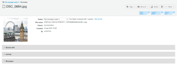

# 管理[!DNL Workfront Proof]中的文件

>[!IMPORTANT]
>
>本文提及独立产品[!DNL Workfront Proof]中的功能。 有关[!DNL Adobe Workfront]内部校对的信息，请参阅[校对](../../../review-and-approve-work/proofing/proofing.md)。

您可以管理、共享和查看有关已上传到Workfront Proof的文件（非验证）的信息（请参阅[将文件和Web内容上传到 [!DNL Workfront Proof]](../../../workfront-proof/wp-work-proofsfiles/create-proofs-and-files/upload-files-web-content.md)）。

1. 单击左侧导航面板中&#x200B;**[!UICONTROL 视图]**&#x200B;右侧的向下箭头，然后单击下拉菜单中的&#x200B;**[!UICONTROL 文件]**。

1. 单击文件的&#x200B;**[!UICONTROL 更多]**&#x200B;按钮，然后在出现的菜单中单击&#x200B;**[!UICONTROL 查看文件详细信息]**。\
   \
   您可以在显示的窗口中查看和编辑有关文件的详细信息。 例如，您可以更改窗口顶部的文件名、存储文件的[!DNL Workfront Proof] **文件夹**&#x200B;以及文件的&#x200B;**所有者**。\
   

1. （可选）如果您具有文件的编辑权限，请使用右上角的操作按钮来管理和共享文件：

* **[!UICONTROL 标记]**。 管理应用于文件的标记。\
   \
   在操作按钮下方，可以查看应用到文件的所有标记。 通过单击多余的标记旁边的x可以删除该标记。\
   

* **[!UICONTROL 移至]**。 将您的文件组织到文件夹中。 您可以在现有文件夹之间移动文件，或将它们放在新文件夹中。\
   

* **[!UICONTROL 共享]**。 与其他人共享文件。 [!DNL Workfront Proof]发送电子邮件通知，其中包含自定义邮件和指向收件人的下载链接。\
   

* **[!UICONTROL 垃圾桶]**。 您可以将该文件移至垃圾桶以将其删除。 请注意，在清空垃圾桶之前，该文件将计入您的存储限制（请参阅[还原并清空垃圾桶 [!DNL Workfront Proof]](../../../workfront-proof/wp-work-proofsfiles/manage-your-work/restore-and-empty-trash.md)）。\
   

* **[!UICONTROL 更多]**。 在此下拉列表中，您可以单击&#x200B;**[!UICONTROL 转换为验证]**&#x200B;以创建文件的验证（请参阅[在 [!DNL Workfront Proof]](../../../workfront-proof/wp-work-proofsfiles/create-proofs-and-files/generate-proofs.md)中生成验证）。 文件必须满足我们对于验证的文件类型要求（请参阅[支持的验证文件类型和大小限制概述](../../../review-and-approve-work/proofing/proofing-overview/supported-proofing-file-types.md)）。 如果文件名称与现有校对的名称匹配，[!DNL Workfront Proof]将显示一条消息，其中包含允许您将文件转换为该校对的&#x200B;**[!UICONTROL 新版本]**&#x200B;的链接（请参阅）。\
   

  >[!TIP]
  >
  >对于从其他[!DNL Workfront Proof]帐户共享（未上载到您自己的帐户）的文件，仅可在企业计划中进行转换。

  您还可以单击&#x200B;**[!UICONTROL 下载]**&#x200B;以将原始文件下载到您的计算机。

1. （可选）打开&#x200B;**[!UICONTROL 共享对象]**&#x200B;部分以列出与文件共享的用户。

   您可以使用右侧的&#x200B;**[!UICONTROL 更多]**&#x200B;图标&#x200B;**[!UICONTROL 消息]**&#x200B;或&#x200B;**[!UICONTROL 删除]**&#x200B;用户。

   

   如果选择向这些用户之一发送消息，则会显示&#x200B;**[!DNL Message all]**&#x200B;页面，您可以在其中一次发送多条消息。

1. 打开&#x200B;**[!UICONTROL 活动]**&#x200B;部分以列出文件上的所有活动，包括时间、日期和执行操作的人员。 活动包括：

   * 已上传文件
   * 已添加新人员
   * 已移除人员
   * 已下载文件

1. 打开&#x200B;**[!UICONTROL 消息]**&#x200B;部分以跟踪用户已发送的与文件关联的消息。 单击右侧的“i”图标可查看消息的内容。
