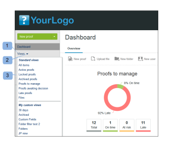

# 在[!DNL Workfront Proof]中管理[!UICONTROL 视图]页面上的项目

>[!IMPORTANT]
>
>本文提及独立产品[!DNL Workfront Proof]中的功能。 有关[!DNL Adobe Workfront]内部校对的信息，请参阅[校对](../../../review-and-approve-work/proofing/proofing.md)。

[!UICONTROL 视图]页面允许您在一个位置查看和使用所有校样、文件和文件夹。

## 显示[!UICONTROL 视图]页面

1. 单击左侧边栏中的&#x200B;**[!UICONTROL 视图]**。
1. 从下拉菜单(2)中，单击要查看的视图(3)。

## 更改[!UICONTROL 视图]页面布局

默认的[!UICONTROL 视图]页面布局是缩略图列表。 在此布局中，您可以看到每个验证、文件（如果可能生成）和文件夹（如果设置）的缩微图像，其他详细信息包含在单独的列中。

1. 单击&#x200B;**[!UICONTROL 页面布局]**&#x200B;图标(1)，然后选择所需的布局。

## 更改[!UICONTROL 视图]列表

要更改您在[!UICONTROL 视图]列表中看到的内容：

1. 单击&#x200B;**[!UICONTROL 更改视图]**&#x200B;按钮。\
   此按钮上显示的名称取决于您上次使用该按钮时选择的视图。\
   

1. 在下拉菜单中单击其他视图：

   * **[!UICONTROL 所有项目]**：包含您有权查看的所有验证、文件和文件夹。 打开[!UICONTROL 视图]页面时，这是默认设置。 您可以选择在此视图中包含/排除存档的验证。
   * **[!UICONTROL 活动项]**：所有活动验证、文件和文件夹。
   * **[!UICONTROL 活动验证]**：您有权查看的所有活动（未存档）验证。
   * **[!UICONTROL 锁定的校样]**：仅锁定的校样。
   * **[!UICONTROL 存档的校样]**：仅存档的校样（请参阅[存档位置 [!DNL Workfront Proof]](../../../workfront-proof/wp-work-proofsfiles/organize-your-work/archive.md)）。

   * **[!UICONTROL 我的校样]**：仅显示您是所有者且委托给您的校样。 有关详细信息，请参阅[在 [!DNL Workfront Proof]](../../../workfront-proof/wp-getstarted/personal-settings/designate-temp-proof-owners.md)中指定临时校对所有者。

   * **[!UICONTROL 等待决策的校对]**：仅显示必须对其做出决策的校对
   * **[!UICONTROL 延迟验证]**：仅显示截止日期已过的验证
   * **[!UICONTROL 文件]**：仅显示文件

   其中每个视图都包含以下列

   * **类型**：带有校样、文件或文件夹图标的项目的图标
   * **名称**：校对、文件或文件夹的名称
   * **Progress**： S=Sent， O=Opened， C=Comment， D=Decision（请参阅进度条）
   * **状态**：[!UICONTROL 待处理，需要更改，已批准]
   * **决策**：已做出的决策数和所需的数量
   * **所有者**：拥有证明的人员姓名\

     我的验证、等待决策的验证和延迟验证视图还有一个名为“我的截止日期”的列。 此列显示您自己作为审阅人/批准人明确添加的验证的截止日期。

     >[!NOTE]
     >
     >如果您离开“视图”页面并在稍后在同一会话中返回该页面，则会显示您最后选择的视图。

     您还可以创建自己的视图。 有关详细信息，请参阅[在 [!DNL Workfront Proof]](../../../workfront-proof/wp-work-proofsfiles/manage-your-work/create-and-manage-custom-views.md)中创建和管理自定义视图。

## 筛选项目

您可以过滤视图中列出的信息。

1. 单击页面右上方的&#x200B;**显示过滤器**&#x200B;图标(1)。\
   

1. 出现筛选栏(2)，每个类别都有一个筛选下拉菜单(3)用于选择您的首选值。 每个类别的默认值为“全部”。
1. 过滤器栏不会显示在您创建的自定义视图中。 对于这些视图，您可以在[!UICONTROL 筛选器]选项卡中应用和编辑筛选器。 有关详细信息，请参阅[在 [!DNL Workfront Proof]](../../../workfront-proof/wp-work-proofsfiles/manage-your-work/create-and-manage-custom-views.md)中创建和管理自定义视图。
1. 要应用所有选择的筛选器，请单击筛选栏末尾的[!UICONTROL 筛选器]图标(4)。\
   

您选择的筛选器值将保持有效，直到您对其进行更改为止。 如果您想再次查看并访问完整的项目列表，则必须将所有筛选值更改回默认值，即&#x200B;**[!UICONTROL 全部]**。

>[!NOTE]
>
>如果您设置了筛选选项，然后通过单击[!UICONTROL 隐藏筛选器]图标(5)来隐藏筛选栏，则在您更改视图时，该栏将自动再次显示。 如果在所有筛选器都设置为默认全部选项时隐藏筛选栏，则在更改视图时，筛选栏保持隐藏状态。

## 对项目排序

创建新验证（或版本）或上传新文件时，它将显示在[!UICONTROL 所有项目]列表的顶部。 最旧的项目显示在列表底部。

要以不同的排序顺序查看列表，请执行以下操作：

1. 执行下列操作之一：

   * 单击列表中的列标题之一：“类型”、“名称”、“状态”、“决策”或“所有者”。\

     例如，如果要按字母顺序查看校样/文件，请单击“名称”标题一次(1)，以按名称的升序(A - Z)对列表进行排序。\
      您可以再次单击验证名称标题(2)以颠倒顺序并按降序显示验证(Z - A)。

   * 单击[!UICONTROL 视图]页面右上角的向下箭头可按创建日期（“最新”或“最旧”）或类型、名称、状态、决策或所有者进行排序。\

     \
      如果列按升序排序，列标题将在列名旁边显示一个向上箭头。 要颠倒顺序（降序），请单击相关的列标题（这将在列名称旁边显示一个向下箭头）。

   * 只有在您停留在“所有项目”页面时，您对项目排序顺序所做的更改才会最后出现。 如果您离开“所有项目”页面并稍后返回该页面，则这些项目将按默认的反向时间顺序列出。

## 查看验证摘要

要查看有关验证的更多详细信息，请执行以下操作：

1. 单击验证图像左侧的箭头。\
   箭头向下指向，验证摘要显示在有关验证的基本信息下方。 验证摘要显示：

   * **校对摘要**：校对的总体状态
   * **阶段**：指示验证截止日期以及已做出和必需的决策数
   * **审阅人**：将列出每个审阅人的姓名、角色和进度
   * **版本**：正在查看的校对的版本和可用版本总数
   * **文件夹**：校对所在的文件夹
   * **状态**：活动、已锁定、草稿或已提交

1. （可选）如果您具有对验证的编辑权限并且验证具有阶段，请单击阶段右侧的&#x200B;**[!UICONTROL 更多]**（三个点）菜单以访问以下选项：

   * **[!UICONTROL 全部发送消息]**：向舞台上的所有审阅者发送电子邮件。
   * **[!UICONTROL 共享]**：添加新审阅者
   * **[!UICONTROL 删除阶段]**

1. （可选）单击查看者名称右侧的&#x200B;**[!UICONTROL 更多]**（三个点）菜单以执行以下任一操作：

   * 向审阅人发送提醒消息。
   * 编辑查看者在验证中的设置。\

     出现的编辑审阅者框，您不仅可以更改角色和电子邮件警报，还可以更改审阅者的显示名称。 请注意，只能在特定验证上更改显示名称，而不能在“联系人”页面中查看者的详细信息中进行更改。 有关详细信息，请参阅[联系人](https://support.workfront.com/hc/en-us/sections/115000920808-Contacts)。

   * 选择审核者作为验证的主要决策者。
   * 从验证中删除查看者。
   * 您还可以更改添加到验证中的审阅人的角色和电子邮件警报。

## 包括并排除存档的验证

默认情况下，“[!UICONTROL 所有项目]”视图显示所有活动和锁定的校样、文件和文件夹。 它还提供在视图中包含或排除已存档验证的选项。\
要包含存档的校样，请执行以下操作：

1. 选择视图时，单击&#x200B;**[!UICONTROL 包括存档的校样]**。\
   \
   存档的验证将以存档的图标显示，以与其他验证区分开来。\
   

## 从列表视图打开项目

1. 执行下列操作之一：

   * 要查看有关校样、文件或文件夹的详细信息，请单击其名称。
   * 要在验证查看器中打开验证，请单击&#x200B;**[!UICONTROL 转到验证]**。\

     有关校对查看器的信息，请参阅[查看校对](../../../review-and-approve-work/proofing/reviewing-proofs-within-workfront/review-a-proof/review-a-proof.md)。

## 对多个项目执行操作

要选择多个项目，请执行以下操作：

1. 单击列表上方的复选框。\
   

1. 在“视图”列表上方显示的额外选项中，对选定的文件执行以下任一操作：

   * 单击&#x200B;**[!UICONTROL 标记]**&#x200B;可向这些项目添加标记。
   * 单击“**[!UICONTROL 移至]**”将选定项目移至其他文件夹(或者如果您选择（未选择文件夹），将项目移出文件夹)。
   * 单击&#x200B;**[!UICONTROL 共享选定项]**&#x200B;以与其他审阅人共享所有这些项。\

     

   * 单击&#x200B;**[!UICONTROL 删除]**&#x200B;以将选定项移至垃圾桶。\

     

   * 单击&#x200B;**[!UICONTROL 更多]**&#x200B;菜单以获取其他可用操作。

   * 这些操作将仅适用于具有特定可用选项的选定项目。 例如，如果您选择文件和验证，然后选择[!UICONTROL 锁定]，则仅锁定验证（因为您无法锁定文件）

## 将项目移动到文件夹

如果您有相应的编辑权限，则可以将校样、文件和文件夹移动到[!UICONTROL 视图]页面上的特定文件夹。

1. 单击最顶部文件夹左侧的箭头，在侧栏中打开文件夹树。
1. 执行下列操作之一：

   * 要移动一个项目，请单击并按住它，将其拖放到要放置它的文件夹中。
   * 若要同时移动多个项目，可以选中项目左侧的复选框，然后单击列表上方的&#x200B;**[!UICONTROL 移至]**，然后选择要放置这些项目的文件夹，或为其创建新文件夹。
