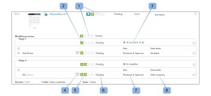

# 在[!DNL Workfront Proof]中查看验证的进度和状态

>[!IMPORTANT]
>
>本文提及独立产品[!DNL Workfront Proof]中的功能。 有关[!DNL Adobe Workfront]内部校对的信息，请参阅[校对](../../../review-and-approve-work/proofing/proofing.md)。

## 了解验证进度

验证进度指示对验证完成的工作，从您向审阅人发送验证时到他们对验证做出决定时为止。

* [进度图标](#progress-icons)
* [验证进度的级别](#levels-of-proof-progress)

### 进度图标 {#progress-icons}

进度条中显示的进度图标S、O、C和D表示校对进度。

它们指示有关验证的以下信息：

<table style="table-layout:auto"> 
 <col> 
 <col> 
 <thead> 
  <tr> 
   <td> 
<strong>进度图标</strong> 
 </td> 
   <td> 
<strong>描述</strong> 
 </td> 
  </tr> 
 </thead> 
 <tbody> 
  <tr> 
   <td> 
  
 </td> 
   <td> 
<strong>已发送</strong>。 校样已发送给审阅者。
 </td> 
  </tr> 
  <tr> 
   <td> 
  
 
 
 </td> 
   <td> 
<strong>已打开</strong>。 查看者已打开验证详细信息页面或在验证查看者中打开验证本身。
 </td> 
  </tr> 
  <tr> 
   <td> 
  
 </td> 
   <td> 
<strong>备注</strong>。 已对验证做出评论的审阅人（可以发表评论的用户）。
 
如果没有为校样指定审阅者，则不会显示此图标。
 </td> 
  </tr> 
  <tr> 
   <td> 
  
 </td> 
   <td> 
<strong>决策</strong>。 审核者已决定验证。
 
如果没有为验证指定审批者（决策者），则不会显示此图标。 
 </td> 
  </tr> 
 </tbody> 
</table>

这些图标可以以下列颜色显示，以指示有关校样进度的某些信息：

* **绿色**。 完成。
* **白色**。 未完成。
* **橙色**。 未完成且截止日期不到24小时。
* **红色**。 未完成且已超过截止日期。

### 验证进度的级别 {#levels-of-proof-progress}

Workfront Proof使用进度图标在下列每个级别跟踪校样的进度：

* 对于每个审阅者，基于其在验证上的活动。
* 对于每个阶段，根据进度，阶段中审核者在校对过程中落在最后面。 有关详细信息，请参阅[自动化工作流暂存概述](../../../review-and-approve-work/proofing/proofing-overview/stages.md)。
* 对于校样，根据在校样过程中落后的阶段（审阅者组）的进度。

例如，[!DNL Workfront Proof]如何使用最落后的审阅人或阶段确定进度，假设有三位审阅人需要决定校样。 如果其中两人已作出决定，但第三人尚未作出决定，则证明的进度条不会因为未决决定而显示D绿色。

如果在验证中选择了[!UICONTROL 主要决策者]设置，并且主要决策者提交了决策，则验证进度栏中的D对于所有审阅人将变为绿色，因为不需要其他决策。

同样，如果在验证上选择了[!UICONTROL 仅需要一个决策]设置，并且任何审阅人提交了决策，则所有审阅人的验证进度栏中的D将变为绿色，因为不需要其他决策。

## 了解验证状态

验证状态显示验证所需的决策的状态。

\
标准状态选项包括：

* 待定
* 已审批
* 已批准（附加更改）
* 需要更改
* 不相关

如果您在帐户中配置了自定义决策，则状态选项将反映您的自定义决策设置。

证明的状态由“最坏情况”参与者决定。 例如，假设对验证有三个决定：两个决定的状态为&#x200B;**已接受**，另一个决定的状态为&#x200B;**已拒绝**。 被拒绝的“最坏情况”决策超过了其他决策和证明的整体状态，显示为&#x200B;**被拒绝**。

## 查看进度和状态 {#viewing-progress-and-status}

您可以查看每个阶段的验证、阶段和审阅者的进度和状态。

* [校对摘要](#proof-summary)
* [暂存操作菜单](#stage-actions-menu)
* [在[!UICONTROL 摘要]部分中，您还可以访问审阅者操作菜单，前提是您对验证具有编辑权限。 有关更多信息，请参阅Workfront Proof中的验证权限配置文件和Workfront Proof中的管理验证角色。 当您将鼠标悬停在审阅人的详细信息上时，[!UICONTROL 审阅人操作]菜单(1)会出现，并允许您执行以下操作：](#in-the-summary-section-you-can-also-access-the-reviewer-actions-menus-provided-you-have-edit-rights-on-the-proof-for-more-information-see-proof-permissions-profiles-in-workfront-proof-and-manage-proof-roles-in-workfront-proof-the-reviewer-actions-menu-1-appears-when-you-hover-over-the-reviewer-s-details-and-allows-you-to)
* [验证操作菜单](#proof-actions-menu)

### 校对摘要 {#proof-summary}

文件夹中的每个校样都有一个可扩展的摘要，可让您快速查看和编辑校样的详细信息。

要展开或折叠摘要，请执行以下操作：

1. 在仪表板或任何列表视图中单击校样左侧的箭头。

摘要包括以下内容：

* 工作流(2)
* 版本(3)
* 文件夹(4)
* 状态(5)\
   

在摘要中，您可以查看和编辑验证的以下详细信息：

* 验证进度(1)
* 每个阶段的进度(2)
* 为阶段设置的截止日期(3)
* 审阅者详细信息：

   * 每个审阅人的评论和回复数(4)
   * 每个审阅人的进度(5)
   * 决定（如果决定包括电子签名，则在决定旁边将显示一个图标，指示这一点。） (6)
   * 在验证上的角色(7)
   * 电子邮件警报设置(8)

>[!NOTE]
>
>您编辑校样详细信息的能力取决于您对校样的权限（请参阅 [!DNL Workfront Proof]](../../../workfront-proof/wp-acct-admin/account-settings/proof-perm-profiles-in-wp.md)中的[校样权限配置文件 [!DNL Workfront Proof]](../../../workfront-proof/wp-work-proofsfiles/share-proofs-and-files/manage-proof-roles.md)中的[管理校样角色）。

### [!UICONTROL 暂存操作]菜单  {#stage-actions-menu}

工作流的每个阶段都有一个单独的菜单，允许您执行该阶段中审阅者相关的批量操作。

当您将鼠标悬停在暂存部分(1)上时，[!UICONTROL 暂存操作]菜单会出现，并允许您执行以下操作

* [!UICONTROL 消息全部] (2)
* [!UICONTROL 共享] (3)
* [!UICONTROL 删除阶段] (4)

>[!NOTE]
>
>这些选项的可用性取决于您对校对的权限（请参阅 [!DNL Workfront Proof]](../../../workfront-proof/wp-acct-admin/account-settings/proof-perm-profiles-in-wp.md)中的[校对权限配置文件 [!DNL Workfront Proof]](../../../workfront-proof/wp-work-proofsfiles/share-proofs-and-files/manage-proof-roles.md)中的[管理校对角色）。

在“摘要”部分中，您还可以访问审阅者操作菜单，前提是您对验证具有编辑权限。 有关详细信息，请参阅 [!DNL Workfront Proof]](../../../workfront-proof/wp-acct-admin/account-settings/proof-perm-profiles-in-wp.md)中的[验证权限配置文件和 [!DNL Workfront Proof]](../../../workfront-proof/wp-work-proofsfiles/share-proofs-and-files/manage-proof-roles.md)中的[管理验证角色。 当您将鼠标悬停在审阅者的详细信息上时，会显示审阅者操作菜单(1)，该菜单允许您：

* 向审阅人发送消息(2)
* 编辑审阅人的详细信息(3) — 允许您编辑该审阅人的显示名称、验证角色和电子邮件警报
* 让他们成为证明的所有者(4)
* 让他们成为主要决策者(5)
* 从验证中移除(6)

>[!NOTE]
>
>这些选项的可见性取决于您对校对的权限（请参阅 [!DNL Workfront Proof]](../../../workfront-proof/wp-acct-admin/account-settings/proof-perm-profiles-in-wp.md)中的[校对权限配置文件和 [!DNL Workfront Proof]](../../../workfront-proof/wp-work-proofsfiles/share-proofs-and-files/manage-proof-roles.md)中的[管理校对角色）。

### 验证操作菜单 {#proof-actions-menu}

每个校样也有一个菜单(1)，允许您执行以下操作：

* 您可以访问验证详细信息页面(2)
* 与其他人共享证明(3)
* 向审阅人发送消息(4)
* 创建新版本的验证(5)
* 复制证明(6)
* 下载原始文件(7)
* 共享校对链接(8)
* 打印评论(9)
* 请求证明的Excel摘要(10)
* 锁定校样(11)
* 删除验证(12)

>[!NOTE]
>
>这些选项的可用性取决于您对校对的权限（请参阅 [!DNL Workfront Proof]](../../../workfront-proof/wp-acct-admin/account-settings/proof-perm-profiles-in-wp.md)中的[校对权限配置文件 [!DNL Workfront Proof]](../../../workfront-proof/wp-work-proofsfiles/share-proofs-and-files/manage-proof-roles.md)中的[管理校对角色）。

有关在[!DNL Workfront]内查看校对进度和状态的信息，请参阅[查看进度和状态](#viewing-progress-and-status)。

有关在桌面验证查看器中查看进度和状态的信息，请参阅[在验证查看器中查看工作流](../../../workfront-proof/wp-work-proofsfiles/review-proofs-wpv/review-workflow.md)。
