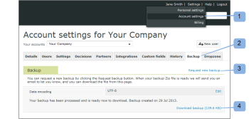

# 备份您的 [!DNL Workfront Proof] 数据

>[!IMPORTANT]
>
>本文介绍独立产品中的功能 [!DNL Workfront Proof]. 有关内部校对的信息 [!DNL Adobe Workfront]，请参阅 [校对](../../../review-and-approve-work/proofing/proofing.md).

## 备份简介

您可以在 [!DNL Workfront Proof] 使用备份函数。

备份将以.zip文件的形式提供给您。 它包含所有数据的XML导出（包括所有校样的所有版本的注释和响应）；但是，它不包括您作为校样上传的原始文件。

为您下载而创建的每个备份.zip文件都有一个唯一的文件名，例如：

9789_05_05_2011_61703.zip

本示例中的文件名提供了以下信息：

* 9789是你的 [!DNL Workfront Proof] 帐户标识符
* 05_05_2011为创建日期，2011年5月5日
* 61703是随机系统分配的数

这种命名约定使您能够轻松地将所有备份.zip文件存储在计算机上的单个位置，并准确了解每个备份的创建时间。

的 [!UICONTROL 备份] 函数允许您决定如何使用资源：

* 允许您释放存储空间，而不丢失活动校样或存档校样。 您可以请求备份、删除校样，然后清空 [在中还原和清空垃圾桶 [!DNL Workfront Proof]](../../../workfront-proof/wp-work-proofsfiles/manage-your-work/restore-and-empty-trash.md).
* 允许您访问最初上传到的任何文件 [!DNL Workfront] 证明。 您可以使用 [!UICONTROL 下载原始文件] 函数。

>[!NOTE]
>
>使用备份时请考虑以下事项：
>
>* 备份在企业和无限制计划上可用。 请联系我们的 [销售团队](mailto:sales@proofhq.com) 的报价。
>* 默认情况下，数据编码类型设置为UTF-8，我们建议您使用此设置。 这是Internet应用程序最常用的编码类型。
>* 您只能请求一个 [!DNL backup] 一次。 在处理备份.zip文件时，“Backups”（备份）选项卡上的“Request new backup”（请求新备份）链接将不会显示，显示的消息保持不变。 有关请求备份的信息，请参阅 [在中请求新的数据备份 [!DNL Workfront Proof]](../../../workfront-proof/wp-acct-admin/account-settings/request-new-data-backup-in-wp.md).
>

## 备份数据

1. 单击 **[!UICONTROL 帐户设置]** 的右上角 [!DNL Workfront Proof] 界面。 (1)
1. 单击 **[!UICONTROL 备份]** 选项卡。 (2)
1. 单击 **[!UICONTROL 请求新备份]** 链接(3)

备份准备就绪后，会发生以下情况：

* 您会收到来自 [!DNL Workfront Proof] 通知您(“ [!DNL Workfront Proof] 备份已准备就绪”)。 电子邮件包含备份数据的下载链接。
* 的 [帐户设置](https://support.workfront.com/hc/en-us/sections/115000912147-Account-settings) “备份”选项卡显示备份数据的下载链接。
* “请求新备份”链接(3)将重新出现在“备份”选项卡上

您的数据将可以下载为zip文件。 您可以通过通知电子邮件或 [!UICONTROL 帐户设置]，如以下部分所述：

* [从电子邮件通知下载备用.zip文件](#downloading-your-backup-zip-file-from-your-email-notification)
* [从帐户设置下载备份.zip文件](#downloading-your-backup-zip-file-from-the-account-settings)

## 从电子邮件通知下载备用.zip文件 {#downloading-your-backup-zip-file-from-your-email-notification}

当备份的.zip文件准备好下载时，您会收到 [!DNL Workfront Proof] 标题为“您的 [!DNL Workfront Proof] 备份已准备就绪。

要通过电子邮件下载备用.zip文件，请执行以下操作：

1. 单击电子邮件中的下载链接。\
   \
   如果您当前未登录 [!DNL Workfront Proof]，将打开一个新的浏览器窗口，并显示登录页面。

## 从帐户设置下载备份.zip文件 {#downloading-your-backup-zip-file-from-the-account-settings}

当备份的.zip文件可供下载时， [!UICONTROL 备份] 选项卡通过显示下载链接来指示这一点。 此外， [!UICONTROL 请求新备份] 链接。

1. 单击 **[!UICONTROL 帐户设置]** 的右上角 [!DNL Workfront Proof] 界面。 (1)
1. 单击 **[!UICONTROL 备份]** 选项卡。 (2)\
   如果您帐户中没有用户请求任何备份，则 [!UICONTROL 备份] 选项卡表示您没有备份。 如果用户请求了备份，则选项卡会显示上次备份的创建日期和下载链接。

1. 单击 **[!UICONTROL 下载备份]** 链接。 (3)\
    出现“File Download（文件下载）”屏幕，询问您是要打开还是保存下载文件。

1. 单击 **[!UICONTROL 保存]**，然后选择您计算机上要保存备份.zip文件的位置。\
   标识最近备份日期的消息仍显示在 [!UICONTROL 备份] 页面，直到下次请求备份。 下载备份链接适用于上次备份。 只要 [!UICONTROL 请求新备份] 链接时，您可以单击该链接以请求其他备份。

## 了解备用.zip文件中的文件

您的备用.zip文件包含七个CSV（以逗号分隔的值或以逗号分隔的逗号分隔）文件，这些文件包含您的活动校样和存档的校样中截至数据备份时的信息：

* comments.csv — 包含对校样的注释
* comment_replies.csv — 包含对校样organization.csv的注释的响应 — 包含数字标识符和您的组织（您的帐户）的名称
* contacts.csv — 包含每个联系人的数字标识符、名称和组织
* files.csv — 包含校样详细信息页面或“文件详细信息”页面中上传到的校样或文件的信息 [!DNL Workfront Proof]
* recipients.csv — 包括数字标识符、角色和每个指定为审阅人、审阅人和审批人等的人员的决策，在上传校样以供审核时 [!DNL Workfront Proof]
* users.csv — 包含数字标识符和帐户中所有用户的名称

您可以使用您使用的任何zip实用程序从备份.zip文件中提取这些文件，然后将它们存储在您选择的计算机上的位置。 在保存zip文件并解压缩单个CSV文件后，您可以根据需要处理内部记录保留信息。

在您的请求下创建的每个备份.zip文件都有一个独特的名称，其中包括备份创建日期，但每个备份.zip文件中包含的CSV文件始终具有相同的名称。 您可能需要使用以下方法之一来确保备份文件彼此不同：

* 为每个备用.zip文件以及您从其中提取的CSV文件创建新文件夹。
* 重命名每个CSV文件，以在从zip文件提取备份日期时包含该备份日期。

>[!NOTE]
>
>如果 [!DNL Microsoft Excel] 计算机上安装了，您的提取实用程序可能会将单个CSV文件的文件类型列为 [!DNL Microsoft Office Excel] 逗号分隔值文件。 您可以使用 [!DNL Excel] 并将文件另存为 [!DNL Excel] 工作簿(&#42;.xlsx)或其他文件类型。
