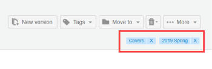

# 在中创建和管理标记 [!DNL Workfront Proof]

>[!IMPORTANT]
>
>本文介绍独立产品中的功能 [!DNL Workfront] 证明。 有关内部校对的信息 [!DNL Adobe Workfront]，请参阅 [校对](../../../review-and-approve-work/proofing/proofing.md).

您可以创建和编辑标记，并将其应用于校样和文件。 当你有很多不同的 [!DNL Workfront Proof] 项目（如项目、部门和客户），您希望轻松识别和查找它们。

您可以将标记应用于任何列表视图页面上的新校样或现有校样、新文件、新版本和副本。

>[!TIP]
>
>当多个类别应用于一个项目时，使用多个标记会非常有用。 任何项目均可应用无限数量的标记。

您的配置文件和权限设置会影响可用的标记功能：

* 帐单管理员、管理员和主管可以使用此页面中描述的所有功能。
* 经理只能为其项目创建和编辑标记。
* 观察者可以对项目应用或编辑标记，但他们可以查看其他用户对项目应用的标记，也可以在“个人”设置中查看“标记”选项卡。

有关这些配置文件和权限的更多信息，请参阅 [中的校样权限配置文件 [!DNL Workfront Proof]](../../../workfront-proof/wp-acct-admin/account-settings/proof-perm-profiles-in-wp.md).

## 在您的帐户中创建、编辑或删除标记

1. 单击 **[!UICONTROL 设置]** > **[!UICONTROL 个人设置]**.

1. 打开 **[!UICONTROL 标记]** 的 **[!UICONTROL 个人设置]** 页面。\
   执行下列操作之一：

   * 要创建标记，请单击 **[!UICONTROL 新标记]**，键入标记的名称，然后按 **[!UICONTROL 输入]**.\

      标记名称必须至少包含一个字母数字字符，且不得超过30个字符。\
      要编辑现有标记，请单击标记名称，键入新文本，然后按 **[!UICONTROL 输入]**.

   * 要删除标记，请单击列出标记的行末尾的垃圾桶图标。

## 查看有关标记的信息

1. 单击 **[!UICONTROL 设置]** > **[!UICONTROL 个人设置]**.

1. 打开 **[!UICONTROL 标记]** 的 **[!UICONTROL 个人设置]** 页面。\
   的 **[!UICONTROL 标记]** 选项卡会为您提供有关标记的以下信息：

   * **名称**
   * **项目总数** 标记已应用到的
   * **您有权查看的项目** 已应用标记的位置

1. （可选）如果要查看已对其应用了特定标记的所有项目，请单击下方该标记旁边的数字 **您有权查看的项目**.\
   显示的“搜索结果”页面列出了允许您查看哪些项目应用了标记。

## 为一个或多个项目创建标记

1. 在列表视图或功能板中，选择要为其创建或管理标记的一个或多个项目。
1. 单击 **[!UICONTROL 标记]** > **[!UICONTROL 新标记]** 在列表的正上方，键入标记的名称，然后单击 **[!UICONTROL 创建]**.

1. 选择新标记，然后单击 **[!UICONTROL 添加标记]**.

## 管理一个或多个项目的标记

1. 在列表视图或功能板中，选择要为其创建或管理标记的一个或多个项目。
1. 单击 **[!UICONTROL 标记]** > **[!UICONTROL 管理标记]** 就在名单上。

1. 在 [!UICONTROL 标记] 选项卡，按照 [创建、编辑或删除选项卡。](https://support.workfront.com/knowledge/articles/115004379508/en-us?brand_id=662728&amp;return_to=%2Fhc%2Fen-us%2Farticles%2F115004379508#CreatingEditingDeletingTag)\
   当标记旁边的复选框中的复选框为深灰色时，标记将应用于所有选定项目。 如果为浅灰色，则只有选定批次中的某些项目会使用它进行标记。 如果要从所有选定项目中删除标记，请确保标记旁边的勾号框为空。\
   

## 通过校样详细信息或文件详细信息管理标记

应用于校样或文件的标记分别显示在“校样详细信息”页面和“文件详细信息”页面上。 在此页面上，您可以查看、更改和删除标记。 有关更多信息，请参阅 [在中管理校样详细信息 [!DNL Workfront Proof]](../../../workfront-proof/wp-work-proofsfiles/manage-your-work/manage-proof-details.md) 和 [在中管理文件 [!DNL Workfront Proof]](../../../workfront-proof/wp-work-proofsfiles/manage-your-work/manage-files.md).

1. 打开校样的校样详细信息页面，如 [在中管理校样详细信息 [!DNL Workfront Proof]](../../../workfront-proof/wp-work-proofsfiles/manage-your-work/manage-proof-details.md).\
   或\
   打开文件的“文件详细信息”页面，如 [在中管理文件 [!DNL Workfront Proof]](../../../workfront-proof/wp-work-proofsfiles/manage-your-work/manage-files.md).\
   应用于项目的所有标记都显示在右上角附近。\
   

1. （可选）要从校样或文件中删除标记，请单击该校样或文件旁边的x。
1. 在右上角，单击 **[!UICONTROL 标记]**.\
   

1. 在显示的框中，选择要应用于该项目的标记（或取消选择要删除的标记），然后单击 **[!UICONTROL 添加标记]**.

## 使用标记名称搜索项目

您可以使用已知应用于该项目的标记名称来搜索项目。如果您与某人共享某个项目，则他们将能够以相同方式搜索该项目。要查看已应用该标记的所有项目的列表：

1. 在任何列表视图或功能板上，打开 **[!UICONTROL 标记]** 选项卡，然后单击所显示标记列表中的标记。\
   \
   标记名称显示在的右上角的搜索字段中 [!DNL Workfront Proof]. 您可以通过选择其他标记或在搜索字段中键入更多关键词来优化搜索。 您可以通过单击标记名称旁边的x图标，从搜索字段中删除标记。
