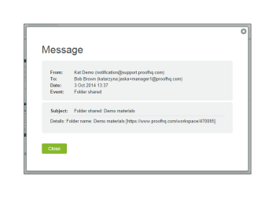

# 管理[!DNL Workfront Proof]中的文件夹及其内容

>[!IMPORTANT]
>
>本文提及独立产品[!DNL Workfront Proof]中的功能。 有关[!DNL Adobe Workfront]内部校对的信息，请参阅[校对](../../../review-and-approve-work/proofing/proofing.md)。

将您的项目和验证组织到文件夹中的好处之一，是能够在[!UICONTROL 文件夹详细信息]页面上管理它们。 此页面是项目的一个控制中心，在这里，您可以方便地管理单个验证和文件以及执行批量操作。

## 对项目进行分组，使审阅人能够一起处理这些项目

您可以使用文件夹将希望审阅人一起处理的验证分组。 当审核者在文件夹中打开其中一个验证以启动验证查看者时，文件夹中的所有其他验证都可用 — 审核者可以在不离开验证查看者的情况下处理文件夹中的任何验证。 有关详细信息，请参阅[在校对查看器中使用多个校对](../../../workfront-proof/wp-work-proofsfiles/review-proofs-wpv/work-with-multiple-proofs.md)。

## 将新项目添加到文件夹

在创建验证或上传文件时，您可以在[!UICONTROL 新建验证]页面或[!UICONTROL 新建文件]页面的[!UICONTROL 整理]分区中选择要存储该文件的文件夹。

有关详细信息，请参阅[在 [!DNL Workfront Proof]](../../../workfront-proof/wp-work-proofsfiles/create-proofs-and-files/generate-proofs.md)中生成验证，或[将文件和Web内容上载到 [!DNL Workfront Proof]](../../../workfront-proof/wp-work-proofsfiles/create-proofs-and-files/upload-files-web-content.md)。

>[!NOTE]
>
>如果您当前正在查看要添加新项目的文件夹，则在打开新验证页面或[!UICONTROL 新文件]页面时，该文件夹会自动显示在[!UICONTROL 整理]分区中。

## 将现有项目添加到文件夹

您可以将现有文件或校对添加到文件夹。

有关详细信息，请参阅[在 [!DNL Workfront Proof]](../../../workfront-proof/wp-work-proofsfiles/manage-your-work/manage-files.md)中管理文件，或[在Workfront Proof中管理校对详细信息](../../../workfront-proof/wp-work-proofsfiles/manage-your-work/manage-proof-details.md)。

1. （视情况而定）执行以下操作之一：

   * 如果您要将校对添加到文件夹，请转到[!UICONTROL 校对详细信息]页面，如 [!DNL Workfront Proof][&#128279;](../../../workfront-proof/wp-work-proofsfiles/manage-your-work/manage-proof-details.md)中的[!UICONTROL 管理校对详细信息]中所述
   * 如果要将文件添加到文件夹，请按照[在 [!DNL Workfront Proof]](../../../workfront-proof/wp-work-proofsfiles/manage-your-work/manage-files.md)中管理文件中的说明转到“文件详细信息”页面。

1. 单击文件或校对所在的&#x200B;**文件夹**&#x200B;的名称，然后单击要移动它的文件夹的名称。\
   

## 将项目移出文件夹

1. （视情况而定）执行以下操作之一：

   * 如果您要将校对移出文件夹，请按照 [!DNL Workfront Proof][&#128279;](../../../workfront-proof/wp-work-proofsfiles/manage-your-work/manage-proof-details.md)中[!UICONTROL 管理校对详细信息]中的说明转到[!UICONTROL 校对详细信息]页面

     或\
      如果要将文件移出文件夹，请按照[在 [!DNL Workfront Proof]](../../../workfront-proof/wp-work-proofsfiles/manage-your-work/manage-files.md)中管理文件中的说明转到“文件详细信息”页面。

1. 单击文件或校对所在的&#x200B;**文件夹**&#x200B;的名称，然后单击&#x200B;**[!UICONTROL 移动到]** > **[!UICONTROL （未选择文件夹）]**。\
   

## 在[!UICONTROL 文件夹详细信息]页面上管理文件夹及其项目

您可以从[!UICONTROL 文件夹详细信息]页面轻松管理文件。

>[!NOTE]
>
>如果您不是文件的创建者或所有者，则可用选项将取决于您在 [!DNL Workfront Proof][&#128279;](../../../workfront-proof/wp-acct-admin/account-settings/proof-perm-profiles-in-wp.md)中的用户验证权限配置文件。

1. 在左侧导航菜单中的&#x200B;**[!UICONTROL 文件夹]**&#x200B;选项卡中，单击任意文件夹以打开[!UICONTROL 文件夹详细信息]页面。
1. 如果文件夹仅包含存档的验证，则页面顶部将以黄色显示一条消息。 如果单击邮件中的链接，文件夹视图将更改为[!UICONTROL 存档的校样]视图。
1. 单击&#x200B;**[!UICONTROL 文件夹详细信息]**，然后使用显示的选项对该文件夹执行以下任何操作：

   * 添加或更改文件夹的缩略图图像。
   * 查看或编辑与该文件夹关联的&#x200B;**描述**、**父文件夹**、**所有者**、**客户端**&#x200B;或&#x200B;**项目**。

   * 将文件夹&#x200B;**设为私有**。
   * 查看文件夹何时&#x200B;**已创建**。
   * 查看文件夹的&#x200B;**创建者**&#x200B;的名称。

1. （可选）要更改与文件夹中某个项目关联的信息，请单击该项目右侧的&#x200B;**[!UICONTROL 更多]**&#x200B;图标，然后使用显示的任意选项。\
   \
   显示的选项取决于项目是验证还是文件。

   * **[!UICONTROL 查看校对详细信息]**&#x200B;或&#x200B;**[!UICONTROL 查看文件详细信息]**：打开校对详细信息或文件详细信息页面。 有关详细信息，请参阅[在 [!DNL Workfront Proof]](../../../workfront-proof/wp-work-proofsfiles/manage-your-work/manage-files.md)中管理文件，或[在 [!DNL Workfront Proof]](../../../workfront-proof/wp-work-proofsfiles/manage-your-work/manage-proof-details.md)中管理校对详细信息。

   * **[!UICONTROL 共享]**：允许您与其他人共享文件。 有关详细信息，请参阅[在[!UICONTROL Workfront Proof]](../../../workfront-proof/wp-work-proofsfiles/share-proofs-and-files/share-files.md)中共享文件。

   * **[!UICONTROL 消息]**：向与其共享校对的人员发送电子邮件。
   * **[!UICONTROL 新版本]**：创建新版本的验证。
   * **[!UICONTROL 复制]**：将包含任何验证评论的验证作为现有验证的新版本或新验证。
   * **[!UICONTROL 下载原始文件]**：允许您下载原始文件。 有关详细信息，请参阅[下载存储在 [!DNL Workfront Proof]](../../../workfront-proof/wp-work-proofsfiles/manage-your-work/download-files-stored.md)中的文件。

   * **[!UICONTROL 委托所有权]**：将证明的所有权委托给其他用户。
   * **[!UICONTROL 共享校对链接]**：发送包含校对链接的电子邮件。
   * **[!UICONTROL 打印评论]**：打印审阅人对校对所做的评论。
   * **[!UICONTROL Excel摘要]**：创建包含校对打印摘要的Excel文件。
   * **[!UICONTROL 锁定]**：锁定校样，这样其他用户就无法打开它。
   * **[!UICONTROL 删除]**：从[!DNL Workfront]校对中删除文件。

1. （可选）在&#x200B;**[!UICONTROL 共享对象]**&#x200B;分区中，要向验证上的审阅人发送提醒，请单击用户名右侧的&#x200B;**[!UICONTROL 更多]**&#x200B;图标，然后单击&#x200B;**[!UICONTROL 消息]**。\
   您可以单击&#x200B;**[!UICONTROL 删除]**&#x200B;以取消与此人共享文件夹。\
   文件夹的所有者和创建者始终显示在此列表中，并且不可移除。 如果用户接管了文件夹的所有权，它们会自动显示并且不可移除。\
   您可以与个人用户和合作伙伴公司共享文件夹。 如果文件夹与合作伙伴公司共享，则可以通过单击将鼠标悬停在该行上时显示的[!UICONTROL 信息]图标来查看收件人的完整列表。 有关详细信息，请参阅[合作伙伴帐户。](https://support.workfront.com/hc/en-us/sections/115000912107-Partner-accounts)

1. （可选）编辑经理对专用文件夹的权限，方法是单击文件夹&#x200B;&rbrack;**上**&#x200B;[[!UICONTROL &#x200B;允许，然后指定您希望此人是否能够创建、编辑和删除该文件夹中的项目。 **注意**&#x200B;此选项仅适用于与添加到专用文件夹的文件夹所有者来自同一帐户的管理员。 主管、管理员和账单管理员对帐户中的所有文件夹具有编辑权限，观察者无法创建任何项目。 有关权限的信息，请参阅 [!DNL Workfront Proof]]](../../../workfront-proof/wp-acct-admin/account-settings/proof-perm-profiles-in-wp.md)中的&lbrack;验证权限配置文件。

1. （可选）单击&#x200B;**[!UICONTROL 活动]**&#x200B;查看在文件夹中按时间顺序执行的所有操作。
1. （可选）单击&#x200B;**[!UICONTROL 消息]**&#x200B;部分以查看已发送给文件夹中用户的消息。\
   当您将鼠标悬停在消息上时，可以单击右侧的&#x200B;**i**&#x200B;图标以查看完整消息。\
   \
   此时会显示包含完整电子邮件的弹出窗口：\
   

## 管理子文件夹

您可以从“文件夹”详细信息页面管理子文件夹。

1. 在左侧导航菜单中的&#x200B;**[!UICONTROL 文件夹]**&#x200B;选项卡中，单击包含子文件夹的父文件夹名称以打开&#x200B;**[!UICONTROL 文件夹详细信息]**&#x200B;页面。

1. 单击子文件夹右侧的&#x200B;**[!UICONTROL 更多]**&#x200B;菜单。\
   

1. 单击以下任一项：

   * **[!UICONTROL 查看文件夹详细信息]**：打开[!UICONTROL 文件夹详细信息]页面。
   * **[!UICONTROL 新验证]**：允许您向子文件夹添加新验证。
   * **[!UICONTROL 上载文件]**：允许将文件上载到子文件夹。
   * **[!UICONTROL 新建子文件夹]**：在子文件夹内创建一个新的子文件夹。
   * **[!UICONTROL 共享]**：允许您与其他用户共享子文件夹。
   * **[!UICONTROL Excel摘要]**：允许您请求子文件夹的Excel摘要。
   * **[!UICONTROL 删除]**：允许您删除子文件夹。
