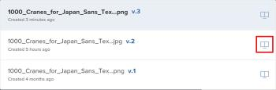

# 在校对查看器中比较校样

>[!IMPORTANT]
>
>本文介绍独立产品中的功能 [!DNL Workfront Proof]. 有关内部校对的信息 [!DNL Adobe Workfront]，请参阅 [校对](../../../review-and-approve-work/proofing/proofing.md).

您可以查看两个校样的并排比较。 这些校样可以是同一校样的两个版本，也可以是两个完全不同的校样。

## 比较校样版本 {#compare-proof-versions}

1. 打开包含多个要比较的版本的校样。
1. 在显示的校样查看器的左上角，单击校样的名称。 然后，在显示的版本列表中，单击 **比较** 图标。

   

   校样并排显示，左侧是较新版本。

   <!--
   
Separate breadcrumbs above each proof allow you to view and go to the work item associated with the proof:

   -->

   <!--
   
  

   -->

1. 继续 [使用比较工具](#use-the-compare-tools).

## 比较单独的校样 {#compare-separate-proofs}

您可以比较两个不同的校样。

* [在中比较单独的校样 [!DNL Workfront]](#compare-separate-proofs-in-workfront)
* [在中比较单独的校样 [!DNL Workfront Proof]](#compare-separate-proofs-in-workfront-proof)

### 在中比较单独的校样 [!DNL Workfront] {#compare-separate-proofs-in-workfront}

有关在 [!DNL Workfront]，请参阅 [比较两个不同的校样](../../../review-and-approve-work/proofing/reviewing-proofs-within-workfront/review-a-proof/compare-proofs.md#comparing-two-proofs-from-a-document-list) 部分 [比较校样](../../../review-and-approve-work/proofing/reviewing-proofs-within-workfront/review-a-proof/compare-proofs.md) 文章。

### 在中比较单独的校样 [!DNL Workfront Proof] {#compare-separate-proofs-in-workfront-proof}

>[!NOTE]
>
>要比较的校样必须位于同一文件夹中，并且位于文件夹结构中层次结构的同一级别。 有关使用文件夹对要比较的校样进行分组的更多信息，请参阅 [在校样查看器中使用多个校样](../../../workfront-proof/wp-work-proofsfiles/review-proofs-wpv/work-with-multiple-proofs.md)

1. 打开要在校样查看器中比较的校样之一。
1. 单击 **[!UICONTROL 比较模式]** 图标。

   \
   查看区域将分成两半，校样同时显示在校样查看器的左侧和右侧。

   

1. 单击 [!UICONTROL 文件夹] 校样上方的图标（左侧或右侧）以列出同一文件夹中的其他校样。

   

1. 在列表中，单击要与校样查看器中当前打开的校样进行比较的校样的名称。

   

   将显示两个校样。

1. 继续 [使用比较工具](#use-the-compare-tools).

## 使用比较工具 {#use-the-compare-tools}

校样查看器提供了各种工具，用于有效和高效地比较校样。

* [自动比较校样](#auto-compare-proofs)
* [在叠加图中比较校样](#compare-proofs-in-an-overlay)
* [同时导航比较](#simultaneous-navigation-comparison)

### 自动比较校样 {#auto-compare-proofs}

自动比较可在两种静态校样或视频校样之间逐像素进行比较。 在左侧的校样中，检测到的任何差异都以红色突出显示。

比较交互式校样时，自动比较不可用。

要自动比较两个校样，请执行以下操作：

1. 开始通过以下任一方式来比较校样：

   * 比较同一校样的两个版本(请参阅 [比较校样版本](#compare-proof-versions) )。
   * 比较两个不同的校样(请参阅 [比较单独的校样](#compare-separate-proofs) )。

1. 单击 **[!UICONTROL 自动比较]** 图标。

   

   两个校样之间的任何差异在左侧的校样中以红色突出显示。

1. （可选）单击 **[!UICONTROL 交换机]** 图标来更改活动侧，以便在右侧的校样中显示差异。 默认情况下，校样的左侧会显示差异。

   

1. （可选）单击 **[!UICONTROL 颜色]** 图标来更改突出显示差异时使用的颜色和不透明度。

   

### 在叠加图中比较校样 {#compare-proofs-in-an-overlay}

叠加图比较允许您通过将两个校样作为单个校样查看来查看两个静态校样之间的差异，同时在校样的中心向下提供垂直分隔符。 在垂直分隔线上平移校样时，会显示差异。

>[!NOTE]
>
>在比较视频或交互式校样时，无法进行叠加图比较。

要启用叠加图比较，请执行以下操作：

1. 开始通过以下任一方式来比较校样：

   * 比较同一校样的两个版本(请参阅 [比较校样版本](#compare-proof-versions) )。
   * 比较两个不同的校样(请参阅 [比较单独的校样](#compare-separate-proofs) )。

1. 单击 **[!UICONTROL 叠加]** 图标。

   

   这两个校样显示为单个校样，并在校样的中心下方有一个垂直分隔线。

1. 执行以下任一操作：

   * 在垂直分隔线上平移校样。 平移时，您会在垂直分隔线的左侧看到校样，而右侧的校样显示在右侧。
   * 将垂直分隔线向左和向右移动。 移动分隔线时，您将在垂直分隔线左侧看到校样，而右侧显示校样。

### 同时导航比较 {#simultaneous-navigation-comparison}

默认情况下，在比较校样时启用同时导航。 在比较静态校样和静态校样时，或者在比较视频校样和视频校样时，都可以使用此插件。 在比较静态校样和视频校样时，该函数不可用。

**静态校样：** 在静态校样上启用后，在平移或滚动时，同时导航会锁定两个校样的缩放级别和位置。 当校样包含多个页面并且启用了同时导航时，更改一个校样中的页面会导致另一个校样中的页面发生更改。

**视频校样：** 在视频校样上启用后，同时导航会记住两个校样的时间轴上的时间差。

要在尚未启用时启用并发导航，请执行以下操作：

1. 开始通过以下任一方式来比较校样：

   * 比较同一校样的两个版本(请参阅 [比较校样版本](#compare-proof-versions) )。
   * 比较两个不同的校样(请参阅 [比较单独的校样](#compare-separate-proofs) )。

1. 单击 **[!UICONTROL 同时导航]** 图标。

   

1. （可选）单击 **[!UICONTROL 重置]** 图标，以重置缩放级别和位置（用于静态校样）或时间轴（用于视频校样）。

   

## 退出比较模式

1. 通过单击校样左上角的(x)图标，关闭不再希望查看的校样。

   

   未关闭的校样将在校样查看器中保持打开状态。
