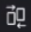

# 在验证查看器中比较验证

>[!IMPORTANT]
>
>本文提及独立产品[!DNL Workfront Proof]中的功能。 有关[!DNL Adobe Workfront]内部校对的信息，请参阅[校对](../../../review-and-approve-work/proofing/proofing.md)。

您可以查看两个校样的并排比较。 这些校对可以是同一校对的两个版本，也可以是两个完全不同的校对。

## 比较验证版本 {#compare-proof-versions}

1. 打开具有多个要比较的版本的验证。
1. 在显示的验证查看器的左上角，单击验证的名称。 然后，在显示的版本列表中，单击要打开和比较的版本旁边的&#x200B;**比较**&#x200B;图标。

   

   验证并排显示，较新版本位于左侧。

   <!--
   
Separate breadcrumbs above each proof allow you to view and go to the work item associated with the proof:

   -->

   <!--
   
  

   -->

1. 继续[使用比较工具](#use-the-compare-tools)。

## 比较单独的校样 {#compare-separate-proofs}

您可以比较两个不同的校样。

* [在 [!DNL Workfront]中比较不同的校对](#compare-separate-proofs-in-workfront)
* [在 [!DNL Workfront Proof]中比较不同的校对](#compare-separate-proofs-in-workfront-proof)

### 在[!DNL Workfront]中比较不同的校对 {#compare-separate-proofs-in-workfront}

有关在[!DNL Workfront]中比较文档列表中的单独校样的信息，请参阅[比较校样](../../../review-and-approve-work/proofing/reviewing-proofs-within-workfront/review-a-proof/compare-proofs.md)文章中的[比较两个不同的校样](../../../review-and-approve-work/proofing/reviewing-proofs-within-workfront/review-a-proof/compare-proofs.md#comparing-two-proofs-from-a-document-list)部分。

### 在[!DNL Workfront Proof]中比较不同的校对 {#compare-separate-proofs-in-workfront-proof}

>[!NOTE]
>
>您比较的校样必须位于同一文件夹中，并且位于文件夹结构的同一层次结构级别中。 有关使用文件夹对要比较的验证进行分组的详细信息，请参阅[在验证查看器中处理多个验证](../../../workfront-proof/wp-work-proofsfiles/review-proofs-wpv/work-with-multiple-proofs.md)

1. 在验证查看器中打开要比较的验证之一。
1. 单击&#x200B;**[!UICONTROL 比较模式]**&#x200B;图标。

   \
   查看区域分成一半，验证查看器的左侧和右侧都会显示验证。

   

1. 单击左边或右边验证上方的[!UICONTROL 文件夹]图标可列出同一文件夹中的其他验证。

   

1. 在列表中，单击要与验证查看器中当前打开的验证进行比较的验证名称。

   

   两个验证都会出现。

1. 继续[使用比较工具](#use-the-compare-tools)。

## 使用比较工具 {#use-the-compare-tools}

校对检视器提供各种工具，用于有效且高效地比较校对。

* [自动比较校样](#auto-compare-proofs)
* [在叠加中比较验证](#compare-proofs-in-an-overlay)
* [同时导航比较](#simultaneous-navigation-comparison)

### 自动比较校样 {#auto-compare-proofs}

自动比较可在两个静态验证或视频验证之间逐像素进行比较。 检测到的任何差异会在左侧的验证中以红色突出显示。

比较交互式验证时，自动比较不可用。

要自动比较两个验证：

1. 开始通过以下任一方式比较验证：

   * 比较同一验证的两个版本（请参阅本文中的[比较验证版本](#compare-proof-versions)）。
   * 比较两个不同的验证（请参阅本文中的[比较不同的验证](#compare-separate-proofs)）。

1. 单击&#x200B;**[!UICONTROL 自动比较]**&#x200B;图标。

   

   两个验证之间的任何差异会在左侧的验证中以红色突出显示。

1. （可选）单击&#x200B;**[!UICONTROL Switch]**&#x200B;图标以更改活动端，以便在右侧验证中显示差异。 默认情况下，差异显示在左侧的验证中。

   

1. （可选）单击&#x200B;**[!UICONTROL 颜色]**&#x200B;图标可更改突出显示差异时使用的颜色和不透明度。

   

### 在叠加中比较验证 {#compare-proofs-in-an-overlay}

叠加比较允许您查看两个静态验证之间的差异，方法是将两个验证视为单个验证，同时沿验证中心向下提供一个垂直分隔线。 将校样平移过垂直分隔线时，会显示差异。

>[!NOTE]
>
>比较视频或交互式验证时，叠加比较不可用。

要启用叠加比较，请执行以下操作：

1. 开始通过以下任一方式比较验证：

   * 比较同一验证的两个版本（请参阅本文中的[比较验证版本](#compare-proof-versions)）。
   * 比较两个不同的验证（请参阅本文中的[比较不同的验证](#compare-separate-proofs)）。

1. 单击&#x200B;**[!UICONTROL 叠加]**&#x200B;图标。

   

   这两个校样显示为单个校样，校样中心以垂直分隔线向下。

1. 执行以下任一操作：

   * 将校样平移过垂直分隔线。 平移时，您可以在垂直分隔线的左侧看到校样，而右侧的校样显示在右侧。
   * 将垂直分隔线左右移动。 移动分隔线时，您会在垂直分隔线的左侧看到校样，而右侧的校样则显示在右侧。

### 同时导航比较 {#simultaneous-navigation-comparison}

默认情况下，比较验证时启用同时导航。 在比较静态校样和静态校样，或者比较视频校样和视频校样时，此变量可用。 比较静态验证和视频验证时，此选项不可用。

**静态校样：**&#x200B;对静态校样启用时，同步导航会在平移或滚动时锁定两个校样的缩放级别和位置。 当验证包含多个页面并启用同时导航时，更改一个验证中的页面会导致另一个验证中的页面更改。

**视频校样：**&#x200B;在视频校样上启用时，同时导航会记住两个校样的时间线上的时间差。

要启用同步导航（如果尚未启用），请执行以下操作：

1. 开始通过以下任一方式比较验证：

   * 比较同一验证的两个版本（请参阅本文中的[比较验证版本](#compare-proof-versions)）。
   * 比较两个不同的验证（请参阅本文中的[比较不同的验证](#compare-separate-proofs)）。

1. 单击&#x200B;**[!UICONTROL 同步导航]**&#x200B;图标。

   

1. （可选）随时单击&#x200B;**[!UICONTROL 重置]**&#x200B;图标可重置缩放级别和位置（对于静态校样）或时间轴（对于视频校样）。

   

## 退出比较模式

1. 单击验证左上角的(x)图标以关闭您不再要查看的验证。

   

   未关闭的校样在校样查看器中保持打开状态。
