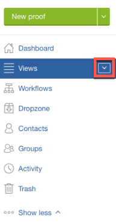

# 在中打开校样 [!DNL Workfront Proof]

>[!IMPORTANT]
>
>本文介绍独立产品中的功能 [!DNL Workfront Proof]. 有关内部校对的信息 [!DNL Adobe Workfront]，请参阅 [校对](../../../review-and-approve-work/proofing/proofing.md).

1. 单击旁边的向下箭头按钮 **[!UICONTROL 视图]** 的上界。\
   

1. 选择 **[!UICONTROL 所有项目]** 中。
1. 单击 **[!UICONTROL 转到校样]** 图标。\
   \
   默认校样查看器会在浏览器的新选项卡上启动，焦点会切换到该选项卡。 您可以同时打开多个校样，每个校样都位于其自己的选项卡中。

1. 根据您所使用的校样查看器，继续阅读以下文章之一。

   * 要在Web校样查看器中进行校样，请参阅 [在Web校样查看器中查看校样。](https://support.workfront.com/hc/en-us/sections/115000275214)
   * 要在桌面校样查看器中进行校样，请参阅 [在桌面校对查看器中查看校样。](https://support.workfront.com/hc/en-us/search/click?data=BAh7CjoHaWRsKwjm7%2BTRUwA6CXR5cGVJIgxhcnRpY2xlBjoGRVQ6CHVybEkiVC9oYy9lbi11cy9hcnRpY2xlcy8zNjAwMDM3MjczMzQtUmV2aWV3aW5nLVByb29mcy1pbi10aGUtRGVza3RvcC1Qcm9vZmluZy1WaWV3ZXIGOwdUOg5zZWFyY2hfaWRJIik0NDIyMjdkZi0zYTA4LTQ2YjItYTdkMy1kYzM1YjhlN2U4MjUGOwdGOglyYW5raQc%3D--2056c434cf6f4f97ca87532493ebfeb67ca07b63)
   要了解有关校样查看器的更多信息，请参阅 [Web校对查看器与桌面校对查看器概述之间的差异](../../../review-and-approve-work/proofing/proofing-overview/understand-differences-between-web-viewer.md).
