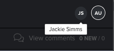

# 与多个审阅人同时审阅验证

>[!IMPORTANT]
>
>本文提及独立产品[!DNL Workfront Proof]中的功能。 有关[!DNL Adobe Workfront]内部校对的信息，请参阅[校对](../../../review-and-approve-work/proofing/proofing.md)。

多个审阅者可以同时审阅一个验证。 查看验证时，您可以看到其他谁当前正在查看同一验证。

当其他查看者打开相同的验证时，无论他们是否向验证添加评论，您都可以看到存在指示器。 如果他们添加注释，则评论会在您查看验证时显示；您无需刷新验证查看器即可查看它们。

1. 查看验证查看器右上角的显示状态指示器。

   如果您使用的是[!DNL Workfront Proof]（未与[!DNL Workfront]集成的验证功能），则状态指示器包含用户的[!DNL Workfront Proof]个人资料图片，如果没有个人资料图片，则包含用户的第一个和最后一个初始图片。

   [!DNL Workfront]中的配置文件图片未出现在验证查看器中。

1. （可选）将鼠标悬停在状态指示器上可查看用户的名称。

   
