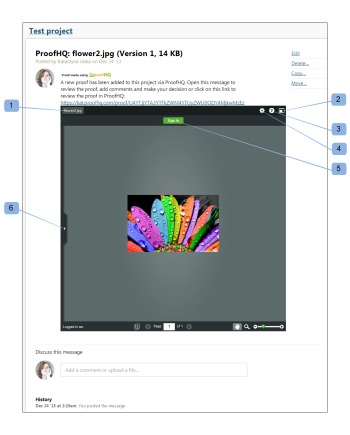

# 在中创建小校样 [!DNL Workfront Proof]

>[!IMPORTANT]
>
>本文介绍独立产品中的功能 [!DNL Workfront Proof]. 有关内部校对的信息 [!DNL Adobe Workfront]，请参阅 [校对](../../../review-and-approve-work/proofing/proofing.md).

小校样是一个小组件，可让您在网页、博客或Wiki中嵌入校样。

小校样将显示校样以及所有现有的注释和标记。 你可以象在 [!DNL Workfront Proof].

以下是Basecamp项目中嵌入的Miniproof示例：

* 校样的名称(1)
* 全屏(2):在校样查看器中打开校样（在嵌入了Miniproof的环境之外）
* 帮助链接(3)
* “操作”菜单(4)
* 在侧栏中查看评论(5)

要在网站、博客或Wiki中嵌入小型校样，请执行以下操作：

1. 转到 **[!UICONTROL 校样详细信息]** 校样页面，如 [在中管理校样详细信息 [!DNL Workfront Proof]](../../../workfront-proof/wp-work-proofsfiles/manage-your-work/manage-proof-details.md).

1. 打开 **[!UICONTROL 更多共享选项]** 部分
1. 确保已启用嵌入代码(1)。
1. 单击 [!UICONTROL 复制代码] 链接(2)将嵌入代码复制到剪贴板。
1. 将代码粘贴到您正在处理的网站、博客或Wiki中，以嵌入Miniproof。

![[!DNL Embed_code].png](assets/embed-code-350x218.png)
