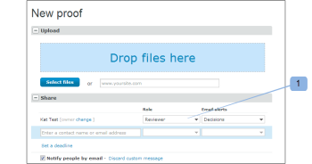

# 在中管理验证角色 [!DNL Workfront Proof]

<!-- Audited: 01/2024 -->

>[!IMPORTANT]
>
>本文介绍了独立版产品中的功能 [!DNL Workfront Proof]. 有关内部校对的信息 [!DNL Adobe Workfront]，请参见 [校对](../../../review-and-approve-work/proofing/proofing.md).

利用验证角色，可将权限授予受用户配置文件上配置的权限配置文件限制的用户。 (有关权限配置文件的更多信息，请参阅 [中的验证权限配置文件 [!DNL Workfront Proof]](../../../workfront-proof/wp-acct-admin/account-settings/proof-perm-profiles-in-wp.md).)

验证角色与帐户配置文件不同。 您的帐户配置文件与您帐户中的整体权限级别相关，将影响您对帐户中所有校对拥有的权限，即使那些没有明确与您共享的校对也是如此。

有关更多信息，请参阅 [中的验证权限配置文件 [!DNL Workfront Proof]](../../../workfront-proof/wp-acct-admin/account-settings/proof-perm-profiles-in-wp.md).

## 关于验证角色

邀请用户查看验证时，为个人验证向用户授予以下验证角色：

* [只读](#read-only)
* [查看者](#reviewer)
* [审批者](#approver)
* [查看者和审批者](#reviewer-approver)
* [作者](#author)
* [审阅人](#moderator)

验证角色定义查看者可对该特定验证执行的操作。

例如，如果您是查看者，则系统会要求您通过添加标记和注释来查看校样。 如果您是查看者和批准者，则系统会要求您查看并决定验证。

某些验证角色为审阅人提供了对验证的编辑权限（即使其帐户配置文件没有），并允许他们使用某些附加功能，例如添加评论操作、创建新版本以及向验证添加更多审阅人。

有关更多信息，请参阅以下文章：

* [对验证评论使用操作](../../../review-and-approve-work/proofing/reviewing-proofs-within-workfront/comment-on-a-proof/use-actions-on-comments-in-viewer.md)
* [在中共享验证 [!DNL Workfront Proof]](../../../workfront-proof/wp-work-proofsfiles/share-proofs-and-files/share-proof.md)

### 只读

{#read-only}

 可以查看校对

 无法添加标记

 无法添加评论

 无法做出决定

 无法删除其他人的评论

 对验证没有编辑权限

>[!NOTE]
>
>如果文件夹与用户共享 [!DNL Workfront Proof]，则他们会自动获得对文件夹中所有现有项目以及随后添加的项目的“只读”权限。

有关更多信息，请参阅 [共享文件夹 [!DNL Workfront Proof]](../../../workfront-proof/wp-work-proofsfiles/organize-your-work/share-folders.md).

### 查看者 {#reviewer}

 可以查看校对

 可以添加标记

 可以添加评论

![[!DNL cleaner].png](assets/cleaner.png) 如果没有回复，可以编辑自己的评论

 无法做出决定

 无法编辑或删除其他人的评论

 对验证没有编辑权限

### 审批者 {#approver}

 可以查看校对

 可以做决定

 无法添加标记

 无法添加评论

 无法编辑或删除其他人的评论

 对验证没有编辑权限

### 查看者和审批者 {#reviewer-approver}

 可以查看校对

 可以添加标记

 可以添加评论

![[!DNL cleaner].png](assets/cleaner.png) 如果没有回复，可以编辑自己的评论

 可以做决定

 无法编辑或删除其他人的评论

 对验证没有编辑权限

### 作者 {#author}

 可以添加标记

 可以添加评论

![[!DNL cleaner].png](assets/cleaner.png) 如果没有回复，可以编辑自己的评论

 可以做决定

 可以提交新版本

 可以创建验证的副本

 可以与其他人共享证明

 可以对评论应用操作

 可以解析注释

 无法编辑或删除其他人的评论

>[!NOTE]
>
>此角色只能分配给的用户 [!DNL Workfront Proof].

### 审阅人 {#moderator}

 可以添加标记

 可以添加评论

![[!DNL cleaner].png](assets/cleaner.png) 如果没有回复，可以编辑自己的评论

 可以做决定

 可以提交新版本

 可以添加新的审阅人

 可以对评论应用操作

 可以解析注释

 可以删除（自己或其他人）对验证的评论和回复

* 删除注释线程中的第一个注释将删除整个线程
* 删除评论会话中的回复只会删除该回复

 无法编辑其他人的评论

此角色允许人员管理和审核验证评论，使他们有机会在验证上仅保留相关评论并删除不相关的评论。

>[!NOTE]
>
>此角色只能分配给的用户 [!DNL Workfront Proof].

## 分配验证角色

您可以在创建新验证、创建新版本现有验证或现有验证时分配验证角色。

### 新验证 {#new-proofs}

可以在以下位置将验证角色分配给查看者： [!UICONTROL 新校对] 验证创建过程中的页面(1)。

### 新版本 {#new-versions}

创建新版本的验证时，将自动显示先前版本的查看者（具有与先前版本相同的角色）。

您可以编辑创建新版本(1)时应用于审阅人的验证角色。

### 现有校样 {#existing-proofs}

如果要更改人员在现有验证上的角色，您可以在以下位置进行更改： [!UICONTROL 校对详细信息] 页面，方式是内联编辑其在工作流部分(1)中的角色。

## 在验证查看器中检查角色

您可以直接从“校样查看器”(1)检查查看者的角色，并在必要时对其进行编辑(2)。

## 默认验证角色

您可以在以下位置设置您的默认验证角色： [!DNL Proofing Defaults] 页面。 这意味着将您添加到验证时，您的默认验证角色将自动填充。 请注意，此角色可以由对验证具有编辑权限的用户在验证级别更改。

>[!NOTE]
>
>只有具有管理员或账单管理员配置文件的用户才能更改其帐户中其他用户的验证默认值。

有关更多信息，请参阅 [中的个人设置 [!DNL Workfront Proof]](../../../workfront-proof/wp-getstarted/personal-settings/personal-settings.md).

## 创建者和所有者

创建者和所有者对验证具有完全编辑权限。

### 创建者 {#creators}

校对创建者是首次上载校对的人。 验证创建者将自动显示在验证的人员列表中（在其默认角色中）。

在 [!UICONTROL 新校对] 页面您可以为验证创建者分配不同的验证角色（不同于其默认角色）。

无法更改校对创建者或从校对中删除校对创建者。

### 所有者 {#owners}

默认情况下，创建者也是校样的所有者；但是，创建者可以在最初创建校样时让他人成为校样所有者(位于 [!UICONTROL 新校对] 页面)。

要在新验证页面上更改所有者，请执行以下操作：

1. 单击创建者名称旁边显示的更改链接。
1. 从下拉菜单中选择新的所有者。 (2)

创建验证后，仍可以更改所有者。 拥有验证编辑权限的任何人都可以通过将验证所有权更改为其他用户 [!UICONTROL 校对详细信息] 页面（见下文）。

从工作流管理的角度来看，更改验证的所有者的功能特别有用。 它允许项目负责人接管校样的所有权，授予他们编辑校样的权利，并能够在以下位置查看校样 [!UICONTROL 我的校样] 视图。

要通过更改校对的所有者，请执行以下操作 [!UICONTROL 校对详细信息] 页面：

* 单击要成为“所有者”的人员姓名旁边的“活动”菜单。
* 选择 [!UICONTROL **成为所有者**] 从下拉菜单中。
* 或者，您可以单击 [!UICONTROL **所有者**] 验证图像旁边的字段，并从显示的下拉列表中选择新的所有者。

完成后，“所有者”一词将显示在该人员的姓名旁边。

>[!NOTE]
>
>只有来自同一帐户或合作伙伴帐户的用户才能成为验证的所有者。 仅当满足以下条件时，合作伙伴帐户中的用户才能成为验证的所有者：
>
>* 帐户之间已设置现有关系关系。 有关更多信息，请参阅 [中的合作伙伴帐户 [!DNL Workfront Proof]](../../../workfront-proof/wp-acct-admin/partner-accounts/partner-accounts.md).
>* 上无自定义字段 [!UICONTROL 新校对] 页面。
>* 尚未将验证分配给文件夹。
>* 未将任何标记应用于验证。

要在中临时委派证明所有权，请执行以下操作 [!DNL Workfront Proof]，请参见 [指定临时证明所有者 [!DNL Workfront Proof]](../../../workfront-proof/wp-getstarted/personal-settings/designate-temp-proof-owners.md).
