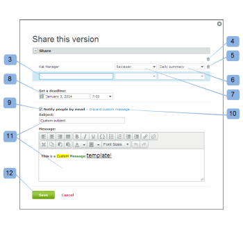

# 在[!DNL Workfront Proof]中共享验证

>[!IMPORTANT]
>
>本文提及独立产品[!DNL Workfront Proof]中的功能。 有关[!DNL Adobe Workfront]内部校对的信息，请参阅[校对](../../../review-and-approve-work/proofing/proofing.md)。

如果您对验证具有编辑权限，则可以轻松与其他查看者共享验证。 任何人都可以添加到验证中，因为您不需要拥有[!DNL Workfront Proof]帐户即可查看验证。

有关编辑权限的信息，请参阅 [!DNL Workfront Proof]](../../../workfront-proof/wp-acct-admin/account-settings/proof-perm-profiles-in-wp.md)中的[验证权限配置文件。

如果通过添加审阅人共享验证：

* 与您共享校对的人员将出现在他们帐户中“校对详细信息”页面的[!UICONTROL 工作流]部分中。 有关此页面的详细信息，请参阅[在 [!DNL Workfront Proof]](../../../workfront-proof/wp-work-proofsfiles/manage-your-work/manage-proof-details.md)中管理校对详细信息。
* 您将能够在验证中设置他们的角色。 有关详细信息，请参阅[在 [!DNL Workfront Proof]](../../../workfront-proof/wp-work-proofsfiles/share-proofs-and-files/manage-proof-roles.md)中管理校对角色。
* 您将能够设置其电子邮件警报。 有关详细信息，请参阅[在 [!DNL Workfront Proof]](../../../workfront-proof/wp-emailsntfctns/email-alerts/config-email-notification-settings-wp.md)中配置电子邮件通知设置。

>[!NOTE]
>
>* 将某人添加到验证时，您可以决定是否希望他们收到验证通知。 有关详细信息，请参阅[新验证电子邮件](../../../workfront-proof/wp-emailsntfctns/proof-notifications-and-reminders/new-proof-email.md)。
>* 您可以将任何人添加到验证中（只要他们拥有有效的电子邮件地址）。 他们不需要拥有[!DNL Workfront Proof]帐户！
>* 审阅人不计入您的用户限制。 您可以根据自己的需要，免费向验证中添加尽可能多的用户。
>

## 将审阅人添加到新验证或新验证版本

创建新验证或上传新版本的验证时，可以向验证添加查看者：

1. 创建验证或新版本，如[在 [!DNL Workfront Proof]](../../../workfront-proof/wp-work-proofsfiles/create-proofs-and-files/generate-proofs.md)中生成验证和中所述。
1. 在&#x200B;**[!UICONTROL 新验证]**&#x200B;页面或&#x200B;**[!UICONTROL 新验证版本]**&#x200B;页面的&#x200B;**[!UICONTROL 工作流]**&#x200B;部分中，键入要添加的审阅人的电子邮件地址。\
   有关与组共享验证的信息，请参阅[将组添加到验证](../../../workfront-proof/wp-mnguserscontacts/groups/add-groups.md)。\
   如果您之前与此人共享验证，则其电子邮件地址会显示在自动完成下拉列表中。\
   如果您改变主意，可以通过单击垃圾桶图标从共享列表中删除审阅人。 通过单击顶部垃圾桶图标，可以轻松删除所有审阅人。

1. 完成创建验证或新验证版本。

## 将审阅人添加到现有校对

1. 在仪表板或任何列表视图中，单击验证右侧的&#x200B;**[!UICONTROL 更多]**&#x200B;按钮。\
   

1. 在下拉菜单中单击&#x200B;**[!UICONTROL 共享]**。
1. 在显示的“共享此版本&#x200B;]**”页面中，通过添加审阅人的电子邮件地址来添加审阅人。**[!UICONTROL \
   您还可以执行以下任一操作：

   * 单击(4)即可删除所有审阅人。
   * 分别删除每个审阅人(5)。
   * 为每个审阅者设置电子邮件警报(6)。
   * 为每个审阅者设置验证角色(7)。
   * 设置审阅人的截止日期(8)。
   * 决定您是否希望审阅人收到新验证电子邮件(9)。
   * 包括或丢弃自定义消息(10)。
   * 在自定义消息(11)的正文和主题行中添加文本。

1. 单击&#x200B;**[!UICONTROL 共享]**。
1. 

